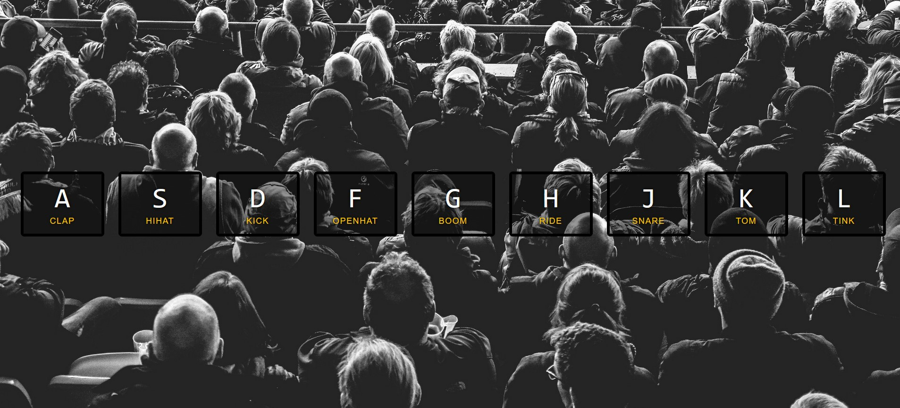

# 01 - JavaScript Drum Kit
## :eyes: Introduction



### Main goals

- When a user presses a certain key, an audio will be played accordingly.
- A short animation will appear when the key is pressed.

## :pushpin: Solution

### My solution
Which achieved the main goals but there are lots of places to be improved.
```javascript
const keys = document.querySelectorAll('.key')
const audios = document.querySelectorAll('audio')

window.addEventListener('keydown', (e) => {
    const downKey = e.keyCode
    keys.forEach(key => {
        if (downKey == key.getAttribute('data-key')) {
            key.classList.toggle('playing')
            setTimeout(() => {
                key.classList.toggle('playing')
            }, 300)
        }
    })
    audios.forEach(audio => {
        if (downKey == audio.getAttribute('data-key')) {
            audio.currentTime = 0
            audio.play()
        }
    })
})
```

### Example solution
```javascript
// if the transitioned property is not "transform", ignore it, 
// otherwise, remove the "playing" class
function removeTransition(e) {
    if (e.propertyName !== 'transform') return;
    e.target.classList.remove('playing');
}

// adding new class and play the audio is in the same function
function playSound(e) {
    const audio = document.querySelector(`audio[data-key="${e.keyCode}"]`);
    const key = document.querySelector(`div[data-key="${e.keyCode}"]`);
    if (!audio) return;

    key.classList.add('playing');
    audio.currentTime = 0;
    audio.play();
}

// execution
const keys = Array.from(document.querySelectorAll('.key'));
keys.forEach(key => key.addEventListener('transitionend', removeTransition));
window.addEventListener('keydown', playSound);
```

## :pencil2: Takeaways

### 1. Personalized attribute in HTML

```html
<!-- The "data-key" attribute -->
<div data-key="65" class="key">
    <kbd>A</kbd>
    <span class="sound">clap</span>
</div>
<!-- and here too -->
<audio data-key="65" src="sounds/clap.wav"></audio>
```

### 2. DOM attribute selector
```javascript
const audio = document.querySelector(`audio[data-key="${e.keyCode}"]`);
const key = document.querySelector(`div[data-key="${e.keyCode}"]`);
```

### 3. Set `audio.currentTime = 0` 
When an audio is still playing, audio.play() won't do anything or restart the audio.
You have to set the `currentTime` to 0 so that the audio will rewind to the beginning.
```javascript
if (downKey == audio.getAttribute('data-key')) {
    audio.currentTime = 0
    audio.play()
}
```

### 4. Don't use `setTimeOut` when there's a CSS animation
It's a valid solution to use setTimeOut to remove the added class here. However, when the transition time is longer than the timeout, it might cause the animation to be stopped abruptly.

Instead, use the `'transitioned'` event to remove added class after the element has done its animation.

```javascript
function removeTransition(e) {
    if (e.propertyName !== 'transform') return;
    e.target.classList.remove('playing');
}
// when the transition is done, the "removeTransition" function will run
keys.forEach(key => key.addEventListener('transitionend', removeTransition));
```

### 5. Use external functions when adding event listeners
By separating the functions and the event listener, you can make your code drier and easier to read.

(Please refer to the two solutions above.)