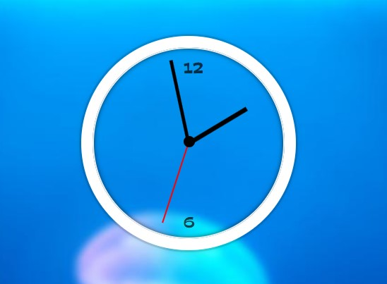

# 02 - CSS + JS Clock
## :eyes: Introduction



### Main goals

- Pointers should rotate according to the current time, yeah, just like a real clock.

### Demo: 👉 [Click me]()

## :pushpin: Solution

### My solution

Added a `if/else` statement to prevent the second pointer to do weird transition behavior. Otherwise it's mostly the same as example solution.

Also added numbers and the circle in the middle for styling purpose.

```javascript
const secondPointer = document.querySelector('.second-hand')
const minutePointer = document.querySelector('.min-hand')
const hourPointer = document.querySelector('.hour-hand')

function setRotate(deg, pointer) {
    if (deg === 90) {
        pointer.style.transition = 'all 0s'
    } else {
        pointer.style.transition = 'all 0.5s cubic-bezier(0.075, 0.82, 0.165, 1)'
    }
    return `rotate(${deg}deg)`
}

function getTime() {
    const currentTime = new Date()

    const second = currentTime.getSeconds()
    const minute = currentTime.getMinutes()
    const hour = currentTime.getHours()

    let secondDegree = (second / 60) * 360 + 90

    let minuteDegree = (minute / 60) * 360 + (second / 60) * 6 + 90
    let hourDegree = (hour / 12) * 360 + (minute / 60) * 30 + 90

    secondPointer.style.transform = setRotate(secondDegree, secondPointer)
    minutePointer.style.transform = setRotate(minuteDegree, minutePointer)
    hourPointer.style.transform = setRotate(hourDegree, hourPointer)
}

setInterval(getTime, 1000)
```

### Example solution
```javascript
const secondHand = document.querySelector('.second-hand');
const minsHand = document.querySelector('.min-hand');
const hourHand = document.querySelector('.hour-hand');

function setDate() {
    const now = new Date();

    const seconds = now.getSeconds();
    const secondsDegrees = ((seconds / 60) * 360) + 90;
    secondHand.style.transform = `rotate(${secondsDegrees}deg)`;

    const mins = now.getMinutes();
    const minsDegrees = ((mins / 60) * 360) + ((seconds/60)*6) + 90;
    minsHand.style.transform = `rotate(${minsDegrees}deg)`;

    const hour = now.getHours();
    const hourDegrees = ((hour / 12) * 360) + ((mins/60)*30) + 90;
    hourHand.style.transform = `rotate(${hourDegrees}deg)`;
}

setInterval(setDate, 1000);
```

## :pencil2: Takeaways

### 1. JavaScript `Date` object

```javascript
// create a new Date object, returns a new Date object.
const now = new Date()
// Date Wed Oct 12 2022 14:05:13 GMT+0200

now.getHours() // 14
now.getMinutes() // 5
now.getSeconds() // 13
```

### 2. Use `setInterval()` to repeat an action

#### Syntax
```javascript
setInterval(code)
setInterval(code, delay)
```
#### Example
```javascript
// run setDate() function every 1000 milliseconds
setInterval(setDate, 1000)
```

### 3. Calculate the degree according to percentage

Calculate the percentage of the current time (devide it by either 60 or 12), and times `360` which is the full degree. You have to add back 90 degrees because all pointers are pointing at the direction of 9 at the beginning. (rotate 90deg to point at at the direction of 12)  

```javascript
// if the current second is 13, it should rotate 78 + 90 = 168 deg
const secondsDegrees = ((seconds / 60) * 360) + 90
```

### 4. Remove transition animation at degree 90 

* Solution from: [guahsu](https://github.com/guahsu/JavaScript30/tree/master/02_JS-and-CSS-Clock)

```javascript
// at second 59, the second pointer should rotate 444 deg
console.log(secondsDegrees = ((59 / 60) * 360) + 90)  // 444

// however, at second 0, it should rotate 90 deg
console.log(secondsDegrees = ((0 / 60) * 360) + 90)  // 90
```
This creates a weird animation where the pointer turns "backward" to meet the 90 degree. It doesn't move forward like normal pointers.

To solve this, you can create a function to detect the degree. If the degree is 90, set transition to `0s`.

```javascript
// code from my solution
function setRotate(deg, pointer) {
    if (deg === 90) {
        pointer.style.transition = 'all 0s'
    } else {
        pointer.style.transition = 'all 0.5s cubic-bezier(0.075, 0.82, 0.165, 1)'
    }
    return `rotate(${deg}deg)`
}

secondPointer.style.transform = setRotate(secondDegree, secondPointer)
minutePointer.style.transform = setRotate(minuteDegree, minutePointer)
hourPointer.style.transform = setRotate(hourDegree, hourPointer)
```