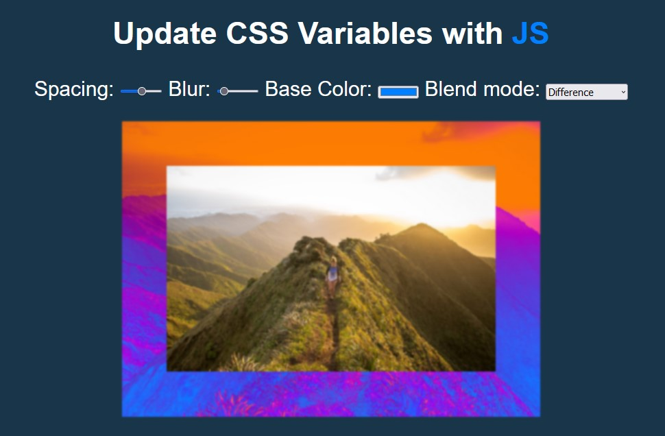

# 03 - Scoped CSS Variables and JS
## :eyes: Introduction



### Main goals

- When a user drags or picks an option, the CSS variables should update accordingly.

### Demo: 👉 [Click me](https://kellychi22.github.io/JavaScript30/03-CSS-Variables/)

## :pushpin: Solution

### My solution

Added blend mode selection with 6 kinds of blend modes.

```javascript
const root = document.documentElement;

const spacing = document.getElementById("spacing");
const blur = document.getElementById("blur");
const base = document.getElementById("base");
const blendMode = document.getElementById("blend-mode");

spacing.addEventListener('change', () => {
    root.style.setProperty('--spacing', `${spacing.value}px`);
})

blur.addEventListener('change', () => {
    root.style.setProperty('--blur', `${blur.value}px`);
})

base.addEventListener('change', () => {
    root.style.setProperty('--base', base.value);
})

blendMode.addEventListener('change', () => {
    root.style.setProperty('--blend-mode', blendMode.value);
})

```

### Example solution
```javascript
const inputs = document.querySelectorAll('.controls input');

    function handleUpdate() {
      const suffix = this.dataset.sizing || '';
      document.documentElement.style.setProperty(`--${this.name}`, this.value + suffix);
    }

    inputs.forEach(input => input.addEventListener('change', handleUpdate));
    inputs.forEach(input => input.addEventListener('mousemove', handleUpdate));
```

## :pencil2: Takeaways

### 1. Select root element and use `setProperty()` to update CSS variables

```javascript
// example solution
document.documentElement.style.setProperty(`--${this.name}`, this.value + suffix);

// my solution
const root = document.documentElement;
root.style.setProperty('--spacing', `${spacing.value}px`);
```

### 2. Difference between a `Nodelist` and an `Array` 

A NodeList has items stored at numeric indices and a length property just like an Array, but it does not have any of the other Array methods (`push`, `slice` and so on). `NodeList` has its own prototype with a single method instead of inheriting from the `Array` prototype.

```javascript
const inputs = document.querySelectorAll('.controls input');
inputs.pop() // Uncaught TypeError: inputs.pop is not a function
```

#### Convert a nodelist to an array using `Array.from()` method

```javascript
// create a `NodeList` object
const divs = document.querySelectorAll('div');

// convert `NodeList` to an array
const divsArr = Array.from(divs);
```

#### Convert a nodelist to an array using spread operator (`[...iterable]`):
```javascript
// create a `NodeList` object
const divs = document.querySelectorAll('div');

// convert `NodeList` to an array
const divsArr = [...divs];
```

link: https://attacomsian.com/blog/javascript-convert-nodelist-to-array

### 3. Also listen to `mousemove` event to update CSS 

```javascript
inputs.forEach(input => input.addEventListener('change', handleUpdate));
inputs.forEach(input => input.addEventListener('mousemove', handleUpdate));
```
### 4. Use `dataset` to get certain data attribute

#### html
```html
<!-- there's a custom attribute "data-sizing" -->
<input id="spacing" type="range" name="spacing" min="10" max="200" value="10" data-sizing="px">
```
#### Javascript
```javascript
// to get the "px" value, we can use dataset, which gives us an object including all custom data attributes
const suffix = this.dataset.sizing || '';
```

### 5. Use short-circuit evaluation `||` to set default value

```javascript
// we need Xpx for setting spacing and blur, but we don't need px for HEX color
// therefore, we add a fallback which returns am empty string if the data-sizing is undefined
const suffix = this.dataset.sizing || '';
document.documentElement.style.setProperty(`--${this.name}`, this.value + suffix);
```
#### Other examples of short-circuit evaluation
##### 1. Logical OR `||` Operator
The `||` operator will return the first truthy value of all the operands, or simply the last value if all of them are falsy.
```javascript
var person = {
  name: 'Jack',
  age: 34
}

console.log(person.job || 'unemployed'); // 'unemployed'
```

```javascript
var person = {
  name: 'Jack',
  age: 34,
  job: 'teacher'
}

console.log(person.job || 'unemployed'); // teacher
```

```javascript
var x;
var y = 'Gurseerat';
var z = 'This will not evaluate';

var name = x || y || z;
console.log(name); // Gurseerat
```
##### 2. Logical AND `&&` Operator
   The `&&` operator will return false as soon as it gets any falsy value and will return the last true value if all the values are truthy.
```javascript
var age =  25;
function driveCar() {
  return 'Driving Car';
}

var result = age > 18 && driveCar();
console.log(result); // Driving Car
```
### 6. Use functions and `forEach()` to reduce duplication

```javascript
// example solution
function handleUpdate() {
      const suffix = this.dataset.sizing || '';
      document.documentElement.style.setProperty(`--${this.name}`, this.value + suffix);
    }

inputs.forEach(input => input.addEventListener('change', handleUpdate));
inputs.forEach(input => input.addEventListener('mousemove', handleUpdate));
```


### 7. Optional: Add blend-mode selection
#### html
```html
<label for="blend-mode">Blend mode:</label>
    <select name="blend-mode" id="blend-mode">
      <option value="normal" selected>Normal</option>
      <option value="multiply">Multiply</option>
      <option value="screen">Screen</option>
      <option value="overlay">Overlay</option>
      <option value="color-dodge">Color-dodge</option>
      <option value="difference">Difference</option>
    </select>
```
#### CSS
```css
:root {
    --base: #ffc600;
    --spacing: 10px;
    --blur: 15px;
    --blend-mode: normal;
}
```
#### Javascript
```javascript
blendMode.addEventListener('change', () => {
    root.style.setProperty('--blend-mode', blendMode.value);
})
```
