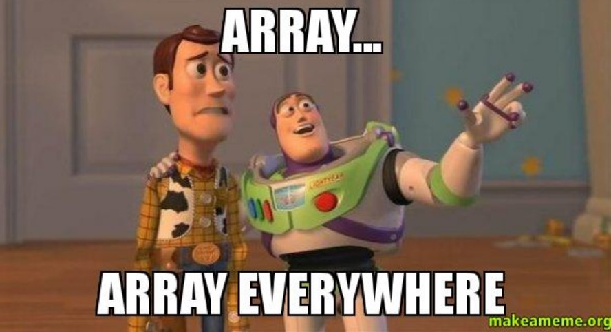
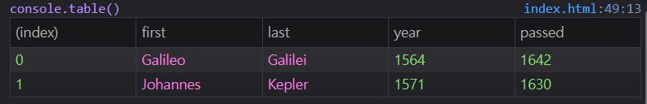

# 04 - Array Cardio Day 1
## :eyes: Introduction

### Main goals

- Strengthen your JavaScript skills by using those array methods!

### Demo: 👉 [Click me](https://kellychi22.github.io/JavaScript30/04-Array-Cardio-Day-1/)

## :pencil2: Takeaways

### 1. `Array.prototype.filter()`
The goal is to filter the list of inventors for those who were born in the 1500's. 

The callback function in the `filter()` method will loop over every item in the array. If an element passes the test implemented by the provided function, it will return `true` (which means keeping it in the array).

Here, if an inventor's birth year is between 1500 and 1600, it will pass the test. Thus we get an array of those inventors that were born in this era.
```javascript
const fifteen = inventors.filter(function (inventor) {
    if (inventor.year >= 1500 && inventor.year < 1600) {
    return true;
    }
});
```
The code can be simplified into one line:
```javascript
const fifteen = inventors.filter(inventor => inventor.year >= 1500 && inventor.year < 1600);
```
#### :bulb: Useful tip
Use `console.table` instead of `console.log` to get a more user friendly output.
```javascript
console.table(fifteen);
```


### 2. `Array.prototype.map()`
The goal is to have an array of the inventors first and last names.

The `map()` method is like a factory which does a certain procedure to each of the elements in the array. Thus, it returns a new array which **of the same length.**

Here, each inventor's first name and last name are mapped out and combined together. Thus we get an array of all inventors full names.
```javascript
const fullName = inventors.map(inventor => `${inventor.first} ${inventor.last}`);
```

### 3. `Array.prototype.sort()`
The goal is to sort the inventors by birth date, oldest to youngest.

Each time, there will only be two items that are being sorted, which is usually called `a` and `b`. The order will be decided by returning `1` or `-1`, If the return value is greater than 0, `a` will be sorted after `b`. On the other hand, if the return value is less than 0, `a` will be sorted before `b`.

Here, we take in the `year` value of each inventor. If `a`'s birth year is after `b`'s birth year, `a` will be put after `b` because the return value is greater than 0.
```javascript
const ordered = inventors.sort(function (a, b) {
    if (a.year > b.year) {
    return 1;
    } else {
    return -1;
    }
});
```
The code can be simplified into one line using **conditional (ternary) operator** (`?`)
```javascript
const ordered_2 = inventors.sort((a, b) => a.year > b.year ? 1 : -1);
```
Note that the return value is the reference to the original array, but now sorted, and **no copy is made**.

#### Another example
Let's say we want to sort the inventors by years lived. Here we calculate each inventor's age, and then compare them. If `a` lived longer than `b`, `a` will be sorted before `b`. (because the return value is `-1`)
```javascript
const oldest = inventors.sort(function (a, b) {
    const lastGuy = a.passed - a.year;
    const nextGuy = b.passed - b.year;
    return lastGuy > nextGuy ? -1 : 1;
});
```
#### One more example

If we want to sort the following people alphabetically by last name, first we have to split each string into an array which consists the first name and the last name. Then, we can compare the last names of `a` and `b` in order to decide who comes first.
```javascript
const people = [
      'Bernhard, Sandra', 'Bethea, Erin', 'Becker, Carl', 'Bentsen, Lloyd', 'Beckett, Samuel', 'Blake, William', 'Berger, Ric', 'Beddoes, Mick', 'Beethoven, Ludwig',
      'Belloc, Hilaire', 'Begin, Menachem', 'Bellow, Saul', 'Benchley, Robert', 'Blair, Robert', 'Benenson, Peter', 'Benjamin, Walter', 'Berlin, Irving',
      'Benn, Tony', 'Benson, Leana', 'Bent, Silas', 'Berle, Milton', 'Berry, Halle', 'Biko, Steve', 'Beck, Glenn', 'Bergman, Ingmar', 'Black, Elk', 'Berio, Luciano',
      'Berne, Eric', 'Berra, Yogi', 'Berry, Wendell', 'Bevan, Aneurin', 'Ben-Gurion, David', 'Bevel, Ken', 'Biden, Joseph', 'Bennington, Chester', 'Bierce, Ambrose',
      'Billings, Josh', 'Birrell, Augustine', 'Blair, Tony', 'Beecher, Henry', 'Biondo, Frank'
    ];

const alpha = people.sort((lastOne, nextOne) => {
    const [aLast, aFirst] = lastOne.split(', ');
    const [bLast, bFirst] = nextOne.split(', ');
    return aLast > bLast ? 1 : -1;
});
```

### 4. `Array.prototype.reduce()`
The goal is to know how many years did all the inventors live all together. 

The `reduce()` method executes a "reducer" callback function on each element of the array in order, passing in the return value from the calculation on the preceding element. The final result is **a single value.**

Here, each inventor's age will be calculated and added to the `total` variable. Thus we get the final sum of all inventors ages. Note that we need to pass in the initial value of `total` at the end, or it won't work.
```javascript
const totalYears = inventors.reduce((total, inventor) => {
    return total + (inventor.passed - inventor.year);
}, 0); // pass in the initial value of `total` at the end
```
The `reduce()` method does the same thing as below:
```javascript
var totalYears_old = 0;
for (var i = 0; i < inventors.length; i++) {
    totalYears_old += inventors[i].year;
}
```
#### Another example
Here, we want to sum up the instances of each items, we can use `reduce()` method as the following way. First we create an empty object as a container. Then, as the function executes on each element, new items will be added to the object. If the object already exists, it will add one instance to the item.
```javascript
const data = ['car', 'car', 'truck', 'truck', 'bike', 'walk', 'car', 'van', 'bike', 'walk', 'car', 'van', 'car', 'truck'];

const transportation = data.reduce((obj, item) => {
    // if the item is not in the object, initial it with 0 
    if (!obj[item]) {
    obj[item] = 0;
    }
    obj[item]++;
    return obj;
}, {}); // add an empty object at the beginning
```

### 5. Combine two methods together
On this page we have a full list of street names in Paris: https://en.wikipedia.org/wiki/Category:Boulevards_in_Paris
Let's say we want to create a list of Boulevards in Paris that contain 'de' anywhere in the name.

To do that, we need to get the correct DOM element first. 

#### :bulb: Useful tip
We can call `querySelector` on any existed DOM element. It doesn't have to be on the `document` element every time.

```javascript
const category = document.querySelector('.mw-category');
const links = Array.from(category.querySelectorAll('a'));
```

After getting the correct DOM element, we can map out the text content (which is the street names) of each element, then filter those who has 'de' in it. Writing two methods on two lines can make your code easier to read. 
```javascript

const de = links
  .map(link => link.textContent)
  .filter(streetName => streetName.includes('de'));
```

## :book: References

* [Array.prototype.filter() - MDN](https://developer.mozilla.org/en-US/docs/Web/JavaScript/Reference/Global_Objects/Array/filter)
*  [Array.prototype.map() - MDN](https://developer.mozilla.org/en-US/docs/Web/JavaScript/Reference/Global_Objects/Array/map)
*  [Array.prototype.sort() - MDN](https://developer.mozilla.org/en-US/docs/Web/JavaScript/Reference/Global_Objects/Array/sort)
*  [Array.prototype.reduce() - MDN](https://developer.mozilla.org/en-US/docs/Web/JavaScript/Reference/Global_Objects/Array/reduce)