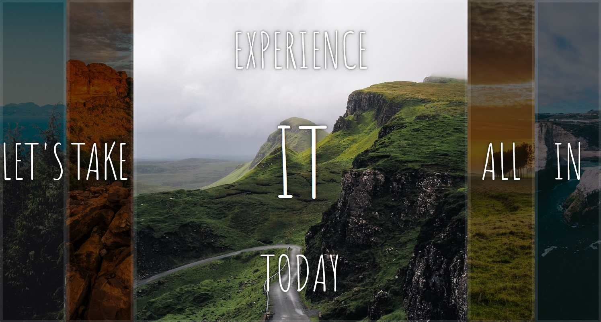

# 05 - Flex Panel Gallery
## :eyes: Introduction


#### Active state


### Main goals

- When a user clicks on an image, the image will expand and some text will appear. 

### Demo: 👉 [Click me]()

## :pushpin: Solution

### My solution

In the original solution, several images can be active at the same time. In my solution, only one image can be active at the same time. Also I added black mask on non-active images. 

```javascript
const panels = document.querySelectorAll('.panel');

function addOpen(panel) {
    panel.classList.add('open');
    setTimeout(() => {
        panel.classList.add('open-text');
    }, 500);
}

function removeOpen(panel) {
    panel.classList.remove('open');
    setTimeout(() => {
        panel.classList.remove('open-text');
    }, 500);
}

panels.forEach(panel => panel.addEventListener('click', function () {
    if (panel.classList.contains('open')) {
        removeOpen(panel);
        panels.forEach(panel => {
            panel.classList.remove('blackBG');
        });
    } else {
        panels.forEach(panel => {
            panel.classList.add('blackBG');
            removeOpen(panel);
        });
        addOpen(panel);
        panel.classList.remove('blackBG');
    }

}));
```

### Example solution
```javascript
const panels = document.querySelectorAll('.panel');

function toggleOpen() {
    this.classList.toggle('open');
}

function toggleActive(e) {
    if (e.propertyName.includes('flex')) {
    this.classList.toggle('open-active');
    }
}

panels.forEach(panel => panel.addEventListener('click', toggleOpen));
panels.forEach(panel => panel.addEventListener('transitionend', toggleActive));
```

## :pencil2: Takeaways

### 1. Change `flex` property to expand an image

```css
.panel {
    flex: 1;
}
/* apply 'open' class so the image will expand */
.panel.open {
    font-size: 40px;
    flex: 5;
}
```

### 2. Use `this` keyword in functions to reduce unnecessary parameters
In the example solution, he uses `this` keyword in the function because the function will be later called on `panel` element. Therefore, the `panel` parameter in my solution is totally unnecessary. 
```javascript
// example solution
function toggleOpen() {
    this.classList.toggle('open');
}

panels.forEach(panel => panel.addEventListener('click', toggleOpen));

// my solution
function addOpen(panel) {
    panel.classList.add('open');
    setTimeout(() => {
        panel.classList.add('open-text');
    }, 500);
}
```

### 3. Use `transitioned` event to avoid wrong `setTimeOut` calculation
In the example solution, the `open-active` class (transform the smaller texts to be visible) is added after the `open` class (change the image size). Since there are some CSS animation settings, it's hard to know how long time the first animation will end. Thus using `transitionend` event can make sure all the animations are done before the next action starts.
```javascript
// example solution
panels.forEach(panel => panel.addEventListener('transitionend', toggleActive));
```

### 4. Custom background mask to make the active image stand out more
By adding this `blackBG` class to all the other images, the active image can stand out more from the others.
```css
/* my solution */
.blackBG {
    background-color: rgba(0, 0, 0, 0.6);
    background-blend-mode: multiply;
}
```