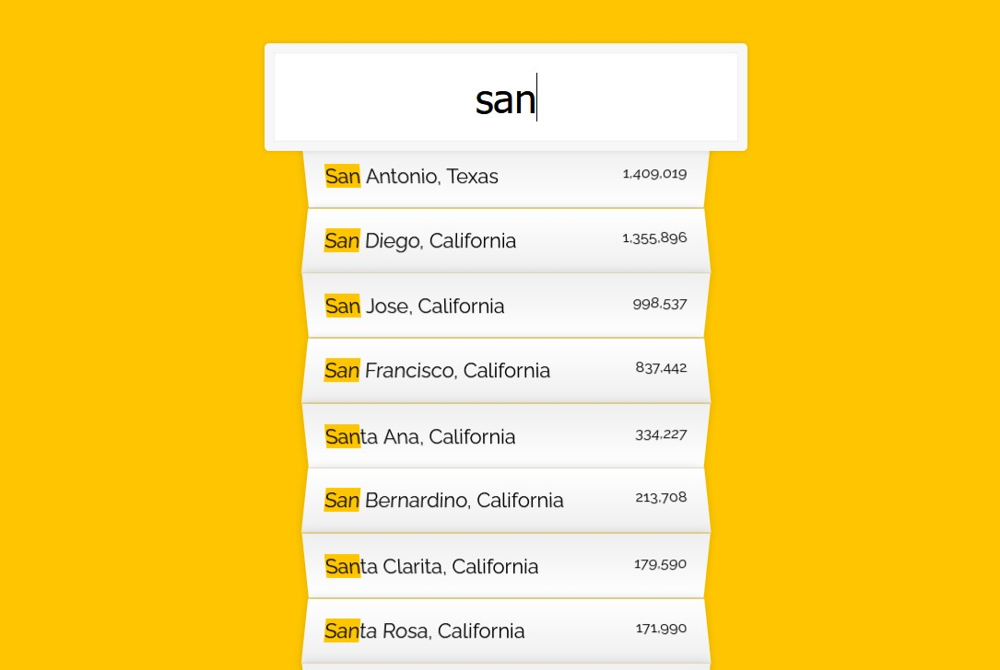

# 06 - Ajax Type Ahead
## :eyes: Introduction



### Main goals

- When a user type in a certain word, a list of cities or states that contain the word wil be displayed. Plus, the key word will be highlighted with yellow background.

### Demo: 👉 [Click me](https://kellychi22.github.io/JavaScript30/06-Type-Ahead/)

## :pushpin: Solution

### My solution

In the example solution, he uses `fetch()` to make http request. Since I just learned about Axios in another course, I used it in my solution. Some notes about the difference between these two methods can be found below.

```javascript
// Get data
const endpoint = 'https://gist.githubusercontent.com/Miserlou/c5cd8364bf9b2420bb29/raw/2bf258763cdddd704f8ffd3ea9a3e81d25e2c6f6/cities.json';

let cities = [];
axios
    .get(endpoint)
    .then(function (response) {
        cities = response.data;
    })
    .catch(function (error) {
        console.log(error);
    });

// functions
function formatData(city) {
    let cityName = city.city.toLowerCase();
    let stateName = city.state.toLowerCase();
    let population = parseInt(city.population).toLocaleString('en-US');
    return { cityName, stateName, population };
}    

function addCity(cityName, stateName, population) {
    return html = `
        <li>
            <span class="name">${cityName}, ${stateName}</span>
            <span class="population">${population}</span>
        </li>
    `;
}

function getCity(cities, input) {
    cities.forEach(city => {
        let { cityName, stateName, population } = formatData(city);
        if (cityName.includes(`${input}`) || stateName.includes(`${input}`)) {
            cityName = cityName.replace(input, `<span class="yellow">${input}</span>`);
            stateName = stateName.replace(input, `<span class="yellow">${input}</span>`);
            addCity(cityName, stateName, population);
            suggestions.innerHTML += html;
        }
    });
}

// Select DOM element 
const search = document.querySelector(".search");
const suggestions = document.querySelector(".suggestions");

// Execution
let timer;
search.addEventListener('keyup', function (e) {
    clearTimeout(timer);
    timer = setTimeout(() => {
        e.preventDefault();
        let inputValue = search.value.toLowerCase();
        if (inputValue.length > 0) {
            suggestions.innerHTML = ``;
            getCity(cities, inputValue);
        }
    }, 1000);
});
```

### Example solution
```javascript
const endpoint = 'https://gist.githubusercontent.com/Miserlou/c5cd8364bf9b2420bb29/raw/2bf258763cdddd704f8ffd3ea9a3e81d25e2c6f6/cities.json';

const cities = [];
fetch(endpoint)
  .then(blob => blob.json())
  .then(data => cities.push(...data));

function findMatches(wordToMatch, cities) {
  return cities.filter(place => {
    const regex = new RegExp(wordToMatch, 'gi');
    return place.city.match(regex) || place.state.match(regex)
  });
}

function numberWithCommas(x) {
  return x.toString().replace(/\B(?=(\d{3})+(?!\d))/g, ',');
}

function displayMatches() {
  const matchArray = findMatches(this.value, cities);
  const html = matchArray.map(place => {
    const regex = new RegExp(this.value, 'gi');
    const cityName = place.city.replace(regex, `<span class="hl">${this.value}</span>`);
    const stateName = place.state.replace(regex, `<span class="hl">${this.value}</span>`);
    return `
      <li>
        <span class="name">${cityName}, ${stateName}</span>
        <span class="population">${numberWithCommas(place.population)}</span>
      </li>
    `;
  }).join('');
  suggestions.innerHTML = html;
}

const searchInput = document.querySelector('.search');
const suggestions = document.querySelector('.suggestions');

searchInput.addEventListener('change', displayMatches);
searchInput.addEventListener('keyup', displayMatches);
```

## :pencil2: Takeaways

### 1. Two ways to make http requests: `fetch()` and Axios

#### A basic overview of Fetch and Axios ([source](https://meticulous.ai/blog/fetch-vs-axios/)): 
The Fetch API is an interface that exposes a method called `fetch()` for making a network request. It is **built into modern browsers** and so no installation is required.

Axios is a **third-party library** that we can add to our project either via a Content Distribution Network or CDN, or install it via a package manager, like npm or yarn. 

Fetch and axios are both **promise-based** HTTP clients. This means that when we use them to make a network request, they return a promise that can either resolve or reject. 

#### Usage in solutions

```javascript
// example solution
const cities = [];
fetch(endpoint)
  .then(blob => blob.json())
  .then(data => cities.push(...data));
```

```javascript
// my solution
let cities = [];
axios
    .get(endpoint)
    .then(function (response) {
        cities = response.data;
    })
    .catch(function (error) {
        console.log(error);
    });
```
In both ways we can get the data that we wanted and an error can be handled if there's one. The biggest different here is that in `fetch()`, the response object doesn't have the JSON form that we need. So we need to call `.json()` method to get the data in JSON form. With Axios, the response data is available as JSON by **default**. 
#### Another note on spread syntax (`...`)
```javascript
// example solution
const cities = [];
fetch(endpoint)
  .then(blob => blob.json())
  .then(data => cities.push(...data));
```
Since here it declares `cities` variable with `const`, if we assign data directly to cities, there will be an error saying reassigning to a const variable. We can change the `const` to `let`, which allows reassigning. But we risk to change the original data during whole process. 

Instead, by using `push()` method, we can push data directly into the array. However, we don't want the data to be pushed as **an individual array** that contains 1000 elements. So before pushing `data` into `cities`, we can use the spread syntax (`...`) so all the elements in `data` array can be expanded in places.

Here's a very simple example:
```javascript
let arr1 = [0, 1, 2];
const arr2 = [3, 4, 5];
arr1.push(arr2)
console.log(arr1)// Array(4) [ 0, 1, 2, (3) […] ]
```
If we push `arr2` directly to `arr1`, it becomes an array of four elements, which the fourth one is an individual array. 

```javascript
arr1.push(...arr2)
console.log(arr1)// Array(6) [ 0, 1, 2, 3, 4, 5 ]
```
If we add spread syntax (`...`) before `arr2`, the result now becomes an array of 6 elements.

### 2. Use `match()` and regular expression to filter strings that contains a certain substring
I am totally new to regular expressions, and it's a very deep subject for sure. So we are not going to look deep into it but see how it's used in the solution.

First here's a simple example of looking for a substring (or a character) in a string. Let's say we want to know if the character "H" is in the `str`. (example from [Heidi-Liu](https://hackmd.io/@Heidi-Liu/regex))
```javascript
let str = 'Hello World';

// solution 1: use a for loop
for (let i = 0; i < str.length - 1; i++) {
  if (str[i] === 'H') {
    return true; 
  }
}

// solution 2：use indexOf() method
if (str.indexOf('H') !== -1) {
  return true;
}

// solution 3：use regular expression
if (new RegExp('H').test(str)) {
  return true;
}
```
A regular expression is an object itself, so it can be created with `new`. And by using `RegExp.test(str)`, it will return `true` if the str contains the regular expression.

#### Usage in example solution

```javascript
function findMatches(wordToMatch, cities) {
  return cities.filter(place => {
    const regex = new RegExp(wordToMatch, 'gi');
    return place.city.match(regex) || place.state.match(regex)
  });
}

function displayMatches() {
  const matchArray = findMatches(this.value, cities);
}

searchInput.addEventListener('change', displayMatches);
```
In the `findMatches` function, a new regular expression is created, which is the variable `wordToMatch`. Since the function `displayMatches` is called on `searchInput` element, the value of variable `wordToMatch` will be anything that the user pass in.

`String.match()` method will return an array of elements that match the regular expression. Thus, we can filter cities that have names containing what the user types in.

The `'gi'` added after the regular expression means search **globally** and **ignore** different cases.

### 3. Separate "search" and "display" into different functions

```javascript
// example solution
function findMatches(wordToMatch, cities) {
  return cities.filter(place => {
    const regex = new RegExp(wordToMatch, 'gi');
    return place.city.match(regex) || place.state.match(regex)
  });
}

function displayMatches() {
  const matchArray = findMatches(this.value, cities);
  const html = matchArray.map(place => {
    // ...omit...
    }).join('');
  suggestions.innerHTML = html;
}
```
When dealing with apps that have searching functions, better way is to deal with the "searching" and "displaying" separately. Not only it's more logical to do so, it can also make your code easier to understand and maintain. 

### 4. Formatting numbers: use commas as thousand separator
In the example solution, he uses a regular expression which I totally can't understand... Honestly I prefer my solution here. The built-in `toLocaleString()` method localizes a number to follow a country-specific number formatting.  
```javascript
// example solution
function numberWithCommas(x) {
  return x.toString().replace(/\B(?=(\d{3})+(?!\d))/g, ',');
}

// my solution
let population = parseInt(city.population).toLocaleString('en-US');
```
More details: [How to Use Comma as Thousand Separator in JavaScript](https://www.codingem.com/comma-thousand-separator-in-javascript/)

### 5. Execute a function after the user finish typing
At first I chose to use an `'input'` event on the search bar, which will fire the function whenever it gets any input. However, I ran into a problem which is, by the time user finishes typing, the displayed results contain actually the results for the first few characters of the word (for example I want to search "san", but it also gives me results for "sa".

So I found the following solution on [this article](https://typeofnan.dev/how-to-execute-a-function-after-the-user-stops-typing-in-javascript/), which uses a timer to track the time after the user has finished typing ('keyup'). Only after one second, the searching and displaying will be fired. 
```javascript
// my solution
let timer;
search.addEventListener('keyup', function (e) {
    clearTimeout(timer);
    timer = setTimeout(() => {
        e.preventDefault();
        let inputValue = search.value.toLowerCase();
        if (inputValue.length > 0) {
            suggestions.innerHTML = ``;
            getCity(cities, inputValue);
        }
    }, 1000);
});
```
## :book: References

* [Axios vs Fetch for beginners](https://meticulous.ai/blog/fetch-vs-axios/)

* [Regular expressions - MDN](https://developer.mozilla.org/en-US/docs/Web/JavaScript/Guide/Regular_Expressions)

* [【學習筆記】JavaScript - Regex 正則表達式](https://hackmd.io/@Heidi-Liu/regex) (Chinese)

* [How to Execute a Function After the User Stops Typing in JavaScript](https://typeofnan.dev/how-to-execute-a-function-after-the-user-stops-typing-in-javascript/)

* [How to Use Comma as Thousand Separator in JavaScript](https://www.codingem.com/comma-thousand-separator-in-javascript/)

* [Check if a String contains a Substring in JavaScript](https://bobbyhadz.com/blog/javascript-check-if-string-contains-substring)
