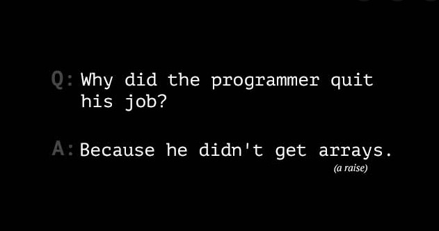

# 07 - Array Cardio Day 2
## :eyes: Introduction

### Main goals

- Strengthen your JavaScript skills by using those array methods!

### Demo: 👉 [Click me](https://kellychi22.github.io/JavaScript30/04-Array-Cardio-Day-1/)

## :pencil2: Takeaways

### 1. `Array.prototype.some()`

The `some()` method tests whether **at least one** element in the array passes the test implemented by the provided function. It returns true if it finds an element returns true for the provided function. Otherwise it returns false. 

Note that it doesn't modify the array. 
```javascript
const people = [
      { name: 'Wes', year: 1988 },
      { name: 'Kait', year: 1986 },
      { name: 'Irv', year: 1970 },
      { name: 'Lux', year: 2015 }
    ];
```
Here we have an array of some people's information. Let's say we want to check if there's at least one person in the array that is 19 or older. 

First we get the current year from a new Date object, so we can calculate the age of each person. If a person's age is 19 or greater than 19, the function will return true. Since there are three people that are over 19 in the array, `isAdult` is `true`.
```javascript
const isAdult = people.some(person => {
      const currentYear = (new Date()).getFullYear();
      if (currentYear - person.year >= 19) {
        return true;
      }
    });

console.log(isAdult); // true
```
The code can be simplified into one line:
```javascript
const isAdult = people.some(person => (new Date()).getFullYear() - person.year >= 19);
```
### 2. `Array.prototype.every()`
Very similar to `some()` method, but `every()` method only returns `true` if **all elements** in the array pass the test implemented by the provided function. It returns a Boolean value. 

Let's say this time we want to check if every person in the array are 19 or older. In this array, there's one person that is under 19, so `isAllAdult` will be `false`.
```javascript
const isAllAdult = people.every(person => {
      const currentYear = (new Date()).getFullYear();
      if (currentYear - person.year >= 19) {
        return true;
      }
    });
console.log(isAllAdult); // false
```
### 3. `Array.prototype.find()`

The `find()` method returns **the first element** in the provided array that satisfies the provided testing function. If no values satisfy the testing function, `undefined` is returned. 

```javascript
const comments = [
      { text: 'Love this!', id: 523423 },
      { text: 'Super good', id: 823423 },
      { text: 'You are the best', id: 2039842 },
      { text: 'Ramen is my fav food ever', id: 123523 },
      { text: 'Nice Nice Nice!', id: 542328 }
    ];
```
Here we have an array of different comments labeled with ids. Let's say we want to find the comment whose id is `823423`. The method will return the first element that matches the statement, which is the second comment 'Super good'. 
```javascript
const comment = comments.find(comment => {
      if (comment.id === 823423) {
        return true;
      }
    });
console.log(comment); // Object { text: "Super good", id: 823423 }
```
The code can be simplified into one line:
```javascript
const comment = comments.find(comment => comment.id === 823423);
```
The `find()` method is very similar to `filter()`, however, `filter()` returns **an ARRAY of ALL elements** that matches the statement. While `find()` only returns the **first ELEMENT** that matches.

If using `filter()` in this situation, we will get an array containing one single element.
```javascript
const comment_filter = comments.filter(comment => {
      if (comment.id === 823423) {
        return true;
      }
    });
console.log(comment_filter); 
// Array [ { text: "Super good", id: 823423 } ]
```
### 4. `Array.prototype.findIndex()`
The `findIndex()` method returns the index of the **first element** in an array that satisfies the provided testing function. If no elements satisfy the testing function, `-1` is returned. 

Let's say we want to find the index of the comment whose id is `823423`, then delete it from the comments. By using `findIndex()` method, we now know the index of the comment is `1`.
```javascript
const index = comments.findIndex(comment => comment.id === 823423);
console.log(index); // 1
```
There are two ways to delete the comment from the array. The first way is by using `splice()`.
```javascript
comments.splice(1, 1);
console.log(comments); // Array(4) [ {…}, {…}, {…}, {…} 
```
However, the `splice()` will mutate the original array. If we don't want to mutate the original array, we can use `slice()` instead. Don't forget to use the `spread(...)` syntax to spread all the elements in the array.
```javascript
const newComments = [
      ...comments.slice(0, index),
      ...comments.slice(index)
    ];
console.log(newComments) // Array(4) [ {…}, {…}, {…}, {…} ]
```

## :book: References

* [Array.prototype.some() - MDN](https://developer.mozilla.org/en-US/docs/Web/JavaScript/Reference/Global_Objects/Array/some)
*  [Array.prototype.every() - MDN](https://developer.mozilla.org/en-US/docs/Web/JavaScript/Reference/Global_Objects/Array/every)
*  [Array.prototype.find() - MDN](https://developer.mozilla.org/en-US/docs/Web/JavaScript/Reference/Global_Objects/Array/find)
*  [Array.prototype.findIndex() - MDN](https://developer.mozilla.org/en-US/docs/Web/JavaScript/Reference/Global_Objects/Array/findIndex)