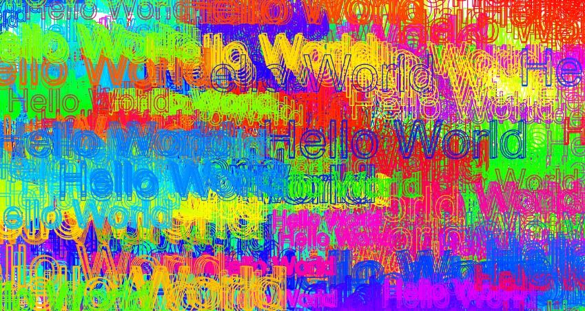

# 07 - Fun with HTML5 Canvas
## :eyes: Introduction



### Main goals

- Just like Windows Paint, when the user draws on the canvas with the mouse, it creates colorful lines and texts.

### Demo: 👉 [Click me]()

## :pushpin: Solution

### My solution

Instead of drawing simple lines and updating the line width, I used `ctx.strokeText` to create text when user draws on the canvas. Also, the font size will change between 50 to 150 pixels.

```javascript
function draw(e) {
    ctx.font = `${fontSize}px sans-serif`;
    ctx.strokeText("Hello World", lastX, lastY);
    
    if (fontSize >= 150 || fontSize <= 50) {
        direction = !direction;
    }

    if (direction) {
        fontSize++;
    } else {
        fontSize--;
    }
}
```

### Example solution
```javascript
const canvas = document.querySelector('#draw');
const ctx = canvas.getContext('2d');
canvas.width = window.innerWidth;
canvas.height = window.innerHeight;
ctx.strokeStyle = '#BADA55';
ctx.lineJoin = 'round';
ctx.lineCap = 'round';
ctx.lineWidth = 100;
// ctx.globalCompositeOperation = 'multiply';

let isDrawing = false;
let lastX = 0;
let lastY = 0;
let hue = 0;
let direction = true;

function draw(e) {
  if (!isDrawing) return; 
  // stop the fn from running when they are not moused down
  console.log(e);
  ctx.strokeStyle = `hsl(${hue}, 100%, 50%)`;
  ctx.beginPath();
  ctx.moveTo(lastX, lastY);
  ctx.lineTo(e.offsetX, e.offsetY);
  ctx.stroke();
  [lastX, lastY] = [e.offsetX, e.offsetY];
  hue++;
  if (hue >= 360) {
    hue = 0;
  }
  if (ctx.lineWidth >= 100 || ctx.lineWidth <= 1) {
    direction = !direction;
  }

  if(direction) {
    ctx.lineWidth++;
  } else {
    ctx.lineWidth--;
  }

}

canvas.addEventListener('mousedown', (e) => {
  isDrawing = true;
  [lastX, lastY] = [e.offsetX, e.offsetY];
});


canvas.addEventListener('mousemove', draw);
canvas.addEventListener('mouseup', () => isDrawing = false);
canvas.addEventListener('mouseout', () => isDrawing = false);

```

## :pencil2: Takeaways

### 1. Basic settings for a html canvas
The Canvas API provides a means for drawing graphics via JavaScript and the HTML `<canvas>` element. Among other things, it can be used for animation, game graphics, data visualization, photo manipulation, and real-time video processing. (MDN)

When starting a canvas, there must be a `<canvas>` element in the html.
```html
<canvas id="draw" width="800" height="800"></canvas>
```
Then, in JavaScript, we can select the element and give it some basic settings. Such as the width and height, or `getContext()`, which defines a 2D drawing interface of the canvas. For 2D interface, there are several settings we can start with. `strokeStyle` for color, `lineJoin` for the shape used to join two lines, `lineCap` for the shape of the end of lines.
```javascript
const canvas = document.querySelector('#draw');
const ctx = canvas.getContext('2d');
// size of the canvas
canvas.width = window.innerWidth;
canvas.height = window.innerHeight;
// settings for lines
ctx.strokeStyle = '#BADA55';
ctx.lineJoin = 'round';
ctx.lineCap = 'round';
ctx.lineWidth = 100;
```
### 2. How to draw a line in a canvas
When we want to create a new path, first we have to call `beginPath()` method to initiate it. Then, use `moveTo(x, y)` to define to starting point and `lineTo(x, y)` for the ending point. Don't forget ti call `stroke()` method at the end, so the path is outlined. Also, we need to update `lastX` and `lastY` or the path will always start from the same place.
```javascript
function draw(e) {
    ctx.beginPath();
    // start from
    ctx.moveTo(lastX, lastY);
    // go to
    ctx.lineTo(e.offsetX, e.offsetY);
    ctx.stroke();
    //// need to update X and Y or it always start from the same place
    [lastX, lastY] = [e.offsetX, e.offsetY];
}
```

### 3. Call `draw()` function only on mouse down and mouse move
We don't want to user to draw whenever he moves his mouse. Only when he clicks and holds the mouse that he can draw things on the canvas.

We can define a variable `isDrawing` to track the situation. When `isDrawing` is `false`, the `draw()` function won't run. Only when a `mousedown` event is triggered, `isDrawing` will be set to `true`. Whenever the mouse is up or out of the canvas (`mouseout` event), `isDrawing` will be set back to `false`, so `draw()` function will stop running.
```javascript
let isDrawing = false;

function draw(e) {
  if (!isDrawing) return;
}

canvas.addEventListener('mousedown', () => isDrawing = true);
canvas.addEventListener('mousemove', draw);
canvas.addEventListener('mouseup', () => isDrawing = false);
canvas.addEventListener('mouseout', () => isDrawing = false);
```
### 4. Only start the line at where the user clicks on
However, we don't want the line to continue where we left off last time, because it becomes a long continuous line. To stop this, we need to update `lastX` and `lastY` to the current mouse position when the `mousedown` event is triggered.
```javascript
canvas.addEventListener('mousedown', (e) => {
  isDrawing = true;
  [lastX, lastY] = [e.offsetX, e.offsetY];
});
```

### 5. Change the color of the line while drawing
For updating the color of the line, hsl color scheme is a good solution, since the color is mainly defined by the hue value. 

We can define a variable `hue` for storting the hue value. As long as the `draw()` function is running, the hue value will continue updating. Besides, for not exploding the hue value, when it hits 360 (the maximum value for hue), we will set it back to 0.
```javascript
let hue = 0;

function draw(e) {
    ctx.stroke();
    ctx.strokeStyle = `hsl(${hue}, 100%, 50%)`;
    hue++;
    if (hue >= 360) {
        hue = 0;
    }
}
```

### 6. Change the line width too while drawing
Like hue value, we can update the line width as the `draw()` function runs.
```javascript
function draw(e) {
    ctx.stroke();
    ctx.lineWidth++;
}
```
However, the line width wil eventually becomes too big and fill the whole screen. To solve this, we can create a variable called `direction`. When `direction` is `true`, the line width grows, on the other hand, when `direction` is set to `false`, the line width decreases. 

In the example solution, the line width will change between the range of 100 and 1.
```javascript
let direction = true;

function draw(e) {
    if (ctx.lineWidth >= 100 || ctx.lineWidth <= 1) {
        direction = !direction; // switch between true and false
    }

    if(direction) {
        ctx.lineWidth++;
    } else {
        ctx.lineWidth--;
    }
}
```

### 7. Optional: Draw texts instead of simple lines
Besides drawing lines on the canvas, we can also draw texts. We need to set the font first, especially the font size (the syntax is same as the CSS font specifier). Then we can call `strokeText()` while passing in a string and the x, y position.
```javascript
function draw(e) {
    ctx.font = `${fontSize}px sans-serif`;
    ctx.strokeText("Hello World", lastX, lastY);
}
```

### 8. Optional: Update font size instead of line width while drawing
Instead of updating the line width, I want to update the font size while drawing. (If updating the line width, the text will be very difficult to see) For doing so, I create a variable to store the fontSize, and update it while `draw()` function is running. 

Just like how the line width changes in the example solution, here the font size will change between the range of 50 and 150.
```javascript
let fontSize = 60;

function draw(e) {
    ctx.font = `${fontSize}px sans-serif`;
    ctx.strokeText("Hello World", lastX, lastY);

    if (fontSize >= 150 || fontSize <= 50) {
        direction = !direction;
    }

    if (direction) {
        fontSize++;
    } else {
        fontSize--;
    }
}
```

## :book: References

* [Canvas API - MDN](https://developer.mozilla.org/en-US/docs/Web/API/Canvas_API)
* [CanvasRenderingContext2D.strokeText() - MDN](https://developer.mozilla.org/en-US/docs/Web/API/CanvasRenderingContext2D/strokeText)
* [Colors HSL - w3schools](https://www.w3schools.com/colors/colors_hsl.asp)
