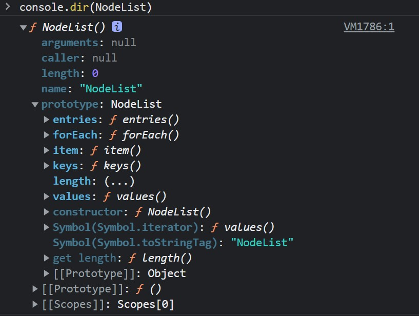
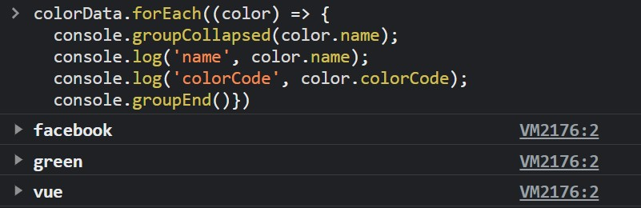

# 09 - Dev Tools Domination
## :eyes: Introduction

### Main goals

- Master Dev Tools to make your developer life a bit easier!

### Demo: 👉 [Click me]()

## :pencil2: Takeaways

### 1. DOM change breakpoints
Use a DOM change breakpoint when you want to pause on the code that changes a DOM node or its children.

Click on the element and hover over **Break on**, then select **Subtree modifications**, **Attribute modifications**, or **Node removal**.

* **Subtree modifications**: Triggered when a child of the currently-selected node is removed or added, or the contents of a child are changed. Not triggered on child node attribute changes, or on any changes to the currently-selected node.
* **Attributes modifications**: Triggered when an attribute is added or removed on the currently-selected node, or when an attribute value changes.
* **Node Removal**: Triggered when the currently-selected node is removed.

### 2. `console.log()`
The console.log() that we all know and love.

### 3. `console.log(%s, value)`
You can change the `%s` to assigned value.

### 4. `console.log(%c, CSS-style)`

You can style the string with CSS syntax.

### 5. `console.warn()`

It gives you a warning style output.

### 6. `console.error()`

It gives you an error style output.

### 7. `console.info()`

It adds a little 'i' icon next to the output. (For whatever reason, the icon doesn't appear in Chrome devtools, so this is the output in Firefox devtools.)

### 8. `console.assert (statement, 'wrong msg')`

If the statement is false, the wrong message will be printed. If it's true, nothing will happen.

### 9. `console.clear()`

You can clear all the messages in the console.

### 10. `console.dir()`

You can see all the attributes and methods of the selected object.

### 11. `console.group()` and `console.groupEnd()`

Group related logging messages together to make the output more readable.

You can use `console.groupCollapsed()` to set the default toggle to be closed.

### 12. `console.count()`

It counts how many times an element has appeared until now.

### 13. `console.time()` and `console.timeEnd()`

You can track how much time does a black of code takes.

### 14. `console.table()`

Turn the output into table format to see the data easier.

## :book: References

* [Pause your code with breakpoints - Chrome Developers](https://developer.chrome.com/docs/devtools/javascript/breakpoints/)