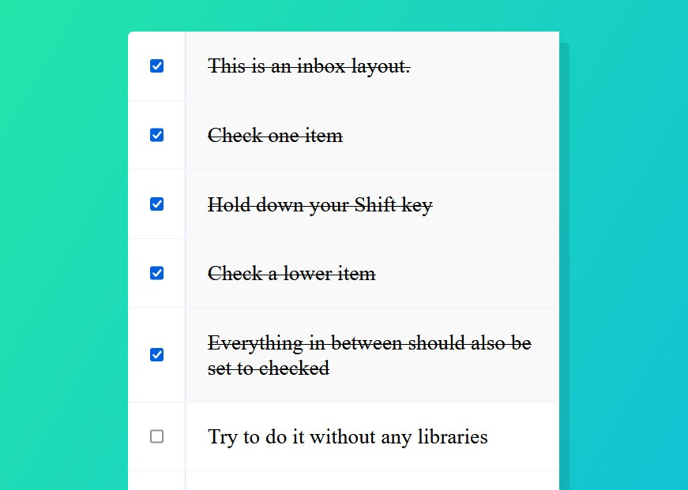

# 10 - Hold Shift to Check Multiple Checkboxes
## :eyes: Introduction



### Main goals

- When a user clicks a checkbox, holds Shift, and then clicks another checkbox a few rows down, all the checkboxes inbetween those two checkboxes should be checked.

### Demo: 👉 [Click me]() 

## :pushpin: Solution

### My solution

Besides being able to check multiple checkboxes inbetween, I also made it possible when unchecking. 

Also, in the example version, there's a small bug when you hold shift and click the same checkbox. If you do that, all checkboxes will be checked. To prevent this, I added the first line of the function to stop the function if the user clicks on the same checkbox again.

```javascript
function handleCheck(e) {
    // Avoid checking all checkboxes after holding and clicking on the same checkbox again.
    if (this === lastChecked) return;

    let inBetween = false;
    // For checking multiple checkboxes inbetween
    if (e.shiftKey && this.checked) {
        checkboxes.forEach(checkbox => {
            if (checkbox === this || checkbox === lastChecked) {
                inBetween = !inBetween;
            }
            if (inBetween) {
                checkbox.checked = true;
            }
        });

    // For unchecking multiple checkboxes inbetween
    } else if (e.shiftKey && !this.checked) {
        checkboxes.forEach(checkbox => {
            if (checkbox === this || checkbox === lastChecked) {
                inBetween = !inBetween;
            }
            if (inBetween) {
                checkbox.checked = false;
            }
        });
    }
    lastChecked = this;
}
```

### Example solution
```javascript
const checkboxes = document.querySelectorAll('.inbox input[type="checkbox"]');

let lastChecked;

function handleCheck(e) {
  let inBetween = false;
  if (e.shiftKey && this.checked) {
    checkboxes.forEach(checkbox => {
      if (checkbox === this || checkbox === lastChecked) {
        inBetween = !inBetween;
        console.log('Starting to check them in between!');
      }
      if (inBetween) {
        checkbox.checked = true;
      }
    });
  }
  lastChecked = this;
}

checkboxes.forEach(checkbox => checkbox.addEventListener('click', handleCheck));
```

## :pencil2: Takeaways

### 1. Track the last checked checkbox
In order to know where does the range start and end, we need to track which checkbox is the one we last checked. To do so, we can create a variable called `lastChecked`, and set `lastChecked` to `this`(which is the checkbox that fired the `click` event.) at the ned of the function.
```javascript
let lastChecked;

function handleCheck(e) {
  ...
  lastChecked = this;
}

checkboxes.forEach(checkbox => checkbox.addEventListener('click', handleCheck));
```

### 2. Continue only if `Shift` key is pressed and the checkbox is checked

Since we want a series of checkboxes only be checked when the user holds the `Shift` key and then check another checkbox, we can set a condition to verify it. The `event.shiftKey` is a read-only property and it's a boolean value that indicates if the shift key was pressed (true) or not (false) when the event occurred. 

Also, the reason why we have to verify if `this` is checked is that we want the following code to run only when the user clicks on a not-yet-clicked checkbox.
```javascript
function handleCheck(e) {
  
  if (e.shiftKey && this.checked) {
    // do something
  }
  lastChecked = this;
}
```

### 3. Use a flag variable to control the checked state

There are definitely other ways to achieve the same goal, like relying on the order of the dom or using parent elements etc. However, this way we get very dependant on the html structure, if someone comes changes some html, everything will just break. 

Therefore, using a flag variable can be a better solution. (learn more about flag variables: [What is a flag variable? - Stackoverflow](https://stackoverflow.com/questions/17402125/what-is-a-flag-variable)) 

First we create a variable called `inBetween` and set it to `false`. 

```javascript
function handleCheck(e) {

  let inBetween = false;
```
When the user holds the Shift key and the checkbox is being checked, we can loop over all the checkboxes. At the beginning, `inbetween` is set to `false`, thus `checkbox.checked = true` won't be fired. 

But, as we meet the checkbox which is either the current `this` checkbox or the `lastChecked` checkbox, `inBetween` will be set to the opposite. So, for the following few checkboxes, the checked state will be set to `true`. Then, when we meet the other checkbox which is either the `this` or the `lastChecked`, `inBetween` will be set to the opposite again, which stops `checkbox.checked = true` from running.
```javascript

checkboxes.forEach(checkbox => {

    if (checkbox === this || checkbox === lastChecked) {
        inBetween = !inBetween;
        console.log('Starting to check them in between!');
    }
    if (inBetween) {
        checkbox.checked = true;
    }
});

```

### 4. Optional: Hold shift and uncheck a few checkboxes

In the example, we can only check a range of checkboxes at once, but we still have to uncheck them one by one. To be able to uncheck several checkboxes at once, we only need to modify a bit the current code by adding:
```javascript
// For unchecking multiple checkboxes inbetween
    } else if (e.shiftKey && !this.checked) {
        checkboxes.forEach(checkbox => {
            if (checkbox === this || checkbox === lastChecked) {
                inBetween = !inBetween;
            }
            if (inBetween) {
                checkbox.checked = false;
            }
        });
    }
```
First, it will fire when the user holds Shift key and the current `this` is also unchecked. Then, we change `checkbox.checked` to `false`, so all the checkboxes inbetween will be set to unchecked. 

### 5. Optional: Avoid checking all the boxes if clicks on the same checkbox

There's this small problem in the example solution: when you hold shift and click the same checkbox, all checkboxes will be checked! This isn't what the user intends to do.  

To prevent this, I can verify if the current `this` checkbox is the same as the last checked one, if yes, the function will just stop running.
```javascript
function handleCheck(e) {
    if (this === lastChecked) return;
}
```

## :book: References

* [KeyboardEvent.shiftKey - MDN](https://developer.mozilla.org/en-US/docs/Web/API/KeyboardEvent/shiftKey)
* [What is a flag variable? - Stackoverflow](https://stackoverflow.com/questions/17402125/what-is-a-flag-variable)