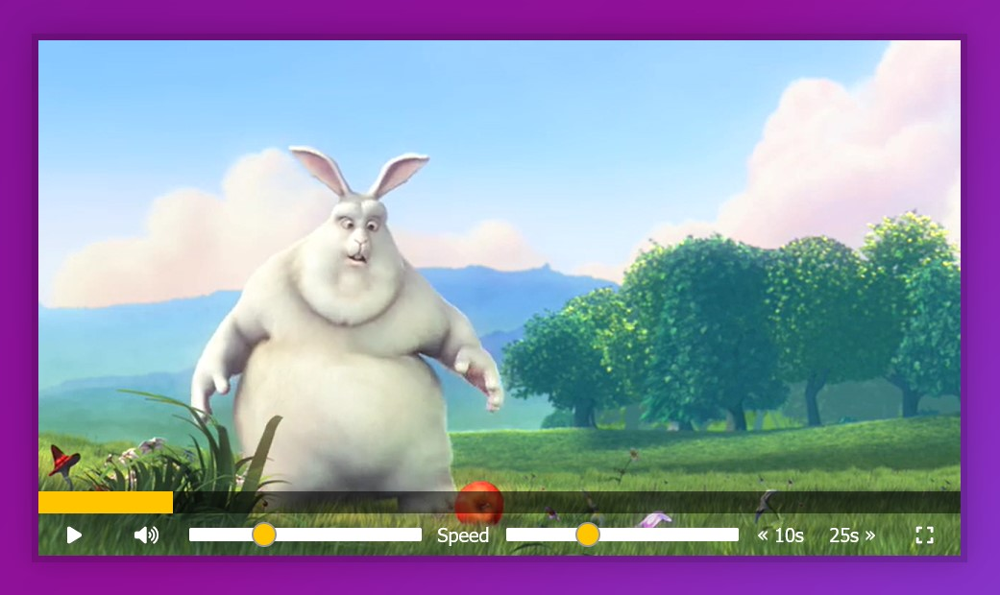

# 11 - Custom HTML5 Video Player
## :eyes: Introduction



### Main goals

- Customized HTML5 video player, with sliders for volume and speed, as well as fast forward and rewind buttons.

### Demo: 👉 [Click me](https://kellychi22.github.io/JavaScript30/11-Custom-Video-Player/) 

## :pushpin: Solution

### My solution

Besides the basic functions in the example solution, I added a button for toggling fullscreen mode and another for muting the video.  

```javascript
// * bonus
function toggleFullscreen() {
    if (!document.fullscreenElement) {
        player.requestFullscreen();
        fullscreenButton.innerHTML = `<i class="fa-solid fa-compress"></i>`;
    } else {
        document.exitFullscreen();
        fullscreenButton.innerHTML = `<i class="fa-solid fa-expand"></i>`;
    }
}

function toggleMute() {
    if (video.volume !== 0) {
        video.volume = 0;
        muteButton.innerHTML = `<i class="fa-solid fa-volume-xmark"></i>`;
    } else {
        video.volume = ranges[0].value;
        muteButton.innerHTML = `<i class="fa-solid fa-volume-high"></i>`;
    }
}
```

### Example solution
```javascript
/* Get Our Elements */
const player = document.querySelector('.player');
const video = player.querySelector('.viewer');
const progress = player.querySelector('.progress');
const progressBar = player.querySelector('.progress__filled');
const toggle = player.querySelector('.toggle');
const skipButtons = player.querySelectorAll('[data-skip]');
const ranges = player.querySelectorAll('.player__slider');

/* Build out functions */
function togglePlay() {
  const method = video.paused ? 'play' : 'pause';
  video[method]();
}

function updateButton() {
  const icon = this.paused ? '►' : '❚ ❚';
  console.log(icon);
  toggle.textContent = icon;
}

function skip() {
 video.currentTime += parseFloat(this.dataset.skip);
}

function handleRangeUpdate() {
  video[this.name] = this.value;
}

function handleProgress() {
  const percent = (video.currentTime / video.duration) * 100;
  progressBar.style.flexBasis = `${percent}%`;
}

function scrub(e) {
  const scrubTime = (e.offsetX / progress.offsetWidth) * video.duration;
  video.currentTime = scrubTime;
}

/* Hook up the event listeners */
video.addEventListener('click', togglePlay);
video.addEventListener('play', updateButton);
video.addEventListener('pause', updateButton);
video.addEventListener('timeupdate', handleProgress);

toggle.addEventListener('click', togglePlay);
skipButtons.forEach(button => button.addEventListener('click', skip));
ranges.forEach(range => range.addEventListener('change', handleRangeUpdate));
ranges.forEach(range => range.addEventListener('mousemove', handleRangeUpdate));

let mousedown = false;
progress.addEventListener('click', scrub);
progress.addEventListener('mousemove', (e) => mousedown && scrub(e));
progress.addEventListener('mousedown', () => mousedown = true);
progress.addEventListener('mouseup', () => mousedown = false);

```

## :pencil2: Takeaways

### 1. Basics of the `<video>` element

Same as the `<canvas>` element, `<video>` element also comes with a lot of particular properties, methods and events. Here I list out those that are used in the tutorial.

#### Properties

* `video.paused`: returns true if the video is paused, returns false when not paused. (**Note that there's NO `video.play` property.**) 
* `video.currentTime`: specifies the current playback time in seconds. Changing the value of currentTime seeks the media to the new time. 
* `video.duration`: indicates the length of the element's media in seconds. 
* `video.volume`: sets the volume at which the media will be played. The value must fall between 0 and 1, where 0 is effectively muted and 1 is the loudest possible value. 
* `video.playbackRate`: sets the rate at which the media is being played back. The default value `1.0` is "normal speed," values lower than 1.0 make the media play slower than normal, higher values make it play faster.

#### Methods

* `video.play()`: attempts to begin playback of the media.
* `video.pause()`: pauses playback of the media, if the media is already in a paused state this method will have no effect. 

#### Events

* `play`: is fired when the `paused` property is changed from `true` to `false`.
* `pause`: The event is sent once the `pause()` method returns and after the media element's `paused` property has been changed to `true`.
*  `timeupdate`: is fired when the time indicated by the `currentTime` attribute has been updated.

### 2. Separate `togglePlay()` function and `updateButton()`

It's better to separate the two functions because the user can pause the video in different ways other than clicking on the pause button or on the video. (for example they have some plug-ins or the video pauses when a pop-up opens)

Thus, we will listen when the video is played or paused, and update the button when either event is fired. 

```javascript
function togglePlay() {
    if (video.paused) {
        video.play();
    } else {
        video.pause();
    }
}

function updateButton() {
    const icon =  this.paused ? '►' : '❚ ❚';
    toggle.innerHTML = icon;
}

video.addEventListener('play', updateButton);
video.addEventListener('pause', updateButton);
```
### 3. Use data attributes for skipping buttons
By using the customized attribute `data-skip`, we can actually add it on any element we want. Also it's very easy to access the value by using `this.dataset`. Note that most information in dataset is in String format, so we need to convert it to number first. 
```html
<button data-skip="-10" class="player__button">« 10s</button>
<button data-skip="25" class="player__button">25s »</button>
```
```javascript
const skipButtons = player.querySelectorAll('[data-skip]');

function skip() {
    video.currentTime += parseFloat(this.dataset.skip);
}

skipButtons.forEach(button => button.addEventListener('click', skip));
```

### 4. Update the width of progress bar by using flex-basis
Since the progress bar is already a flex item, we can control its width by changing the flex-basis property. All we need to do is to calculate the percentage by dividing the current time by the duration.

Then, we hook the event listener to the video. Whenever the playback time is updated, the width of progress bar will be updated too.
```javascript
function handleProgress() {
    const percent = (video.currentTime / video.duration) * 100;
    progressBar.style.flexBasis = `${percent}%`;
}

video.addEventListener('timeupdate', handleProgress);
```

### 5. Click and drag on the progress bar to update playback time
We want the user to be able to update the playback time when they click or drag on the progress bar. For doing so, we need to calculate the correct time by the position of the mouse and also listen to mousedown events.   

The `offsetX` property tells how far your mouse is away from the edge of the target element. And the `offsetWidth` property returns the layout width of the element. By diving the previous to the second then multiplying it by the video duration, we can know what the playback time is at the exact position.
```javascript
function scrub(e) {
    // offsetX => tell you how much into the progress bar
    const scrubTime = (e.offsetX / progress.offsetWidth) * video.duration;
    video.currentTime = scrubTime;
}
```
Besides, we can create a flag variable to track if the user is clicking on the mouse because we only want the playback time to update when the user is actively doing it. 
```javascript
let mousedown = false;
progress.addEventListener('click', scrub);
progress.addEventListener('mousemove', () => {
    if (mousedown) {
        scrub();
    }
});

progress.addEventListener('mousedown', () => mousedown = true);
progress.addEventListener('mouseup', () => mousedown = false);
```
Another way to write it is to use the logical AND expression `&&` (short-circuit evaluation). If the left side of the expression is evaluated as `falsy`, the function will never be called. On the other hand, the function will run normally.
```javascript

progress.addEventListener('mousemove', (e) => mousedown && scrub(e));
```

### 6. Bonus: Toggle fullscreen mode using Fullscreen API
Browsers provide Fullscreen API to make toggling fullscreen mode evey easy. It can be used on any element including video elements. 

#### Simple usage
* `Document.fullscreenElement`: this property tells you the element that's currently being displayed in fullscreen mode. It returns `null` if fullscreen mode is not currently in use. 
* `Element.requestFullscreen()`: this method places the specified element (and its descendants) into fullscreen mode, removing all of the browser's UI elements as well as all other applications from the screen.  
* `Document.exitFullscreen()`: this method requests the element on fullscreen mode to be taken out of fullscreen mode.

#### Usage in my solution
```javascript
function toggleFullscreen() {
    if (!document.fullscreenElement) {
        player.requestFullscreen();
        fullscreenButton.innerHTML = `<i class="fa-solid fa-compress"></i>`;
    } else {
        document.exitFullscreen();
        fullscreenButton.innerHTML = `<i class="fa-solid fa-expand"></i>`;
    }
}

fullscreenButton.addEventListener('click', toggleFullscreen);
```

### 7. Bonus: Toggle mute mode
```javascript
function toggleMute() {
    if (video.volume !== 0) {
        video.volume = 0;
        muteButton.innerHTML = `<i class="fa-solid fa-volume-xmark"></i>`;
    } else {
        video.volume = ranges[0].value;
        muteButton.innerHTML = `<i class="fa-solid fa-volume-high"></i>`;
    }
}

muteButton.addEventListener('click', toggleMute);
```

## :book: References

* [HTMLMediaElement - MDN](https://developer.mozilla.org/en-US/docs/Web/API/HTMLMediaElement)
* [MouseEvent.offsetX - MDN](https://developer.mozilla.org/en-US/docs/Web/API/MouseEvent/offsetX)
* [HTMLElement.offsetWidth - MDN](https://developer.mozilla.org/en-US/docs/Web/API/HTMLElement/offsetWidth)
* [Logical AND (&&) - MDN](https://developer.mozilla.org/en-US/docs/Web/JavaScript/Reference/Operators/Logical_AND)
* [Fullscreen API - MDN](https://developer.mozilla.org/en-US/docs/Web/API/Fullscreen_API)