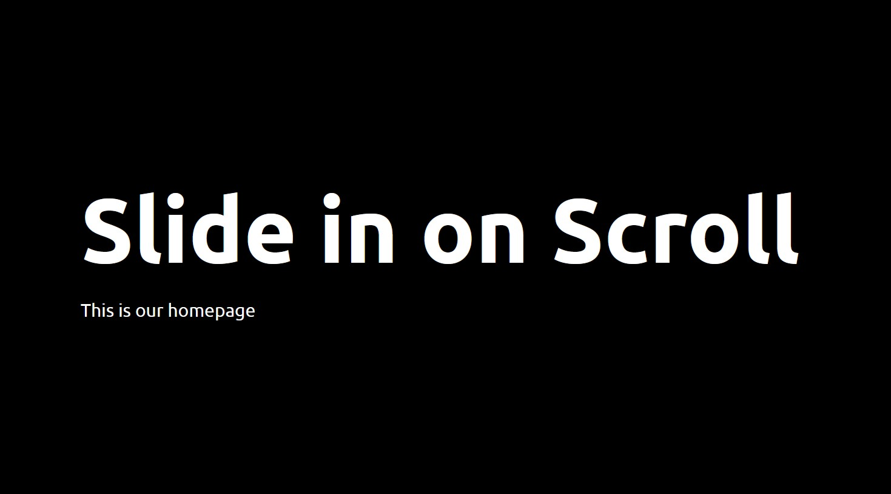

# 13 - Slide in on Scroll
## :eyes: Introduction



### Main goals

- The images will only appear when the user scrolls down/up the page. (Simple lazing loading!) 

### Demo: 👉 [Click me](https://kellychi22.github.io/JavaScript30/13-Slide-in-on-Scroll/) 

## :pushpin: Solution
### My solution
My solution is entirely different from the example, first is because there's a much easier approach available now, second is that the layout is too outdated and far from realistic webpages.  

My solution mainly comes from [this video](https://www.youtube.com/watch?v=T33NN_pPeNI&t=14s) from Fireship, which uses the **Intersection Observer API** (supported in all major browsers nowadays) to achieve lazy-loading.
#### CSS
```css
.slide-in {
    opacity: 0;
    transition: all .5s;
}

.slide-in.from-left {
    transform: translateX(-30%) scale(0.95);
}

.slide-in.from-right {
    transform: translateX(30%) scale(0.95);
}

.slide-in.active {
    opacity: 1;
    transform: translateX(0%) scale(1);
}
```

#### JavaScript
```javascript
const observer = new IntersectionObserver(entries => {
    entries.forEach(entry => {
        console.log(entry);
        if (entry.isIntersecting) {
            entry.target.classList.add('active');
        } else {
            entry.target.classList.remove('active');
        }
    });
});

const slideInImages = document.querySelectorAll('.slide-in');
slideInImages.forEach(image => observer.observe(image));
```
### Example solution
* The demo for example solution is here 👉 **[Click me](https://kellychi22.github.io/JavaScript30/13-Slide-in-on-Scroll/example-solution-demo/)** 
  
Compared to the solution using the Intersection Observer API, this approach requires using a debouncing function and more math (thus is more complicated, haha). But there are still a few things to learn from.

```javascript
function debounce(func, wait = 20, immediate = true) {
    var timeout;
    return function() {
    var context = this, args = arguments;
    var later = function() {
        timeout = null;
        if (!immediate) func.apply(context, args);
    };
    var callNow = immediate && !timeout;
    clearTimeout(timeout);
    timeout = setTimeout(later, wait);
    if (callNow) func.apply(context, args);
    };
};

const sliderImages = document.querySelectorAll('.slide-in');

function checkSlide() {
    sliderImages.forEach(sliderImage => {
        // half way through the image
        const slideInAt = (window.scrollY + window.innerHeight) - sliderImage.height / 2;
        // bottom of the image
        const imageBottom = sliderImage.offsetTop + sliderImage.height;
        const isHalfShown = slideInAt > sliderImage.offsetTop;
        const isNotScrolledPast = window.scrollY < imageBottom;
        if (isHalfShown && isNotScrolledPast) {
            sliderImage.classList.add('active');
        } else {
            sliderImage.classList.remove('active');
        }
    });
}

window.addEventListener('scroll', debounce(checkSlide));
```

## :pencil2: Takeaways
### 1. Using debounce function to avoid performance issues
In the example solution, we are listening to the `'scroll'` event of the window. However, this event fires EVERY TIME when the position of the window changes. This can cause serious performance issues as there are just too many events being fired in a short period of time.

To avoid this, we can use a debounce function to reduce the amount of the scroll events. 

#### What is debouncing?

In [this article](https://blog.bitsrc.io/what-is-debounce-in-javascript-a2b8e6157a5a), the author defines **debouncing** as:

> a programming pattern or a technique to restrict the calling of a time-consuming function frequently, by delaying the execution of the function until a specified time to avoid unnecessary CPU cycles, and API calls and improve performance.

In short, the debounce function forces a function to wait a certain amount of time before running again.

Debouncing can be applied in implementing suggestive text, where we wait for the user to stop typing for a few seconds before suggesting the text. Another example is for content-loading webpages like Facebook and Twitter where the user keeps on scrolling.

#### How to use debouncing?

Here's a simpler example from [this article](https://blog.webdevsimplified.com/2022-03/debounce-vs-throttle/).

```javascript
function debounce(cb, delay = 250) {
  let timeout

  return (...args) => {
    clearTimeout(timeout)
    timeout = setTimeout(() => {
      cb(...args)
    }, delay)
  }
}
```

This debounce function takes in a callback function, `cb`, as the first parameter and a `delay` as the second parameter. We are then returning a new function at the end of the debounce function which acts as a wrapper for our callback. **This wrapper will ensure that the callback is only called after the delay that is passed into the debounce function.** 

Lastly, we clear any existing timeout every time we call debounce which ensures that if we call debounce before the delay has finished then **it will restart the timer.**

In the example solution, the debounce function will wait 20ms before registering an event, which will reduce browser overhead.
```javascript
window.addEventListener('scroll', debounce(checkSlide));
```

#### What is throttling?
Another way to avoid performance issues is to use **throttling**, which is used to call a function after every millisecond or a particular interval of time (only the first click is executed immediately).

According to [this article](https://blog.webdevsimplified.com/2022-03/debounce-vs-throttle/), debouncing is better to be used for autocomplete text, while throttling is for dealing with things like resizing elements or drag and drop. For more comparison between debouncing and throttling, please refer to the article and [this video](https://www.youtube.com/watch?v=cjIswDCKgu0).

### 2. Checking if an image is in the page with `window.scrollY`, `window.innerHeight` and `element.offsetTop`

* `window.scrollY` + `window.innerHeight` gives you the exact number (in pixels) of where the bottom of your screen is currently located in relation to where the webpage is scrolled to. 
* `HTMLElement.offsetTop` tells you the distance of the current element relative to the top of the offsetParent element.
* `HTMLElement.offsetTop` + `HTMLElement.height` gives you the bottom of an element.

Since we want the image to slide in when we are half way through the image, we can get the value by `(window.scrollY + window.innerHeight) - sliderImage.height / 2`.

Also, we want the animation to work either way (from top and also from the bottom), we can set a variable `isNotScrolledPast`, to indicate that this image is still currently visible. 
```javascript
function checkSlide() {
    sliderImages.forEach(sliderImage => {
        // half way through the image
        const slideInAt = (window.scrollY + window.innerHeight) - sliderImage.height / 2;
        // bottom of the image
        const imageBottom = sliderImage.offsetTop + sliderImage.height;
        const isHalfShown = slideInAt > sliderImage.offsetTop;
        const isNotScrolledPast = window.scrollY < imageBottom;
        if (isHalfShown && isNotScrolledPast) {
            sliderImage.classList.add('active');
        } else {
            sliderImage.classList.remove('active');
        }
    });
}
```
### 3. Easier way to detect visibility of an element: Intersection Observer API

Ok, after all the math stuff above, now we have a very powerful and easy to use tool to detect visibility of an element, which is the **intersection observer API**.

#### Simple usage
To implement an observer, first we need to declare a new observer by using the **new** keyword. Then, for the first parameter, we can pass in a callback function which observes one or several entries. 

On each entry element, we have the access to the `isIntersecting` property which is a Boolean value that tells us if the target element intersects with the intersection observer's root. In this case, we want to apply the `'active'` class (which sets the opacity to `1`) to an image when it enters the viewport. On the other hand, when the image is not intersecting, the `active` class will be removed, and the image opacity will go back to `0`.

```javascript
const observer = new IntersectionObserver(entries => {
    entries.forEach(entry => {
        console.log(entry);
        if (entry.isIntersecting) {
            entry.target.classList.add('active');
        } else {
            entry.target.classList.remove('active');
        }
    });
});
```
After declaring the observer, we select all the elements that have the `slide-in` class with `document.querySelectorAll()`. Then, we can make the observer watching all those elements by using the method `observe()`.

```javascript
const slideInImages = document.querySelectorAll('.slide-in');
slideInImages.forEach(image => observer.observe(image));
```

### 4. Using different transition delay on each element to create better animation
To make the animation even cooler, we can apply different transition delay to each element. In the partners section, there are four different images which are aligned with each other, and we want the images to slide in one after another (not all at once) as we scroll down. 

By using `:nth-child(n)` selector, we can select each element and then apply different transition delay to them. Setting a transition delay will make the transition happen only after a certain amount of time, which results in an illusion of images appearing one after another.  
```css
.partner:nth-child(2) {
    transition-delay: 200ms;
}

.partner:nth-child(3) {
    transition-delay: 400ms;
}

.partner:nth-child(4) {
    transition-delay: 600ms;
}
```

## :book: References

* [What is Debounce in JavaScript?](https://blog.bitsrc.io/what-is-debounce-in-javascript-a2b8e6157a5a)
* [Debouncing in JavaScript](https://www.geeksforgeeks.org/debouncing-in-javascript/)
* [Debounce vs Throttle - web dev simplified](https://blog.webdevsimplified.com/2022-03/debounce-vs-throttle/) 
* [Learn Debounce And Throttle In 16 Minutes - web dev simplified (video)](https://www.youtube.com/watch?v=cjIswDCKgu0)
* [Subtle, yet Beautiful Scroll Animations - Fireship (video)](https://www.youtube.com/watch?v=T33NN_pPeNI&t=14s)
* [Intersection Observer API - MDN](https://developer.mozilla.org/en-US/docs/Web/API/Intersection_Observer_API)
* [Lazy loading using the Intersection Observer API](https://blog.logrocket.com/lazy-loading-using-the-intersection-observer-api/)