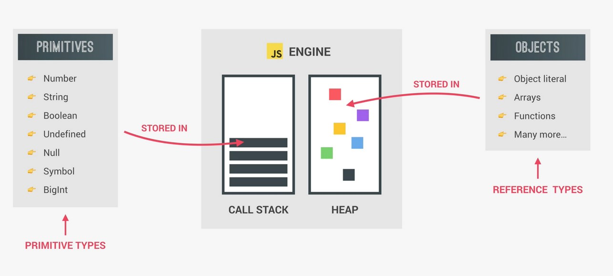
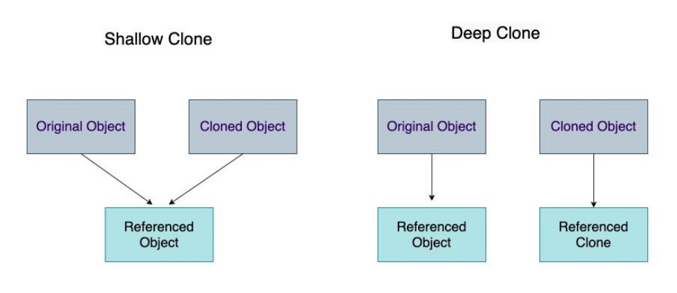

# 14 - JS Reference VS Copy
## :eyes: Introduction



### Main goals

- Learning different ways to copy an array or an object, as well as the difference between shallow copy and deep copy. 

### Demo: ⛔️ no demo for this one!

## :pencil2: Takeaways
### 1. The difference between primitive types and objects

For primitive types like Strings, Numbers or Booleans, when we copy the value to another variable, and then update the copied variable, the original variable remains unchanged.

```javascript
let age = 100;
let age2 = age;
console.log(age, age2); // 100 100

age2 = 200;
console.log(age, age2); // 100 200

let name = 'Wes';
let name2 = name;
console.log(name, name2); // Wes Wes

name2 = 'wesley';
console.log(name, name2); // Wes wesley
```
However, when it comes to an array or an object, things are different. If we update the copied array, oops! The original array has changed too.

```javascript
const players = ['Wes', 'Sarah', 'Ryan', 'Poppy'];
const team = players;
console.log(players, team); 
// Array(4) [ "Wes", "Sarah", "Ryan", "Poppy" ] 
// Array(4) [ "Wes", "Sarah", "Ryan", "Poppy" ]

team[3] = 'Lux';
console.log(players, team); 
// Array(4) [ "Wes", "Sarah", "Ryan", "Lux" ]  
// Array(4) [ "Wes", "Sarah", "Ryan", "Lux" ]
```
The reason is because primitive types are called by **VALUE**, while objects are called by **REFERENCE**. So actually `team` and `players` they point to the same array!

### 2. Different ways to copy an array

To avoid changing the original value of an array when making a copy of it, there are several ways to achieve it.

#### (1) Using `Array.slice()`
If we don't pass in any arguments in the `slice()` method, it just gives us a copy of the original array.
```javascript
const team2 = players.slice();

team2[3] = 'Lux';
console.log(players, team2); 
// Array(4) [ "Wes", "Sarah", "Ryan", "Poppy" ]
// Array(4) [ "Wes", "Sarah", "Ryan", "Lux" ]
```
#### (2) Using `Array.concat()`
We can also create a new array and concat the old one in.
```javascript
const team3 = [].concat(players);

team3[3] = 'Cool';
console.log(players, team3); 
// Array(4) [ "Wes", "Sarah", "Ryan", "Poppy" ]
// Array(4) [ "Wes", "Sarah", "Ryan", "Cool" ]
```

#### (3) Using ES6 spread operator (...)
The spread operator (...) in ES6 is a very simple way to do it.
```javascript
const team4 = [...players];

team4[3] = 'heeee';
console.log(players, team4);
// Array(4) [ "Wes", "Sarah", "Ryan", "Poppy" ]
// Array(4) [ "Wes", "Sarah", "Ryan", "heeee" ]
```

#### (4) Using `Array.from()`
Another way is to use `Array.from()` to create a new array.
```javascript
const team5 = Array.from(players);

team5[3] = 'hawww';
console.log(players, team5);
// Array(4) [ "Wes", "Sarah", "Ryan", "Poppy" ]
// Array(4) [ "Wes", "Sarah", "Ryan", "hawww" ]
```
### 3. Different ways to copy an object
#### (1) Using `Object.assign()`
The same thing goes for objects, let's say we have a person object:
```javascript
const person = {
    name: 'Wes Bos',
    age: 80
};
```
And we want to create a copy of it and add some other properties. In `Object.assign()` method, we first pass in an empty object, then the object we want to copy, as well as other properties that we want to add to our new object.  
```javascript
const captain = Object.assign({}, person, { number: 99 });
console.log(captain); 
// Object { name: "Wes Bos", age: 80, number: 99 }
```
#### (2) Using ES6 spread operator (...)
We can use the spread operator for objects too. 
```javascript
const cap2 = {...captain};
cap2.age = 12;
console.log(cap2, person); 
// Object { name: "Wes Bos", age: 12, number: 99 }
// Object { name: "Wes Bos", age: 80 }
```

### 4. Shallow Copy and Deep Copy
What we need to be careful is that all those methods above are only making a **shallow copy** of the original array/object.

In the following example, we have a user data which contains a nested object. Let's say we want to make a copy of it and then reassign a twitter account to it.

```javascript
const wes = {
    name: 'Wes',
    age: 100,
    social: {
        twitter: '@wesbos',
        facebook: 'wesbos.developer'
    }
};

const dev = Object.assign({}, wes, { name: 'dev' });

// change the twitter account of dev
dev.social.twitter = '@dev';

console.log(dev);
// Object { name: "dev", age: 100, social: {…} }
​// social: Object { twitter: "@dev", facebook: "wesbos.developer" }

console.log(wes);
// Object { name: "Wes", age: 100, 
// social: { twitter: "@dev", facebook: "wesbos.developer" } }
```
Oops! When we log out the data of `wes`, we can see that the `name` remains the same, while the twitter account info has been changed!

The reason behind is because `Object.assign()` is still making a shallow copy (As well as spread syntax, `Array.concat()`, `Array.slice()`, `Array.from()`) because **only the first level of the object has been copied. The nested object inside of the object, will still refer to the same memory address.**

In our example, the reference of `twitter` in `dev` and the reference of `twitter` in `wes` remain the same. Therefore, if we update the value of `twitter` in `dev`, the value of `twitter` in `wes` will change as well.

### 5. How to make a deep copy in JavaScript

According to [MDN](https://developer.mozilla.org/en-US/docs/Glossary/Deep_copy), a deep copy of an object is **a copy whose properties do not share the same references (point to the same underlying values) as those of the source object from which the copy was made**. As a result, when you change either the source or the copy, you can be assured you're not causing the other object to change too.



There are several ways to make a deep copy in JavaScript.

#### (1) Using `JSON.parse(JSON.stringify(object))`

A simple way to do it is by turning an object into a JSON string, and then parse it back to a javascript object. 

Here we have a nested ingredients list, then we make a deep copy of it using `JSON.parse(JSON.stringify(object))`.
```javascript
let ingredients_list = ["noodles", { list: ["eggs", "flour", "water"] }];
let ingredients_list_deepcopy = JSON.parse(JSON.stringify(ingredients_list));

// Change the value of the 'list' property in ingredients_list_deepcopy
ingredients_list_deepcopy[1].list = ["rice flour", "water"];

console.log(ingredients_list[1].list);
// Array(3) [ "eggs", "flour", "water" ]
```
After changing the the value of the 'list' property in `ingredients_list_deepcopy`, the 'list' property does not change in the original `ingredients_list`.

⚠️ However! If there are data types like Dates, functions, undefined, Infinity, NaN, RegExps, Maps, Sets or other complex types within the object, some data might be lost during the process. 

#### (2) Using `structuredClone()`
`StructuredClone()` is a global method which allows you to create a deep copy of an object. This method is relatively new but it's already supported by all major browsers.

Here we have an array of wizards, first we create a deep copy of it by using `structuredClone()`.
```javascript
let wizards = [{
	name: 'Radagast',
	color: 'brown'
}, {
	name: 'Gandalf',
	color: 'gray'
}];

let wizardsCopy = structuredClone(wizards);
```
Then, we push some new data in the copied array and also update the name of the first wizard.
```javascript
wizardsCopy.push({
	name: 'Ursula',
	color: 'purple'
});

// Update a nested object
wizardsCopy[0].name = 'Merlin';
```
When we log out the original `wizards` array, we will find that all the data remain unchanged. 
```javascript
// The original array remains unchanged
console.log(wizards);
// Array [ {…}, {…} ]
​// 0: Object { name: "Radagast", color: "brown" }
​// 1: Object { name: "Gandalf", color: "gray" }

console.log(wizardsCopy)
// Array(3) [ {…}, {…}, {…} ]
​// 0: Object { name: "Merlin", color: "brown" }
​// 1: Object { name: "Gandalf", color: "gray" }
// 2: Object { name: "Ursula", color: "purple" }
```

#### (3) Using libraries
There are several libraries to help you easily create a deep copy, such as Lodash, Ramda, rdfc etc. As noted at the end of  [this article](https://web.dev/structured-clone/), `structuredClone()` still has some limitations. If you ever encounter any problem, using a library can be a good idea too. But for now, `structuredClone()` is suggested to be the default approach for creating deep copies.

## :book: References

* [Shallow Copy - MDN](https://developer.mozilla.org/en-US/docs/Glossary/Shallow_copy)
* [Deep Copy - MDN](https://developer.mozilla.org/en-US/docs/Glossary/Deep_copy)
* [structuredClone() - MDN](https://developer.mozilla.org/en-US/docs/Web/API/structuredClone)
* [A Deep Dive into Shallow Copy and Deep Copy in JavaScript](https://javascript.plainenglish.io/shallow-copy-and-deep-copy-in-javascript-a0a04104ab5c)
* [How to Deep Copy Objects and Arrays in JavaScript](https://javascript.plainenglish.io/how-to-deep-copy-objects-and-arrays-in-javascript-7c911359b089)
* [How to make a deep copy of an array or object with vanilla JavaScript ](https://gomakethings.com/how-to-make-a-deep-copy-of-an-array-or-object-with-vanilla-javascript/)
* [Deep-copying in JavaScript using structuredClone](https://web.dev/structured-clone/)

