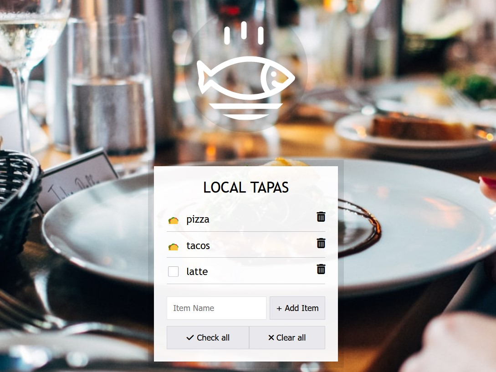

# 15 - LocalStorage and Event Delegation
## :eyes: Introduction



### Main goals

- The user can add items to the list and check it when it's done
- When the user refreshes the page, the checked status won't disappear

### Demo: 👉 [Click me](https://kellychi22.github.io/JavaScript30/15-LocalStorage-and-Event-Delegation/) 

## :pushpin: Solution
### My solution

First I added the "check all" and "clear all" buttons to toggle done states of all items at once. I also added trashcan icons to delete items individually.

#### Toggle all items at once
```javascript
function toggleAll(e) {
    if (e.target.matches('.check-all')) {
        items.forEach(item => {
            item.done = true;
        });
        localStorage.setItem('items', JSON.stringify(items));
        populateList(items, itemsList);
    } else if (e.target.matches('.clear-all')) {
        items.forEach(item => {
            item.done = false;
        });
        localStorage.setItem('items', JSON.stringify(items));
        populateList(items, itemsList);
    }
}

toggleAllBtns.addEventListener('click', toggleAll);
```

#### Delete individual item
```javascript
function deleteItem(e) {
    if (!e.target.matches('.delete')) return;
    const index = parseInt(e.target.dataset.index);
    items.splice(index, 1);
    localStorage.setItem('items', JSON.stringify(items));
    populateList(items, itemsList);
}

itemsList.addEventListener('click', deleteItem);
```
### Example solution

```javascript
const addItems = document.querySelector('.add-items');
const itemsList = document.querySelector('.plates');
const items = JSON.parse(localStorage.getItem('items')) || [];

function addItem(e) {
    e.preventDefault();
    const text = (this.querySelector('[name=item]')).value;
    const item = {
        text,
        done: false
    };

    items.push(item);
    populateList(items, itemsList);
    localStorage.setItem('items', JSON.stringify(items));
    this.reset();
}

function populateList(plates = [], platesList) {
    platesList.innerHTML = plates.map((plate, i) => {
        return `
        <li>
            <input type="checkbox" data-index=${i} id="item${i}" ${plate.done ? 'checked' : ''} />
            <label for="item${i}">${plate.text}</label>
        </li>
        `;
    }).join('');
}

function toggleDone(e) {
    if (!e.target.matches('input')) return; 
    const el = e.target;
    const index = el.dataset.index;
    items[index].done = !items[index].done;
    localStorage.setItem('items', JSON.stringify(items));
    populateList(items, itemsList);
}

addItems.addEventListener('submit', addItem);
itemsList.addEventListener('click', toggleDone);

populateList(items, itemsList);
```

## :pencil2: Takeaways
### 1. Preserve data on page refresh using `localStorage`
#### What is `localStorage`?

`localStorage` is part of the **Web Storage API** which maintains a separate storage area for each given origin (for example for the same domain) that is available even after the browser is closed and reopened. 

The data in `localStorage` has no expiration date, and gets cleared only through JavaScript, or clearing the Browser cache / Locally Stored Data.

#### How about `sessionStorage`?
`sessionStorage` does the exact same thing as `localStorage`, the only different thing is the data in `sessionStorage` is only available for a session, meaning that the data is stored until the browser (or tab) is closed.

For both `localStorage` and `sessionStorage`, any item stored in them will be stored as a **string**. This means that we need to convert them into strings before storing them in the storage.

#### How to use `localStorage`(or `sessionStorage`)?
**(1) Create an entry by `localStorage.setItem()`**
```javascript
let key = 'Item 1';
localStorage.setItem(key, 'Value');
```
If you want to update the value, just do the same thing again with the new value.
```javascript
localStorage.setItem(key, 'New Value');
```
**(2) Read an entry by `localStorage.getItem()`**
```javascript
let myItem = localStorage.getItem(key);
```
**(3) Remove an entry by `localStorage.removeItem()`**
```javascript
localStorage.removeItem(key);
```
**(4) Clear everything that’s stored in `localStorage`**
```javascript
localStorage.clear();
```
**(5) Convert entries into JSON format if needed**
`localStorage` can only store string values. If you want to store objects or arrays as values in `localStorage`, you can use `JSON.stringify()` to convert them into strings.
```javascript
let myObj = { name: 'Skip', breed: 'Labrador' };
localStorage.setItem(key, JSON.stringify(myObj));
```
To read and return stringified values, use the `JSON.parse()` method. The `JSON.parse()` method takes JSON strings and converts them into JavaScript objects.
```javascript
let item = JSON.parse(localStorage.getItem(key));
``` 

### Wait, how about `cookies`?
Cookies are pieces of data that are communicated between **the server and the browser** in the header of requests. While the server doesn't have the access to `localStorage` and `sessionStorage`.

Cookies allow the server to learn more information about the user accessing the website but also gives you access in the browser to interact with that data.

For more comparsion between these three kinds of data, please refer to this article 👉 [JavaScript Cookies vs Local Storage vs Session Storage](https://blog.webdevsimplified.com/2020-08/cookies-localstorage-sessionstorage/)

### 2. Several notes on `form` element
#### (1) Listen to the 'submit' event rather than the 'click' event
Because the user can submit the form by pressing the enter key or in other ways.
#### (2) Use `event.preventDefault()` to prevent browser from refreshing
The default behavior of the browser when a user submits a form, is to refresh the page and send the data to the server. However, as the page refreshes, our inputs are gone too. In order to take control over the input, we should use `event.preventDefault()` at the beginning of our function.
#### (3) Use `HTMLFormElement.reset()` to clear the input
A simple one liner to clear the inputs. No need to rely on operating the DOM. 

### 3. Use ternary operator for `check` attribute
If we add `checked` attribute to an input element that has a type of `checkbox`, the checkbox will be set to checked by default. It's impossible to set something like `checked = false` in the HTML. Therefore, we can use ternary operator in javascript. 

If the item's `done` property is set to `true`, the `checked` attribute will be added to the HTML. Otherwise it only returns an empty string.
```javascript
<li>
    <input type="checkbox" data-index=${i} id="item${i}" ${plate.done ? 'checked' : ''} />
    <label for="item${i}">${plate.text}</label>
</li>
```

### 4. Increase reusability by setting parameters in functions
First thing to note here is that he sets a default value for the `plate` parameter. This is to prevent the function from breaking if someone accidentally forgets to pass in an argument.

Instead of just passing in the `itemsList` variable, he sets the second parameter `platesList`. The reason behind is to increase the reusability of this function. If one day we want to use this function on other parts of the website, we can reuse the same function without modifying anything. 

```javascript
const itemsList = document.querySelector('.plates');
const items = JSON.parse(localStorage.getItem('items')) || [];

function populateList(plates = [], platesList) {
    platesList.innerHTML = plates.map((plate, i) => {
    // ... 
    }).join('');
}
```

### 5. Event delegation: Attach event listeners to elements that are always on the screen
In the video he shows us one big problem if you attach event listeners to every single list items. The problem is, the event listener won't work because the items have not yet been created yet! Even if you move `populateList(items, itemsList)` before attaching event listeners, once you add a new item and the list gets rerendered, all the previous event listeners will be gone too.

Therefore, a better way to do is to use **event delegation**. This is an approach where you attach your event listener to a parent element instead of directly on the element you’re listening to. Then, in the callback function, you can filter out any events that happen on elements you don’t care about.
```javascript
function toggleDone(e) {
    if (!e.target.matches('input')) return; 
    const el = e.target;
    const index = el.dataset.index;
    items[index].done = !items[index].done;
    localStorage.setItem('items', JSON.stringify(items));
    populateList(items, itemsList);
}

// attach event listener to the entire list, not to each single items
itemsList.addEventListener('click', toggleDone);

// list items are created here
populateList(items, itemsList);
```
According to [this article]((https://gomakethings.com/when-should-you-use-event-delegation/)), there are two major advantages of using event delegation.

1. **First, every event listener uses memory in the browser.** So, the more you have, the more memory you use. For web apps that have a larger scale, having too many event listeners can cause performance issues.
2. **Second, you don’t need to attach and detach listeners whenever you update the UI.** If you attach your listener to a parent element that’s always in the DOM, you don’t need to do anything special whenever you add or remove interactive elements from your UI. The callback function will filter the events by itself.

### 6. Bonus: Toggle all items at once

I added two buttons which have either `check-all` or `clear-all` class. Then, in the function, it will loop over all the items to update the done property. 
```javascript
function toggleAll(e) {
    if (e.target.matches('.check-all')) {
        items.forEach(item => {
            item.done = true;
        });
        localStorage.setItem('items', JSON.stringify(items));
        populateList(items, itemsList);
    } else if (e.target.matches('.clear-all')) {
        items.forEach(item => {
            item.done = false;
        });
        localStorage.setItem('items', JSON.stringify(items));
        populateList(items, itemsList);
    }
}

toggleAllBtns.addEventListener('click', toggleAll);
```
### 7. Bonus: Delete individual items

I added a trashcan icon on each list items and attached the item index to the icons using data-attribute. When the clicked item gets deleted from the list, the localStorage should be updated as well as the list UI.
```javascript
function deleteItem(e) {
    if (!e.target.matches('.delete')) return;
    const index = parseInt(e.target.dataset.index);
    items.splice(index, 1);
    localStorage.setItem('items', JSON.stringify(items));
    populateList(items, itemsList);
}

itemsList.addEventListener('click', deleteItem);
```


## :book: References
* [Web Storage API - MDN](https://developer.mozilla.org/en-US/docs/Web/API/Web_Storage_API#web_storage_concepts_and_usage)
* [localStorage - MDN](https://developer.mozilla.org/en-US/docs/Web/API/Window/localStorage)
* [Introduction to localStorage and sessionStorage](https://www.digitalocean.com/community/tutorials/js-introduction-localstorage-sessionstorage)
* [How Web Storage Works – Local vs Session Storage Explained](https://www.freecodecamp.org/news/how-web-storage-works/)
* [Local Storage vs Cookies: What's the Difference?](https://blog.shahednasser.com/localstorage-vs-cookies-whats-the-difference/)
* [JavaScript Cookies vs Local Storage vs Session Storage](https://blog.webdevsimplified.com/2020-08/cookies-localstorage-sessionstorage/)
* [JavaScript Cookies vs Local Storage vs Session Storage (Video)](https://www.youtube.com/watch?v=GihQAC1I39Q)
* [HTMLFormElement.reset() - MDN](https://developer.mozilla.org/en-US/docs/Web/API/HTMLFormElement/reset)
* [When should you use event delegation? ](https://gomakethings.com/when-should-you-use-event-delegation/)