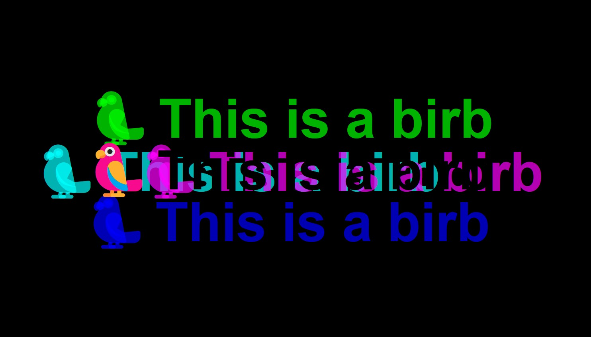
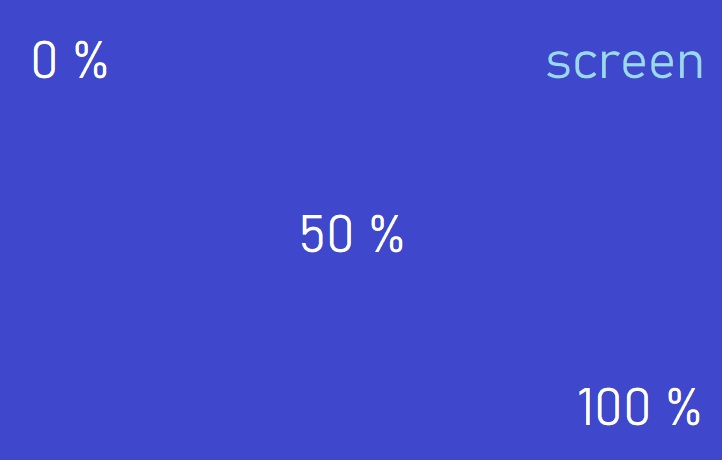
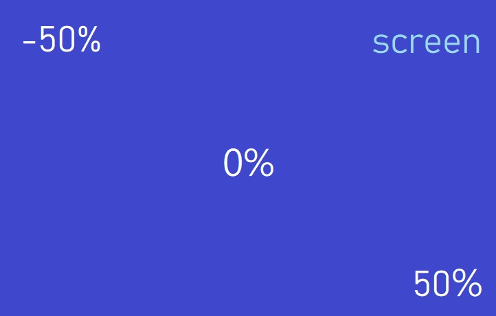

# 16 - Text Shadow Mouse Move Effect
## :eyes: Introduction



### Main goal

- The text shadows move as the user moves his mouse.

### Demo: 👉 [Click me](https://kellychi22.github.io/JavaScript30/16-Mouse-Move-Shadow/) 

## :pushpin: Solution
### Example solution
The tricky part of this exercise is to calculate how far the text shadow should move according to the mouse position. We will discuss about it below.
```javascript
const hero = document.querySelector('.hero');
const text = hero.querySelector('h1');
const walk = 500; // 500px

function shadow(e) {
    const { offsetWidth: width, offsetHeight: height } = hero;
    let { offsetX: x, offsetY: y } = e;

    if (this !== e.target) {
        x = x + e.target.offsetLeft;
        y = y + e.target.offsetTop;
    }

    const xWalk = Math.round((x / width * walk) - (walk / 2));
    const yWalk = Math.round((y / height * walk) - (walk / 2));

    text.style.textShadow = `
    ${xWalk}px ${yWalk}px 0 rgba(255,0,255,0.7),
    ${xWalk * -1}px ${yWalk}px 0 rgba(0,255,255,0.7),
    ${yWalk}px ${xWalk * -1}px 0 rgba(0,255,0,0.7),
    ${yWalk * -1}px ${xWalk}px 0 rgba(0,0,255,0.7)
    `;

}

hero.addEventListener('mousemove', shadow);
```

## :pencil2: Takeaways
### 1. Notes on object destructuring 
When we want to use some data inside of an array or an object in a function, we might not want to use the array/object as a whole. Thus, we need extract some data out of it. Destructuring is a new ES6 syntax that allows us to “unpack” arrays or objects into a bunch of variables, as sometimes that’s more convenient.

The basic syntax of object destructuring is:
```javascript
let {var1, var2} = {var1:…, var2:…}
```
On the right side, we have the object that we want to destructure. On the left side, we have an object-like “pattern” for corresponding properties. 

Here's a very simple example:
```javascript
let options = {
  title: "Menu",
  width: 100,
  height: 200
};

let {title, width, height} = options;

alert(title);  // Menu
alert(width);  // 100
alert(height); // 200
```
The order doesn't matter, as long as the property names matches those keys in the object.
```javascript
let {height, width, title} = { title: "Menu", height: 200, width: 100 }
```
If we want to assign a property to a variable with another name, for instance, make `options.width` go into the variable named `w`, then we can set the variable name using a colon:
```javascript
let {width: w, height: h, title} = options;

alert(title);  // Menu
alert(w);      // 100
alert(h);      // 200
```
Back to our example solution, he uses destructuring on the hero object and the event object (which comes from the mousemove event).
```javascript
const { offsetWidth: width, offsetHeight: height } = hero;
let { offsetX: x, offsetY: y } = e;


// equals to 
// const heroWidth = hero.offsetWidth
// const heroHeight = hero.offsetHeight
// let offsetXAfterAdjust = e.offsetX
// let offsetYAfterAdjust = e.offsetY
```
### 2. The difference between `this` and `e.target`

In the `shadow()` function, one thing to note is that sometimes the event target and `this` is different, and this will cause our calculation to be wrong. 

```javascript
function shadow(e) {
    // ...
    if (this !== e.target) {
        x = x + e.target.offsetLeft;
        y = y + e.target.offsetTop;
    }
}

hero.addEventListener('mousemove', shadow);
```
In the callback function of an event listener, `this` keyword will always refer to the element which the event listener is attached to. In this case, it's the `hero` element. 

However, the `offsetX` and `offsetY` (which is properties of the MouseEvent itself) is showing the X/Y coordinate of the mouse pointer between that event and the padding edge of the target node. 

Which means, if the mouse is inside the `<h1>` element, the `<h1>` element will be the target. Thus the `offsetX` and `offsetY` show the distance between the pointer and the edge of `<h1>` element.

If the mouse is outside the `<h1>` element, the target will become the `hero` element. So `offsetX` and `offsetY` show the distance between the pointer and the edge of the `hero` element.

To fix the inconsistency, when the event target is the `<h1>` element, we can add back the `offsetLeft` and `offsetTop` value of the element itself. (`offsetLeft` and `offsetTop` show the distance between an element and it's parent element)

#### Recap of different coordinate properties
**Element properties**

1. `offsetLeft`, `offsetTop`: distance between the element and its `offsetParent` (closest parent element)
2. `offsetWidth`, `offsetHeight`: the width and height of the element itself

**Event properties**

1. `offsetX`, `offsetY`: the distance between the event and the edge of current target

### 3. Change the starting point to the text itself
In order to calculate how much the shadow should be stretched according to the mouse pointer position, we need to turn the distance into percentage. 
```javascript
const xWalk = Math.round((x / width * walk) - (walk / 2));
const yWalk = Math.round((y / height * walk) - (walk / 2));
```
Besides, we can adjust the percentage from picture 1 to picture 2 to make the text itself the starting point.





## :book: References
* [Destructuring assignment - MDN](https://developer.mozilla.org/en-US/docs/Web/JavaScript/Reference/Operators/Destructuring_assignment)
* [Destructuring assignment - javascript.info](https://javascript.info/destructuring-assignment#object-destructuring)
* [MouseEvent.offsetX](https://developer.mozilla.org/en-US/docs/Web/API/MouseEvent/offsetX)
* [HTMLElement.offsetLeft](https://developer.mozilla.org/en-US/docs/Web/API/HTMLElement/offsetLeft)
* [[JS30] Day16: CSS Text Shadow Mouse Move Effect](https://pjchender.dev/js30/js30-day16/) (Chinese)
* [Day16 CSS Text Shadow Mouse Move Effect](https://ithelp.ithome.com.tw/articles/10195679) (Chinese)