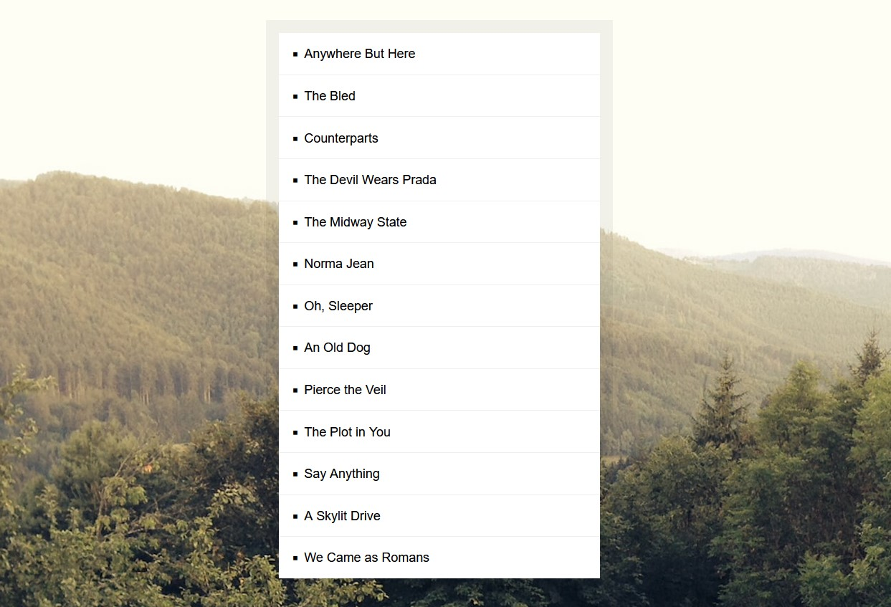
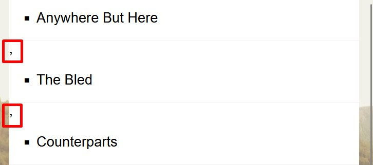

# 17 - Sort Without Articles
## :eyes: Introduction



### Main goal

- Sort the bands names while neglecting articles like `a`, `an` or `the`

### Demo: 👉 [Click me](https://kellychi22.github.io/JavaScript30/17-Sort-Without-Articles/) 

## :pushpin: Solution
### Example solution
Today's exercise is relatively simple and short, just a review of some array methods that we've talked about already. 
```javascript
const bands = ['The Plot in You', 'The Devil Wears Prada', 'Pierce the Veil', 'Norma Jean', 'The Bled', 'Say Anything', 'The Midway State', 'We Came as Romans', 'Counterparts', 'Oh, Sleeper', 'A Skylit Drive', 'Anywhere But Here', 'An Old Dog'];

function strip(bandName) {
    return bandName.replace(/^(a |the |an )/i, '').trim();
}

const sortedBands = bands.sort((a, b) => strip(a) > strip(b) ? 1 : -1);

document.querySelector('#bands').innerHTML =
    sortedBands
        .map(band => `<li>${band}</li>`)
        .join('');

console.log(sortedBands);
```

## :pencil2: Takeaways

### 1. Use regex to filter unwanted articles
Regular expression is a very huge topic, for now let's just explain what he has used in the example.
```javascript
function strip(bandName) {
    return bandName.replace(/^(a |the |an )/i, '').trim();
}
```
* A regular expression consists of a pattern that starts and ends with a forward slash (`/.../`), just the same way we use quotes `“...”` to create a string.
* `^` matches the start of a line and anchors a literal at the beginning of that line. (In other words, only examines **the beginning** of a string)
* The pipe symbol (`|`) means ‘or’, so it matches a series of options.It allows you combine subexpressions as alternatives. For example, `(x|y|z)a` will match `xa` or `ya`, or `za`. 
* `i` is one of the expression flags. It is used for case-insensitive search, meaning that a match can occur **regardless of the casing.**

### 2. Use `Array.sort()` to sort names alphabetically

#### Recap from 04 - Array Cardio Day 1
Each time, there will only be two items that are being sorted, which is usually called a and b. The order will be decided by returning `1` or `-1`, If the return value is greater than 0, a will be sorted after b. On the other hand, if the return value is less than 0, a will be sorted before b.

```javascript
const sortedBands = bands.sort((a, b) => strip(a) > strip(b) ? 1 : -1);
```
Here we compare all the elements in `bands` by their return value of `strip()` function. If an element's value is greater than the other element, it will be sorted after the other element. (which means sorting it alphabetically)

### 3. Use `Array.map()` to create a series of list elements

#### Recap from 04 - Array Cardio Day 1
The `map()` method is like a factory which does a certain procedure to each of the elements in the array. Thus, it returns a new array which of the same length.

```javascript
document.querySelector('#bands').innerHTML =
    sortedBands
        .map(band => `<li>${band}</li>`)
        .join('');
```
Here the callback function takes in every element in `sortedBands` array and generate an `<li>` element out of it.

### 4. Note on `Element.innerHTML` 
`Element.innerHTML` will turn everything to an htmlString before parsing it and constructing nodes out if it. Therefore, if we pass in an array, the commas used for separating each elements in an array will be kept in the string too. 


```javascript
document.querySelector('#bands').innerHTML =
    sortedBands
        .map(band => `<li>${band}</li>`)
        .join('');
```
That's why we need to have `join('')` here, it joins all elements in the array with an empty string so there won't be any comma in the htmlString. 


## :book: References
* [How to Use Regular Expressions in JavaScript – Tutorial for Beginners - freeCodeCamp](https://www.freecodecamp.org/news/regular-expressions-for-beginners/)
* [04 - Array Cardio Day 1 - My own notes](https://github.com/KellyCHI22/JavaScript30/blob/main/04-Array-Cardio-Day-1/README.md)
* [Element.innerHTML - MDN](https://developer.mozilla.org/en-US/docs/Web/API/Element/innerHTML)