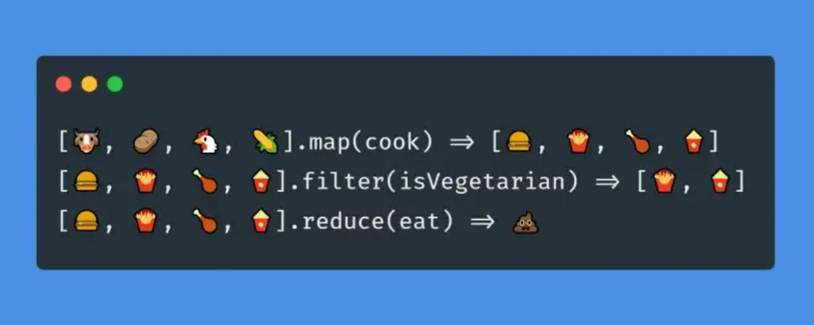

# 18 - Adding Up Times with Reduce
## :eyes: Introduction



### Main goals

- Count the total run time of a list of videos by using the `reduce()` method

### Demo: ⛔️ no demo for this one!

### :pushpin: Example solution
```javascript
const timeNodes = Array.from(document.querySelectorAll('[data-time]'));

const seconds = timeNodes
    .map(node => node.dataset.time)
    .map(timeCode => {
        const [mins, secs] = timeCode.split(':').map(parseFloat);
        return (mins * 60) + secs;
    })
    .reduce((total, vidSeconds) => total + vidSeconds);

let secondsLeft = seconds;
const hours = Math.floor(secondsLeft / 3600);
secondsLeft = secondsLeft % 3600;

const mins = Math.floor(secondsLeft / 60);
secondsLeft = secondsLeft % 60;

console.log(hours, mins, secondsLeft); // 4 58 58
```

## :pencil2: Takeaways
### 1. Grab the time data in the markup

After grabbing all the `<li>` elements on the page, we can access the time data with `node.dataset.time`.

```html
<li data-time="5:43">
    Video 1
</li>
```
```javascript
const seconds = timeNodes
    .map(node => node.dataset.time)
```
### 2. Convert all timeCodes into seconds
Since the data we get back from the markup is a string, we need to separate them into two variables by using `String.split()` method and destructuring assignment syntax. (And don't forget to parse them into numbers by using `parseFloat`)

At the end, all the timeCodes will be converted into seconds.
```javascript
const seconds = timeNodes
    // ...
    .map(timeCode => {
        const [mins, secs] = timeCode.split(':').map(parseFloat);
        return (mins * 60) + secs;
    })
```
### 3. Add up the total run time by using `reduce()`

#### 📙 Recap from 04 - Array Cardio Day 1
The `reduce()` method executes a "reducer" callback function on each element of the array in order, passing in the return value from the calculation on the preceding element. The final result is a single value.

In the example solution, the reducer callback adds each video's runtime (which we get from the previous line) to the `total` variable. So the final value of `seconds` is the total runtime of all the videos in seconds.

```javascript
const seconds = timeNodes
    // ...
    .reduce((total, vidSeconds) => total + vidSeconds);
```
### 4. Convert total seconds back to hours, minutes and seconds

To not confusing ourselves, we can create another variable `secondsLeft` for doing the calculation. We can get the hours and the minutes by dividing `secondsLeft` by `3600` (because one hour is 3600 seconds) and `60`. As for the remaining parts we can get them by the remainder (`%`) operator. 
```javascript
let secondsLeft = seconds;
const hours = Math.floor(secondsLeft / 3600);
secondsLeft = secondsLeft % 3600;

const mins = Math.floor(secondsLeft / 60);
secondsLeft = secondsLeft % 60;
```


## :book: References

* [Array.prototype.reduce() - MDN](https://developer.mozilla.org/en-US/docs/Web/JavaScript/Reference/Global_Objects/Array/reduce)
* [Remainder (%) - MDN](https://developer.mozilla.org/en-US/docs/Web/JavaScript/Reference/Operators/Remainder)
* [04 - Array Cardio Day 1 - My own notes](https://github.com/KellyCHI22/JavaScript30/blob/main/04-Array-Cardio-Day-1/README.md)
