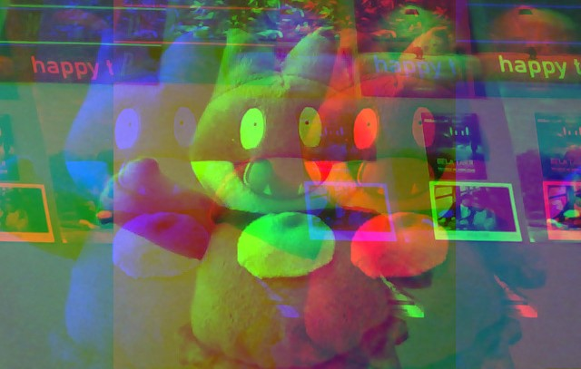

# 19 - Unreal Webcam Fun
## :eyes: Introduction



### Main goal

- Put super cool filters on your streaming video using webcam and canvas. 

### Demo: 👉 [Click me](https://kellychi22.github.io/JavaScript30/19-Webcam-Fun/) 

## :pushpin: Solution
### Example solution
Please head towards the js file to see full solution 👉 **[FULL SOLUTION](https://github.com/KellyCHI22/JavaScript30/blob/main/19-Webcam-Fun/scripts.js)** 
```javascript
function getVideo() {
  navigator.mediaDevices.getUserMedia({ video: true, audio: false })
    .then(localMediaStream => {
      console.log(localMediaStream);
      video.srcObject = localMediaStream;
      video.play();
    })
    .catch(err => {
      console.error(`OH NO!!!`, err);
    });
}

function paintToCanvas() {
  const width = video.videoWidth;
  const height = video.videoHeight;
  canvas.width = width;
  canvas.height = height;

  return setInterval(() => {
    ctx.drawImage(video, 0, 0, width, height);
    let pixels = ctx.getImageData(0, 0, width, height);
    pixels = rgbSplit(pixels);
    ctx.putImageData(pixels, 0, 0);
  }, 16);
}

getVideo();
video.addEventListener('canplay', paintToCanvas);
```

## :pencil2: Takeaways

### 1. Get access to the webcam by the Media Streams API
#### The Media Streams API
The Media Streams API allows us to work with live audio and video data. And the `navigator.mediaDevices` is a feature that only works in a secured contexts (like localHost or HTTPS) and in browsers.

The `getUserMedia()` method will prompt a message to ask users for permission to use a media input (in our case is the webcam). If the user gives the permission, it will return a Promise that resolves to a `MediaStream` object.  If the user denies permission, the promise will be rejected and throw an error. 

Note that the parameter which is an object with two members: `video` and `audio`, has to be passed in. Here it requests both audio and video without any specific requirements.
```javascript
function getVideo() {
  navigator.mediaDevices.getUserMedia({ video: true, audio: false })
    .then(localMediaStream => {
      console.log(localMediaStream);
      video.srcObject = localMediaStream;
      video.play();
    })
    .catch(err => {
      console.error(`OH NO!!!`, err);
    });
}
```
#### HTMLMediaElement.srcObject
After getting back our `MediaStream` object, we need to set the source url of our `<video>` element to it. In the video, he uses `createObjectURL()` method:
```javascript
video.src = window.URL.createObjectURL(localMediaStream)
```
However, this method is no longer supported by all major browsers. Instead, we can just use the `srcObject` property on the `<video>` element to set the source of the media. 
```javascript
video.srcObject = localMediaStream;
```
### 2. Use `setInterval()` to paint screenshots of the video on the canvas every 16ms

Now we have our `<video>` element running, but in order to apply cool filters to our video, we need to paint the video on a `<canvas>` element.

First, we set the canvas's width and height to be the same as the video's width and height. Then, we will return a `setInterval()` function which runs a callback every 16ms. 

💡 **Why 16ms?** Nowadays smartphones, laptops, computer screens… have a refresh rate of 60 frames per second. So, single frame lasts `1 (second)  / 60 (frames) = 16.66 milliseconds`. Which means, even if you set your interval time to be less than 16ms, the fastest the screen can go is still limited to 16ms.

Inside the callback, we use `ctx.drawImage()` to paint the video on to our canvas. However, since it's an image, we need to repaint the canvas every 16ms. The result will look the same as a continuous video, even though it's just separate screenshots being repainted at the same speed as the screen refresh rate.

```javascript
function paintToCanvas() {
  const width = video.videoWidth;
  const height = video.videoHeight;
  canvas.width = width;
  canvas.height = height;

  return setInterval(() => {
    ctx.drawImage(video, 0, 0, width, height);
  }, 16);
}
```
### 3. Get the pixels data from the canvas (and put them back)
Besides simply painting the video to our canvas, we want to take advantage of the canvas element's features and apply filters to the image.
```javascript
function paintToCanvas() {
    //...
    return setInterval(() => {
        ctx.drawImage(video, 0, 0, width, height);
        let pixels = ctx.getImageData(0, 0, width, height);
        pixels = rgbSplit(pixels);
        ctx.putImageData(pixels, 0, 0);
    }, 16);
}
```
We can get all the pixels data by `getImageData()`. The parameters indicate the starting points (x-axis and y-axis) and how far (right/left and down/up) we want to extract from the stating point. Here we want to extract the data from the (0, 0) position of the canvas, and extract all along to the end of the width and height.

Once we are done messing with the pixels, we can put all the pixels data back to the canvas by `putImageData()`. The parameters indicate the image data that we want to put in, and the horizontal and vertical position at which to place the image data. In our case, we take the new pixels data and put them at the (0, 0) position of the canvas.

### 4. `canplay` event on `<video>` elements
The `canplay` event fires when the user agent can play the media (in our case, is when we run `video.play()`). However, it doesn't guarantee that it will play tills its end. As long as the video starts, the `canplay` event will be fired.
```javascript
getVideo();
video.addEventListener('canplay', paintToCanvas);
```

### 5. Create downloadable links of our video screenshots
When we click on the "take photo" button, we want to create a link that allows us to download the screenshot.

First we can use the `canvas.toDataURL()` method to get a data URL of the image in the format specified by the type parameter. The default type is `image/png`, but some browsers also support formats like `image/jpeg` and `image/webp`.

Then, we create an `<a>` element which has a `download` attribute. This allows the browser to treat the linked URL as a download. We also create an `` element in the link so we can see the image directly on the page. Don't forget to insert the element into the DOM at the end.
```javascript
function takePhoto() {
  // ...
  const data = canvas.toDataURL('image/jpeg');
  const link = document.createElement('a');
  link.href = data;
  link.setAttribute('download', 'handsome');
  link.innerHTML = ``;
  strip.insertBefore(link, strip.firstChild);
}
```
### 6. Ideas behind different filters
The basic idea is to loop over all the pixels in our image data, and modify the values of each pixel. Note that our image data is not stored in a normal array, instead, it's a **typed array** (Uint8ClampedArray) which doesn't have all methods available for normal arrays. (See [JavaScript typed arrays - MDN](https://developer.mozilla.org/en-US/docs/Web/JavaScript/Typed_arrays))

#### (1) Red effect
Increases the value of the integer representing the red value, so every pixel looks much red.
```javascript
function redEffect(pixels) {
  for (let i = 0; i < pixels.data.length; i+=4) {
    pixels.data[i + 0] = pixels.data[i + 0] + 200; // RED
    pixels.data[i + 1] = pixels.data[i + 1] - 50; // GREEN
    pixels.data[i + 2] = pixels.data[i + 2] * 0.5; // Blue
  }
  return pixels;
}
```
#### (2) RGB split effect
Randomly change the pixel somewhere near by to the current pixel's rgb values, so the red, green and blue values in a pixel look splitted from each other.
```javascript
function rgbSplit(pixels) {
  for (let i = 0; i < pixels.data.length; i+=4) {
    pixels.data[i - 150] = pixels.data[i + 0]; // RED
    pixels.data[i + 500] = pixels.data[i + 1]; // GREEN
    pixels.data[i - 550] = pixels.data[i + 2]; // Blue
  }
  return pixels;
}
```
#### (3) Green screen effect
The idea is while the red, green or blue value is between `min` and `max`, we set the `alpha` value of a pixel to `0`, so the pixel will be transparent.  
```javascript
function greenScreen(pixels) {
  const levels = {};

  document.querySelectorAll('.rgb input').forEach((input) => {
    levels[input.name] = input.value;
  });

  for (i = 0; i < pixels.data.length; i = i + 4) {
    red = pixels.data[i + 0];
    green = pixels.data[i + 1];
    blue = pixels.data[i + 2];
    alpha = pixels.data[i + 3];

    if (red >= levels.rmin
      && green >= levels.gmin
      && blue >= levels.bmin
      && red <= levels.rmax
      && green <= levels.gmax
      && blue <= levels.bmax) {
      // take it out!
      pixels.data[i + 3] = 0;
    }
  }

  return pixels;
}
```
## :book: References
* [Media Capture and Streams API (Media Stream) - MDN](https://developer.mozilla.org/en-US/docs/Web/API/Media_Capture_and_Streams_API)
* [MediaDevices.getUserMedia() - MDN](https://developer.mozilla.org/en-US/docs/Web/API/MediaDevices/getUserMedia)
* [HTMLMediaElement.srcObject - MDN](https://developer.mozilla.org/en-US/docs/Web/API/HTMLMediaElement/srcObject)
* [HTMLMediaElement: canplay event - MDN](https://developer.mozilla.org/en-US/docs/Web/API/HTMLMediaElement/canplay_event)
* [CanvasRenderingContext2D.getImageData() - MDN](https://developer.mozilla.org/en-US/docs/Web/API/CanvasRenderingContext2D/getImageData)
* [CanvasRenderingContext2D.putImageData() -MDN](https://developer.mozilla.org/en-US/docs/Web/API/CanvasRenderingContext2D/putImageData)
* [HTMLCanvasElement.toDataURL() - MDN](https://developer.mozilla.org/en-US/docs/Web/API/HTMLCanvasElement/toDataURL)
* [JavaScript typed arrays - MDN](https://developer.mozilla.org/en-US/docs/Web/JavaScript/Typed_arrays)