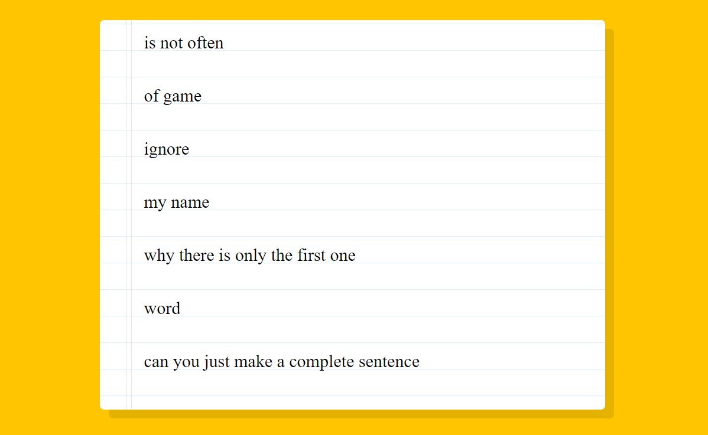

# 20 - Native Speech Recognition
## :eyes: Introduction



### Main goal

- No need for external libraries or tools for speech recognition! (However this native api is currently only supported in Chrome and it doesn't work offline)

### Demo: 👉 [Click me]() 

## :pushpin: Solution
### Example solution

```javascript
const recognition = new SpeechRecognition();
recognition.interimResults = true;
recognition.lang = 'en-US';

let p = document.createElement('p');
const words = document.querySelector('.words');
words.appendChild(p);

recognition.addEventListener('result', e => {
    const transcript = Array.from(e.results)
        .map(result => result[0])
        .map(result => result.transcript)
        .join('');

    const poopScript = transcript.replace(/poop|poo|shit|dump/gi, '💩');
    p.textContent = poopScript;

    if (e.results[0].isFinal) {
        p = document.createElement('p');
        words.appendChild(p);
    }
});

recognition.addEventListener('end', recognition.start);
recognition.start();
```

## :pencil2: Takeaways

### 1. The `SpeechRecognition` interface and the Web Speech API 
The Web Speech API enables us to incorporate voice data into web apps, like text-to-speech (`SpeechSynthesis`) or speech recognition (`SpeechRecognition`). Here we are using the `SpeechRecognition` interface.

To initialize a speed recognition, we can use `new` keyword to create a new `SpeechRecognition` object.

```javascript
const recognition = new SpeechRecognition();
```
#### Instance properties
There are some properties that we can set up before starting. 
* `SpeechRecognition.interimResults` controls if the interim results should be returned. If set to `true`, interim results will be returned even the recognition is not yet finished.
* `SpeechRecognition.lang` specifies the language of the current `SpeechRecognition`. If not specified, it defaults to the HTML `lang` attribute value.
* `SpeechRecognition.continuous` controls whether continuous results are returned for each recognition, or only a single result. The default value is `false`.
```javascript
recognition.interimResults = true;
recognition.lang = 'en-US';
```
#### Instance events
This API also provides some events to play with. In the example solution, he uses the `result` event and the `end` event. The former fires when the speech recognition service returns a result (either a word or a phrase) and the latter is fired when the speech recognition service has disconnected. There's also a `start` event which fires when the speech recognition service has begun listening.
```javascript
recognition.addEventListener('result', e => {
    // ...
});

recognition.addEventListener('end', recognition.start);
```
#### Instance methods
As for the methods, there are three of them. We can use `start()` to start the speech recognition and `stop()` to stop the speech recognition. As for `abort()`, it also stops the speech recognition but it doesn't return any recognition result. 

```javascript
recognition.start();
recognition.stop();
recognition.abort();
```

### 2. Replace certain transcript content with... emoji?
After getting the transcripts inside of the result (they are nested very deeply inside of the object, therefore we have to use `map()` to extract them), we can do whatever we want with them. 

In the example solution, he replaces all the `poop`, `poo`, `shit`, `dump` in the transcript with a `💩` emoji. Note that he is using a regular expression here.
```javascript
recognition.addEventListener('result', e => {
    const transcript = Array.from(e.results)
        .map(result => result[0])
        .map(result => result.transcript)
        .join('');

    const poopScript = transcript.replace(/poop|poo|shit|dump/gi, '💩');
    p.textContent = poopScript;

    if (e.results[0].isFinal) {
        p = document.createElement('p');
        words.appendChild(p);
    }
});
```

### 3. The `contenteditable` global attribute
In the HTML markup of the example solution, he uses the `contenteditable` attribute to make the text area editable. When the user clicks on the text, the cursor changes and the browser outlines the element in which the text can be edited.

The attribute can take one of the two values: `true` or `false`, to indicate if the element is not editable. In the example solution he didn't specify any value to the attribute. In this case its value is treated as an empty string, which is the same as `true`. 
```html
<div class="words" contenteditable>
</div>
```

## :book: References
* [Web Speech API - MDN](https://developer.mozilla.org/en-US/docs/Web/API/Web_Speech_API)
* [SpeechRecognition - MDN](https://developer.mozilla.org/en-US/docs/Web/API/SpeechRecognition)
* [SpeechRecognition: result event - MDN](https://developer.mozilla.org/en-US/docs/Web/API/SpeechRecognition/result_event)
* [contenteditable - MDN](https://developer.mozilla.org/en-US/docs/Web/HTML/Global_attributes/contenteditable)