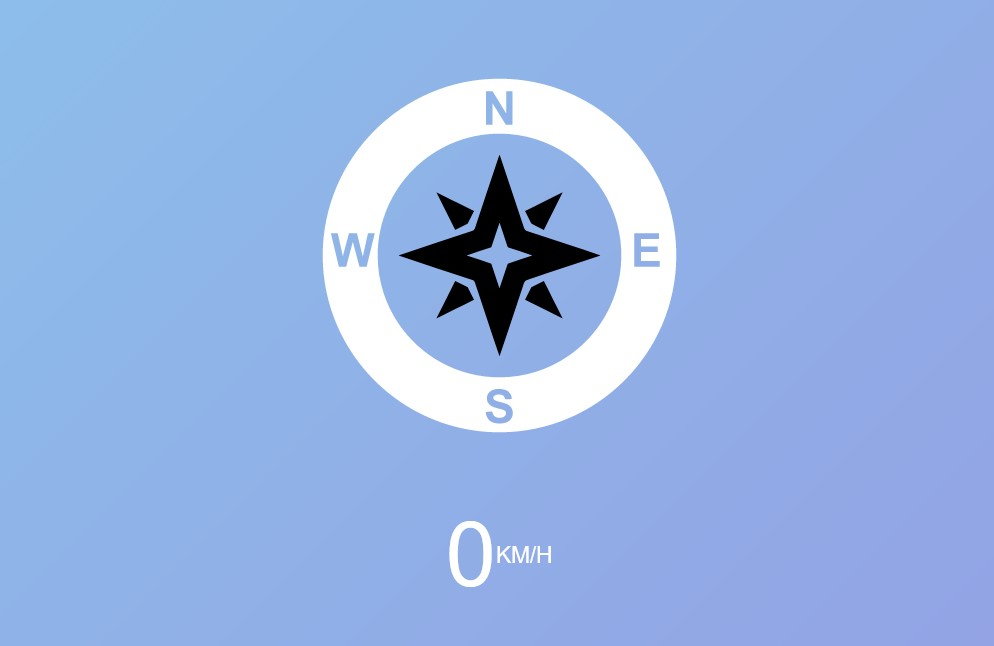

# 21 - Geolocation based Speedometer and Compass
## :eyes: Introduction



### Main goal

- Understand the basic usage of the Geolocation API

### Demo: 👉 [Click me]() 

## :pushpin: Solution
### Example solution

```javascript
const arrow = document.querySelector('.arrow');
const speed = document.querySelector('.speed-value');

navigator.geolocation.watchPosition((data) => {
    console.log(data);
    speed.textContent = data.coords.speed;
    arrow.style.transform = `rotate(${data.coords.heading}deg)`;
}, (err) => {
    console.error(err);
});
```

## :pencil2: Takeaways

### 1. Get a user's location data using the Geolocation API
The Geolocation API allows web applications to access users location data if they give permission. For privacy reasons, this feature is available only in secure contexts (HTTPS). There are lots of common usages for this API such as plotting a user's location on a map, or displaying personalized information relevant to their location.

#### Instance methods

To start using the geolocation API, we can call `Navigator.geolocation` which returns a `Geolocation` object that has different instance methods.
* `Geolocation.getCurrentPosition()`: Determines the device's current location and gives back a `GeolocationPosition` object with the data.
* `Geolocation.watchPosition()`: Returns a long value representing the newly established callback function to be invoked whenever the device location changes.
* `Geolocation.clearWatch()`: Removes the particular handler previously installed using `watchPosition()`.

#### Properties on the `GeolocationPosition` object
On the `GeolocationPosition` object, we have access to two properties that can be useful for us:

* `GeolocationPosition.coords`: Gives us different kinds of data of the current location.
* `GeolocationPosition.timestamp`: Returns the time at which the location was retrieved.

<!-- todo -->
<!-- todo -->
<!-- todo -->
<!-- todo -->

#### Properties inside the `coords`
Inside the `coords` (the `GeolocationCoordinates` object), we have access to various data of the current position.
* `GeolocationCoordinates.latitude`: The latitude of the current position.
* `GeolocationCoordinates.longitude`: The longitude of the current position.
* `GeolocationCoordinates.altitude`: The altitude of the current position, expressed in meters.
* `GeolocationCoordinates.accuracy`: The accuracy of the latitude and the longitude properties, expressed in meters. 
* `GeolocationCoordinates.heading`: The direction towards which the device is facing. The value is specified in degrees, `0` degrees represents true north, and the direction is determined clockwise (which means that east is `90` degrees and west is `270` degrees).
* `GeolocationCoordinates.speed`: It shows how fast the user's device is moving in meters per second. 

### 2. Usage in the example solution
In the example solution, he uses `watchPosition()` method which will call a function each time the position of the device changes. Inside the callback, he retrieves the `speed` data from the geolocation object and update the text accordingly. He also uses the `heading` data to update the arrow's rotate angle everytime the user's position changes. 

```javascript
navigator.geolocation.watchPosition((data) => {
    speed.textContent = data.coords.speed;
    arrow.style.transform = `rotate(${data.coords.heading}deg)`;
}
```


## :book: References
* [Geolocation API - MDN](https://developer.mozilla.org/en-US/docs/Web/API/Geolocation_API)
* [Geolocation.watchPosition() - MDN](https://developer.mozilla.org/en-US/docs/Web/API/Geolocation/watchPosition)
* [GeolocationPosition - MDN](https://developer.mozilla.org/en-US/docs/Web/API/GeolocationPosition)
* [GeolocationCoordinates - MDN](https://developer.mozilla.org/en-US/docs/Web/API/GeolocationCoordinates)