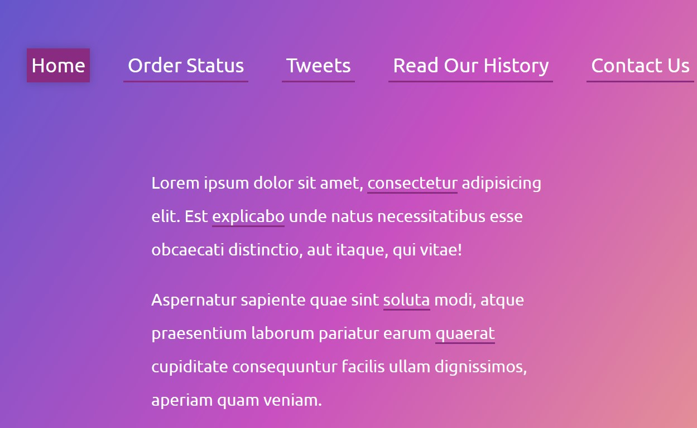
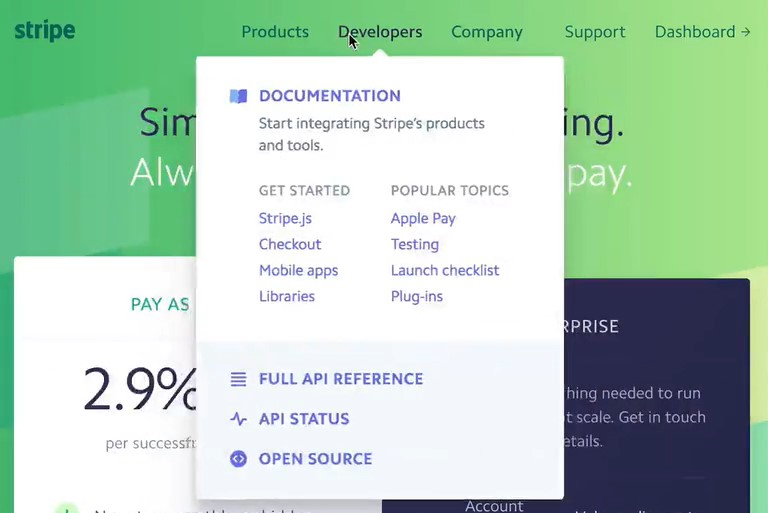
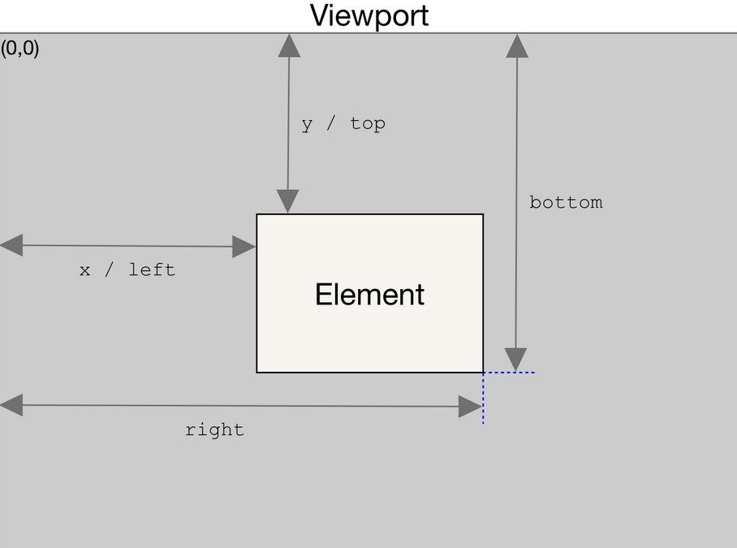

# 22 - Follow Along Links Highlighter
## :eyes: Introduction



### Main goal

- When the user hovers over a link, the link will be highlighted by a div which changes its size and position accordingly.
- This is the first part of reverse engineering the Stripe homepage link effects (for the second part please refer to day 26)

 

### Demo: 👉 [Click me]() 

## :pushpin: Solution
### My solution
Only did a small modification on the position of the highlight div, so it won't appear at the top left corner of the page at the beginning.
```css
.highlight {
    position: absolute;
    top: -10px;
    left: -10px;
}
```
```javascript
function highlightLink() {
    // ...
    highlight.style.transform = `translate(${coords.left + 10}px, ${coords.top + 10}px)`;
}
```

### Example solution

```javascript
const triggers = document.querySelectorAll('a');
const highlight = document.createElement('span');
highlight.classList.add('highlight');
document.body.appendChild(highlight);

function highlightLink() {
    const linkCoords = this.getBoundingClientRect();
    console.log(linkCoords);
    const coords = {
        width: linkCoords.width,
        height: linkCoords.height,
        top: linkCoords.top + window.scrollY,
        left: linkCoords.left + window.scrollX
    };

    highlight.style.width = `${coords.width}px`;
    highlight.style.height = `${coords.height}px`;
    highlight.style.transform = `translate(${coords.left}px, ${coords.top}px)`;

}

triggers.forEach(a => a.addEventListener('mouseenter', highlightLink));
```

## :pencil2: Takeaways

### 1. The trick: a div that changes it size and position
At first we probably guessed that the effect is made with several different divs which is next to the link elements, but in fact it's all made with the same div. Therefore we can add some transition animation to it to make it moves smoothly from one link to another. 
```css
.highlight {
    transition: all 0.2s;
}
```

### 2. Get info about an element's size and position using `getBoundingClientRect()`

To get the information about an element's size and position, all we need to do is to call the `getBoundingClientRect()` method on the element.

```javascript
const linkCoords = this.getBoundingClientRect();
```

The method returns the `left`, `top`, `right`, `bottom`, `x`, `y`, `width`, and `height` properties of the element in pixels. Note that properties other than `width` and `height` are relative to **the top-left of the viewport.** 



Since the values of `top`, `right`, `bottom` and `left` are relative to the viewport and not absolute, when the user scrolls down the page, those values change too. This might cause problem when you want to make the highlight div follow the position of the links.

To fix this, just add the current scrolling position to the top and left properties (these can be obtained using `window.scrollY` and `window.scrollX`) to get the element which is independent from the current scrolling position. 

```javascript
function highlightLink() {
    const linkCoords = this.getBoundingClientRect();
    const coords = {
        width: linkCoords.width,
        height: linkCoords.height,
        // add current scrolling position
        top: linkCoords.top + window.scrollY,
        left: linkCoords.left + window.scrollX
    };
}
```

## :book: References
* [Element.getBoundingClientRect() - MDN](https://developer.mozilla.org/en-US/docs/Web/API/Element/getBoundingClientRect#examples)