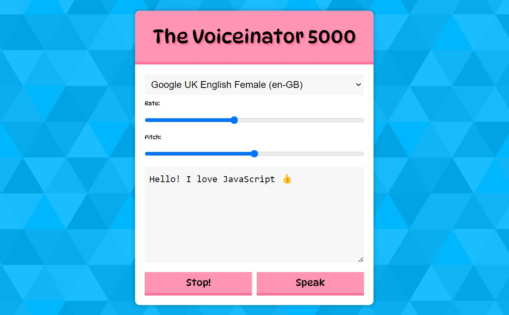

# 23 - Speech Synthesis
## :eyes: Introduction



### Main goal

- Let the computer read your text in different voices 📢

### Demo: 👉 [Click me](https://kellychi22.github.io/JavaScript30/23-Speech-Synthesis/) 

## :pushpin: Solution
### Example solution
```javascript
const msg = new SpeechSynthesisUtterance();
let voices = [];
const voicesDropdown = document.querySelector('[name="voice"]');
const options = document.querySelectorAll('[type="range"], [name="text"]');
const speakButton = document.querySelector('#speak');
const stopButton = document.querySelector('#stop');
msg.text = document.querySelector('[name="text"]').value;

// generate available voices list
function populateVoices() {
    voices = this.getVoices();
    voicesDropdown.innerHTML = voices
        .filter(voice => voice.lang.includes('en'))
        .map(voice => `<option value="${voice.name}">${voice.name} (${voice.lang})</option>`)
        .join('');
}

// set current voice to the selected voice
function setVoice() {
    msg.voice = voices.find(voice => voice.name === this.value);
    toggle();
}

// toggle speech start/stop
function toggle(startOver = true) {
    speechSynthesis.cancel();
    if (startOver) {
        speechSynthesis.speak(msg);
    }
}

// set speech speed and pitch
function setOption() {
    console.log(this.name, this.value);
    msg[this.name] = this.value;
    toggle();
}

speechSynthesis.addEventListener('voiceschanged', populateVoices);
voicesDropdown.addEventListener('change', setVoice);
options.forEach(option => option.addEventListener('change', setOption));
speakButton.addEventListener('click', toggle);
stopButton.addEventListener('click', () => toggle(false));
```
### My solution
For whatever reason, the `voicechanged` event doesn't fire when the page loads, so I changed the `populateVoices` function to the function provided on MDN docs and call the function on page load. 
```js
function populateVoiceList() {
    if (typeof speechSynthesis === 'undefined') {
        return;
    }

    voices = speechSynthesis.getVoices();

    for (let i = 0; i < voices.length; i++) {
        const option = document.createElement('option');
        option.textContent = `${voices[i].name} (${voices[i].lang})`;

        if (voices[i].default) {
            option.textContent += ' — DEFAULT';
        }

        option.setAttribute('data-lang', voices[i].lang);
        option.setAttribute('data-name', voices[i].name);
        voicesDropdown.appendChild(option);
    }
}
// call on page load
populateVoiceList();
speechSynthesis.addEventListener('voiceschanged', populateVoiceList);
```

## :pencil2: Takeaways

### 1. A brief introduction to the `SpeechSynthesisUtterance` and the `SpeechSynthesis` interfaces
At day 20 we already talked about the `SpeechRecognition` interface of the Web Speech API. Both `SpeechSynthesisUtterance` and the `SpeechSynthesis` are also interfaces provided by the Web Speech API, but they are dealing with text-to-speech functions.

Basically, the `SpeechSynthesisUtterance` object is an object that contains all the information about the speech, including the text, the language, the speed etc. While `SpeechSynthesis` provides methods for us to interact with the `SpeechSynthesisUtterance` object.

To create a new `SpeechSynthesisUtterance` object, use the `new` keyword and save it to a variable. 
```javascript
let msg = new SpeechSynthesisUtterance();
```
#### Properties of `SpeechSynthesisUtterance` 

* `msg.text`: the text content of the speech
* `msg.lang`: the language of the utterance
* `msg.pitch`: the pitch at which the utterance will be spoken at
* `msg.rate`: the speed at which the utterance will be spoken at 
* `msg.voice`: the voice that will be used to speak the utterance
* `msg.volume`: the volume that the utterance will be spoken at

In the example solution, he sets the default `msg.text` to the text in the text area.
```javascript
msg.text = document.querySelector('[name="text"]').value;
```

#### Methods for `SpeechSynthesis`
```js
SpeechSynthesis.speck() // start the speech
SpeechSynthesis.cancel() // cancel the speech
SpeechSynthesis.pause() // pause the speech
SpeechSynthesis.resume() // restart the speech if paused
```
In the example solution, he calls the `cancel()` and `speak()` methods for starting and stopping the speech. Note that in the `speak()` method, the `msg` argument has to be passed in, so it knows which utterance to speak. 
```js
function toggle(startOver = true) {
    speechSynthesis.cancel();
    if (startOver) {
        speechSynthesis.speak(msg);
    }
}
```

### 2. Generate available voices list by using `getVoices()`
The `getVoices()` method of the `SpeechSynthesis` interface returns a list of all the available voices on the current device. (Thus different browsers or OS might have different  built in voices)

In the example solution, he calls the `getVoices()` method and filter out non-english voices. Then he creates all the options insde the dropdown form by using `map()` and `join()`.
```js
function populateVoices() {
    voices = this.getVoices();
    voicesDropdown.innerHTML = voices
        .filter(voice => voice.lang.includes('en'))
        .map(voice => `<option value="${voice.name}">${voice.name} (${voice.lang})</option>`)
        .join('');
}

speechSynthesis.addEventListener('voiceschanged', populateVoices);
```
Note that here the `populateVoices()` function is called on `voicechanged` event, which could be used to generate available voices for the user to choose. However, for whatever reason, this event doesn't fire on page load on my pc. Thus in my solution, I have to call it on page load to generate available voices list. (I also changed the function to the example function on MDN docs, and removed the filtering process)

```js
// call on page load
populateVoiceList();
speechSynthesis.addEventListener('voiceschanged', populateVoiceList);
```

### 3. Set a `startOver` flag to toggle start and stop
By using `speak()` and `cancel()` methods, we can start and stop the speech easily. What's worth noticing is that he creates a `startOver` flag for controlling whether the speech should restart or not. If the flag is set to `false`, the speech will only be canceled and not starting again.
```js
// toggle speech start/stop
function toggle(startOver = true) {
    speechSynthesis.cancel();
    if (startOver) {
        speechSynthesis.speak(msg);
    }
}
```
In the functions for setting voices and other options, we want the speech to restart after we adjust the settings. So we can call `toggle()` function to restart the speech. Since we don't pass in any argument, the `startOver` flag is default to `true`.
```js
function setOption() {
    console.log(this.name, this.value);
    msg[this.name] = this.value;
    toggle();
}
```
As for the speaking and stopping buttons, we can call `toggle()` for starting the speech and call `toggle(false)` for stopping the speech. Since we pass in the `false` argument, only the `cancel()` method will run.  
```js
speakButton.addEventListener('click', toggle);
stopButton.addEventListener('click', () => toggle(false));
```
### 4. How to pass an argument to a function?
One thing we might easily neglected is the way we pass in arguments to a function. To tie a function to an event listener, we should only pass in the function name (which means without the `()`) as below.
```js
speakButton.addEventListener('click', toggle);
```
What if we want to pass in arguments to the function? The following code is not going to work. 
```js
stopButton.addEventListener('click', toggle(false));
```
#### (1) Use `function()` statement
There are several ways to get the work done. First is to use the `function()` statement. But it looks kinda long with two extra lines of code.  
```js
stopButton.addEventListener('click', function() {
    toggle(false)
});
```
#### (2) Use `bind()` method
Since `bind()` is a more advanced and complicated concept, here we are only going to explain briefly how it can work in this context. 

`Bind()` method returns a new function which has a `this` and arguments bound with it. If we assign `null` for the `this` parameter, the `this` of the returned function will refer to the `global` context, which is `window` in the browser. 

Therefore, we are not using `bind()` for changing the `this` here, but to pass in the `false` argument, which we need to execute the function in the way we wish.
```js
stopButton.addEventListener('click', toggle.bind(null, false));
```
#### (3) Use arrow function
The easiest way might be using an arrow function, which has the same logic as using a `function()` statement, but with much shorter syntax.
```js
stopButton.addEventListener('click', () => toggle(false));
```

## :book: References
* [SpeechSynthesisUtterance - MDN](https://developer.mozilla.org/en-US/docs/Web/API/SpeechSynthesisUtterance)
* [SpeechSynthesis - MDN](https://developer.mozilla.org/en-US/docs/Web/API/SpeechSynthesis)
* [SpeechSynthesis.getVoices() - MDN](https://developer.mozilla.org/en-US/docs/Web/API/SpeechSynthesis/getVoices)
* [Function.prototype.bind() - MDN](https://developer.mozilla.org/en-US/docs/Web/JavaScript/Reference/Global_Objects/Function/bind)
* [JavaScript30 / 23 — Speech Synthesis (Chinese)](https://chiaohu0211.medium.com/javascript30-23-speech-synthesis-b14fae6ede15)