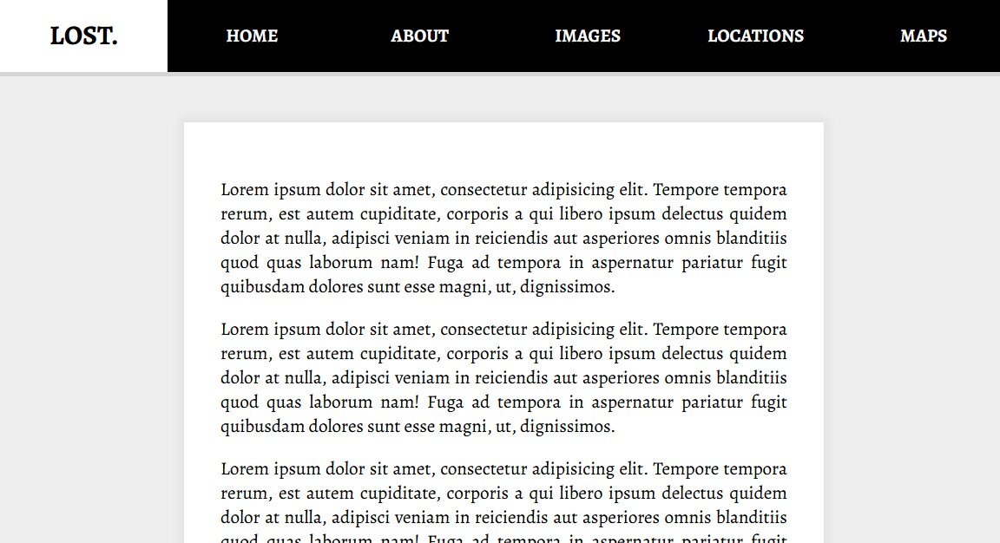

# 24 - Sticky Nav
## :eyes: Introduction



### Main goal

- As the user scrolls down, the navbar will stick on the top of the page
- The logo will slide in when the hero image is no longer visible

### Demo: 👉 [Click me]() 

## :pushpin: Solution
### Example solution

```javascript
const nav = document.querySelector('#main');
let topOfNav = nav.offsetTop;

function fixNav() {
    if (window.scrollY >= topOfNav) {
        document.body.style.paddingTop = nav.offsetHeight + 'px';
        document.body.classList.add('fixed-nav');
    } else {
        document.body.classList.remove('fixed-nav');
        document.body.style.paddingTop = 0;
    }
}

window.addEventListener('scroll', fixNav);
```

## :pencil2: Takeaways

### 1. Figure out when to fix the navbar with `offsetTop` and `scrollY`
To make the navbar fixed on the top of the page when the hero image is no longer visible, we need two key values to achieve this goal. First is the distance between the top of the `body` and the `nav`, second is how much the user has scrolled down the page. When the two values are the same, it means that the `nav` is now on top of the page.

We can get the first value by using `offsetTop`. This property returns the distance of the outer border of the current element relative to the inner border of the top of the `offsetParent` (the closest ancestor element). 
```javascript
let topOfNav = nav.offsetTop;
```
As for the second value, we can get it easily from `Window.scrollY`, which returns the number of pixels that the document is currently scrolled vertically. 

In the example solution, when `window.scrollY` is greater or equal to `topOfNav`, which means the user is scrolling enough and the navbar is already at the top of the page, we are going to do something to make the `nav` position fixed.
```js
function fixNav() {
    if (window.scrollY >= topOfNav) {
        // do stuff
    }
}
```
### 2. Pop a class on the `body` to target any children element
We can add a class to the `nav` itself to make the position fixed, but there's a better way to do it. Instead of adding class directly to the `nav`, we add the class to the `body`.

The advantage of doing so is that we can change more than one element at the same time without creating any extra classes.
```js
function fixNav() {
    if (window.scrollY >= topOfNav) {
        document.body.classList.add('fixed-nav');
    } else {
        document.body.classList.remove('fixed-nav');
    }
}
```
In the stylesheet we can see there are three different elements being changed when the `.fixed-nav` class is added to the `body`: the navbar, the wrapping `div` of the text content and the logo. Therefore, by adding just one class to the body, we can change three elements at the same time.
```css
body.fixed-nav nav {
    position: fixed;
    box-shadow: 0 5px 0 rgba(0, 0, 0, 0.1);
}

body.fixed-nav .site-wrap {
    transform: scale(1);
}

body.fixed-nav li.logo {
    max-width: 500px;
}
```
### 3. Problem: content jumps when hitting the top

One thing we will notice so far is that the content area "jumps" when the navbar hits the top of the page. This is because when we set something to `position: fixed`, it's actually pulled out of the document flow (which means how each element takes up space and how other elements position themselves accordingly).

Therefore, when the `position` of `nav` is changed to `fixed`, it will no longer occupy space in the document flow, which causes the content area to move up the height of the navbar.  
```js
function fixNav() {
    if (window.scrollY >= topOfNav) {
        document.body.style.paddingTop = nav.offsetHeight + 'px';
        document.body.classList.add('fixed-nav');
    } else {
        document.body.classList.remove('fixed-nav');
        document.body.style.paddingTop = 0;
    }
}
```
To fix this, we can simply add some padding to the body at the moment when the class is added. The padding will be equal to the height of the navbar. By doing so, the content area will be pushed down secretly and stop doing a jump when scrolling.

### 4. Animate `max-width` to slide in the logo
Besides fixing the position of the navbar, we also want the logo to slide in as we scroll down the page. 

On the logo element, the `max-width` is set to `0` and the `overflow` is set to `hidden`. Since the element has no width, it is also invisible. When we add the `fixed-nav` class to the body, the `max-width` of the logo element is set to `500px` and thus we can see the logo. 
```css
li.logo {
    max-width: 0;
    overflow: hidden;
    background: white;
    transition: all 0.5s;
    font-weight: 700;
    font-size: 30px;
}

body.fixed-nav li.logo {
    max-width: 500px;
}
```
The reason why we are not setting the `width` here is because `width` doesn't work when all the `<li>` elements has a `flex: 1` setting. `flex: 1` means that all elements will grow with the same scale as long as there is enough space. So even if `width` is set to `0`, the browser will still calculate the `flex: 1` and stretch the element to a certain width.  
```css
nav li {
    flex: 1;
    text-align: center;
    display: flex;
    justify-content: center;
    align-items: center;
}
```
However, if we use `max-width`, **the element won't be wider than this value**, even if `flex: 1` is trying to distribute available spaces between the elements.


#### 💡 Extra tip: Scale up the text a bit too 
We can also scale up a bit the wrapper div of the content area to enhance the user experience. 
```css
.site-wrap {
    /* ... */
    transform: scale(0.98);
    transition: transform 0.5s;
}

body.fixed-nav .site-wrap {
    transform: scale(1);
}
```

## :book: References
* [HTMLElement.offsetTop - MDN](https://developer.mozilla.org/en-US/docs/Web/API/HTMLElement/offsetTop)
* [Window.scrollY - MDN](https://developer.mozilla.org/en-US/docs/Web/API/Window/scrollY)
* [What Is Document Flow? ](https://soulandwolf.com.au/blog/what-is-document-flow/)