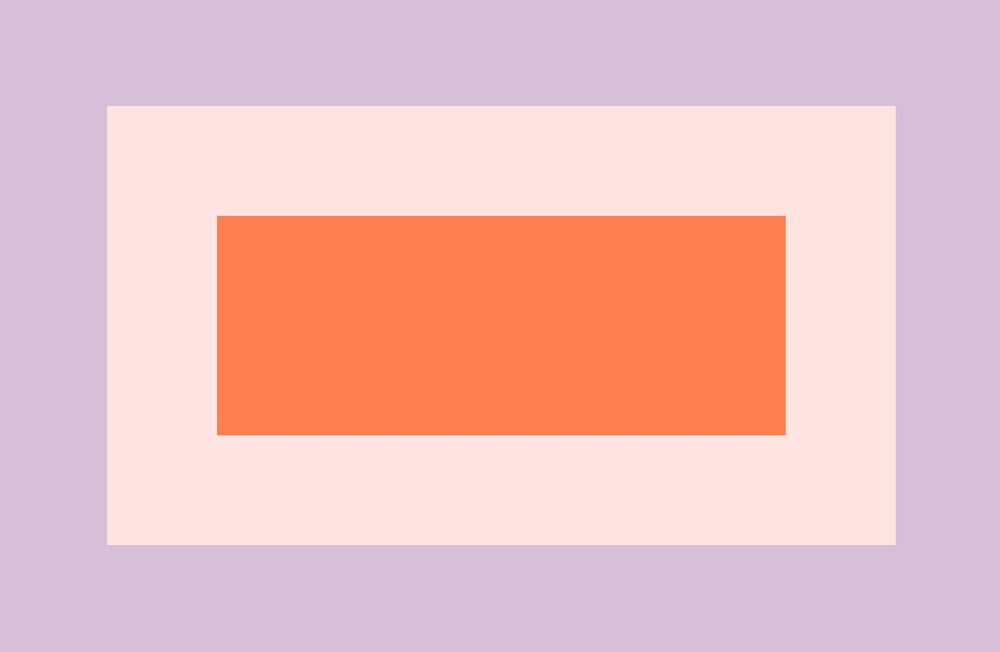
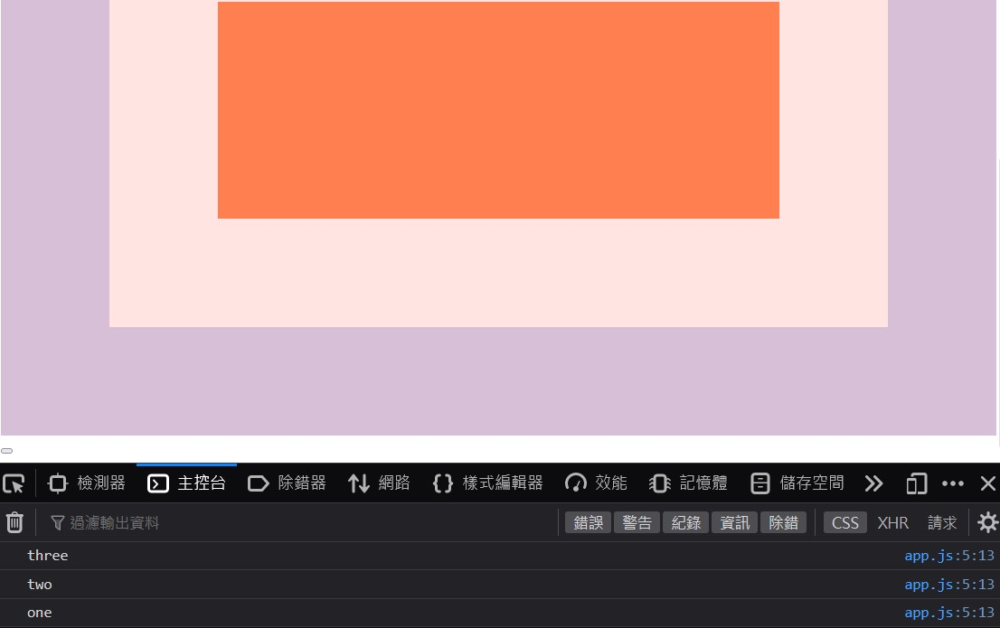
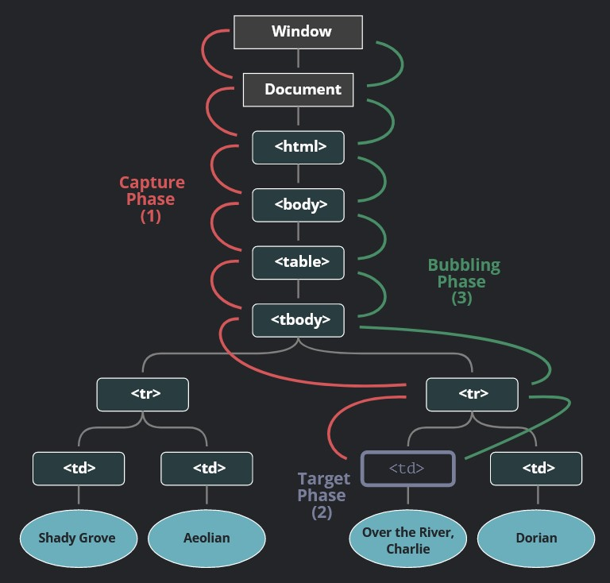
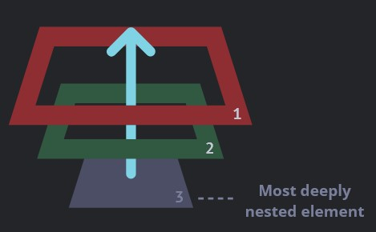
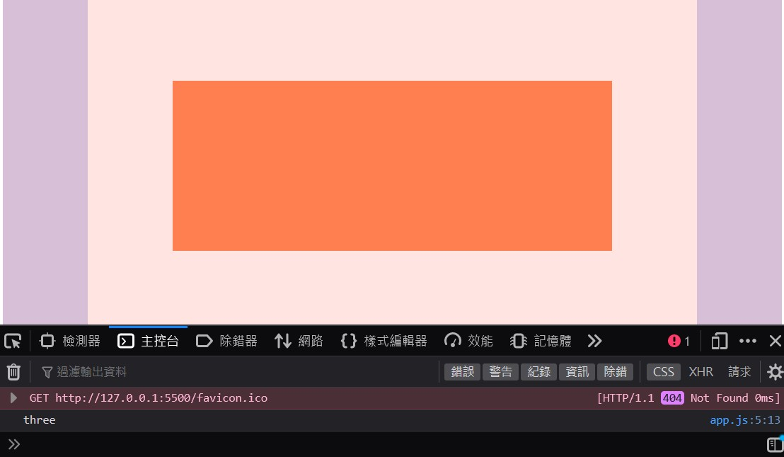
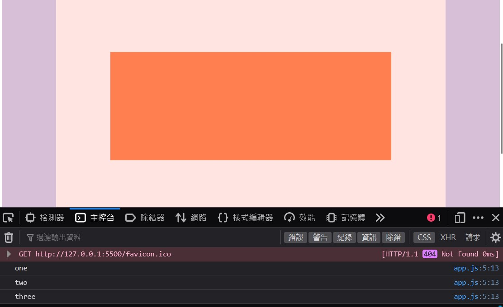
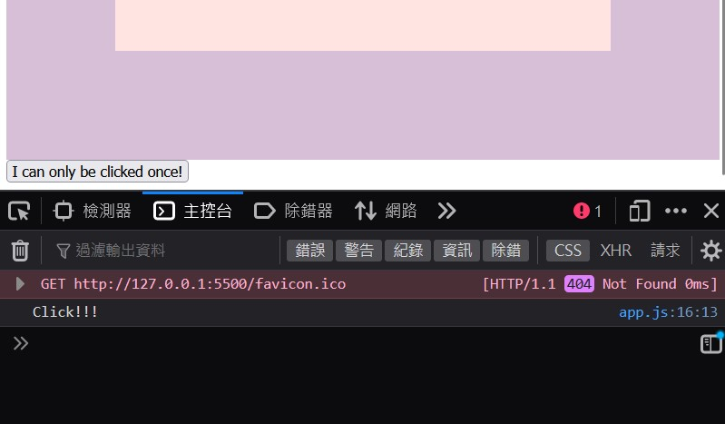

# 25 - Event Propagation
## :eyes: Introduction



### Main goal

- Understand basic ideas of JavaScript event propagation, capturing and bubbling 

### Demo: 👉 [Click me]() 

## :pushpin: Solution
### Example solution

```javascript
const divs = document.querySelectorAll('div');
const button = document.querySelector('button');

function logText(e) {
    console.log(this.classList.value);
    // e.stopPropagation(); // stop bubbling!
    // console.log(this);
}

divs.forEach(div => div.addEventListener('click', logText, {
    capture: false,
    once: true
}));

button.addEventListener('click', () => {
    console.log('Click!!!');
}, {
    once: true
});
```

## :pencil2: Takeaways

### 1. Set up: add event listeners to all the divs
There are three nested divs with different colors on the page. From outside to inside, they have the class of "one", "two" and "three". 
```html
<div class="one">
    <div class="two">
        <div class="three">
        </div>
    </div>
</div>
```
Then we add event listeners to all of them by using `forEach`. The `logText` function will log out the class name of the element:
```js
function logText(e) {
    console.log(this.classList.value);
}

divs.forEach(div => div.addEventListener('click', logText));
```
We will notice that when we click on the orange div (the one with a "three" class), our console will log out "two" and "one" too, even if we didn't click on them.



### 2. Quick introduction to capturing and bubbling
The reason why this is happening is because of how capturing and bubbling work in the browser. 

First we need to know what is **event propagation**. According to [this article](https://blog.loginradius.com/engineering/javascript-events-bubbling-capturing-and-propagation/), event propagation refers simply to how events travel through the Document Object Model (DOM) tree. Since the DOM tree consists lots of nested elements, the event needs to pass through every node on the DOM until it reaches the destination.

The following image from [JAVASCRIPT.info](https://javascript.info/bubbling-and-capturing) shows clearly how event propagation works. 



There are 3 phases of event propagation:

1. **Capturing phase** – the event goes down to the element.
2. **Target phase** – the event reached the target element.
3. **Bubbling phase** – the event bubbles up from the element.

**Because of bubbling, when an event happens on an element, it first runs the handlers on it, then on its parent, then all the way up on other ancestors.**


This means, if there are event listeners hooked on to the parents, those handlers will run too if there's an event fired on their descendant elements.

This is why we see our console logs out "one" and "two" too, even if we only clicked on the "three" div. 

### 3. Stop capturing or bubbling by `stopPropagation()`

What if we don't want the handlers on the ancestor elements run? We can call `stopPropagation()` inside the function to achieve this. This method of the `Event` interface prevents further propagation of the current event in the capturing and bubbling phases. 
```js
function logText(e) {
    console.log(this.classList.value);
    e.stopPropagation(); // stop bubbling!
}
```
We can see now the console only logs out "three", which is the element we actually clicked on.



### 4. The `capture` and `once` options for `addEventListener()`
#### The `capture` option
Normally, the `capture` option inside `addEventListener()` is set to `false`, this is why handlers don't run during the capturing phase. We can set this option to `true` manually. 
```js
function logText(e) {
    console.log(this.classList.value);
}

divs.forEach(div => div.addEventListener('click', logText, {
    capture: true,
}));
```
When `capture` option is set to `true`, the handlers will run during the capturing phase, which is, from top to bottom. We can see the console logs out class names in the opposite order here because the handlers are fired during the capturing phase.   



#### The `once` option
As for the `once` option, it is not directly related to capturing or bubbling, but it can be useful if we want some elements to be clicked only **once** by the user. It works the same as calling:
```js
EventTarget.removeEventListener()
```
But when setting `once` to true, the event listener will remove itself automatically after being fired.  

Let's say we have a button on the page and it will log out "Click!!!" when being clicked. Just now the `once` is set to `true` so the event will fire only once. 

```js
button.addEventListener('click', () => {
    console.log('Click!!!');
}, {
    once: true
});
```
No matter how many times we click on the button, it will only logs out "Click!!!" once. 



## :book: References

* [Bubbling and capturing - JAVASCRIPT.info](https://javascript.info/bubbling-and-capturing)
* [JavaScript Events: Bubbling, Capturing, and Propagation](https://blog.loginradius.com/engineering/javascript-events-bubbling-capturing-and-propagation/)
* [EventTarget.addEventListener() - MDN](https://developer.mozilla.org/en-US/docs/Web/API/EventTarget/addEventListener)
* [Event.stopPropagation() - MDN](https://developer.mozilla.org/en-US/docs/Web/API/Event/stopPropagation)
* [EventTarget.removeEventListener() - MDN](https://developer.mozilla.org/en-US/docs/Web/API/EventTarget/removeEventListener)