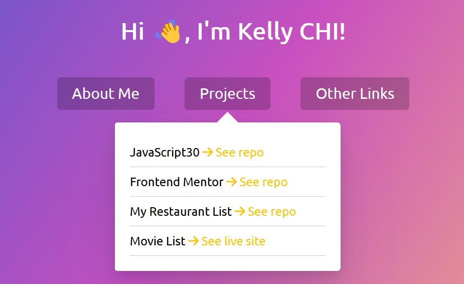
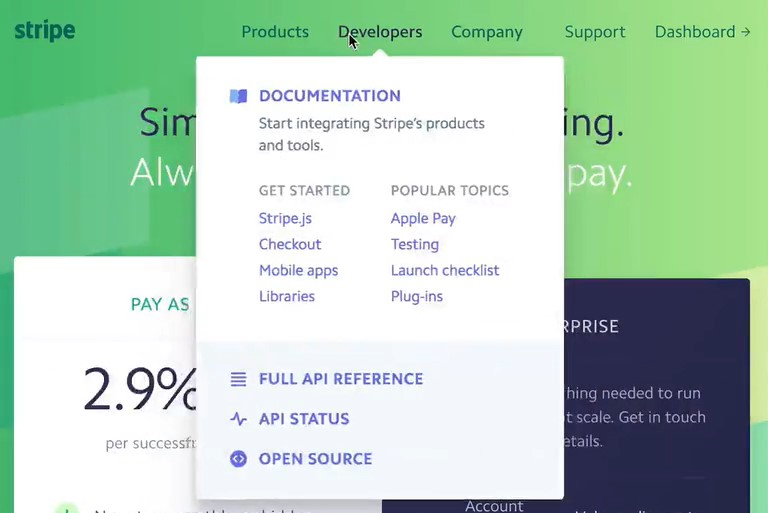
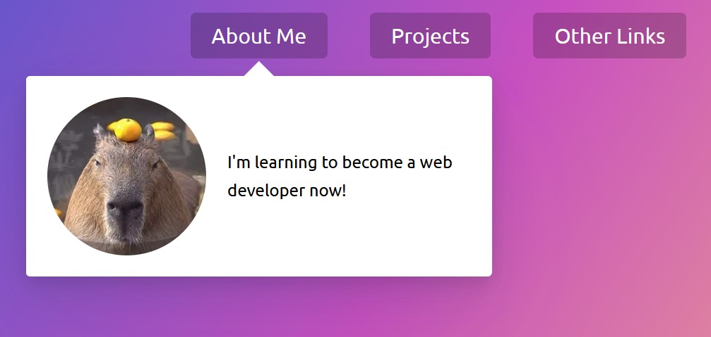
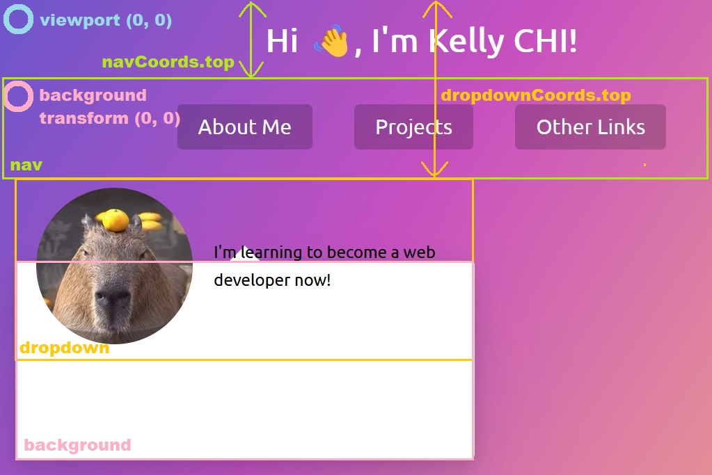
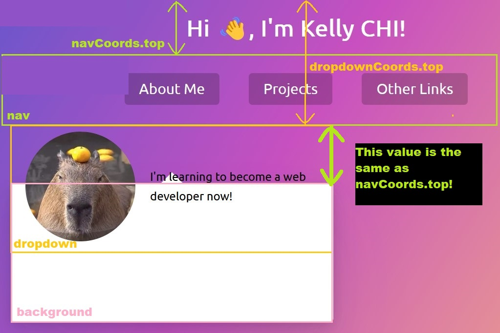
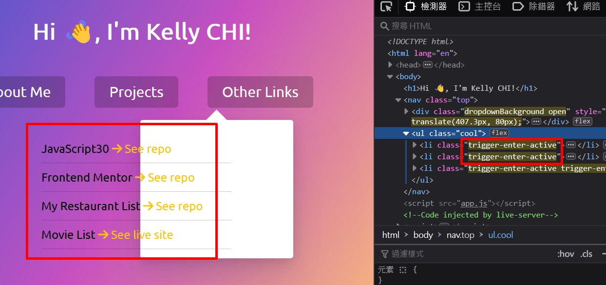

# 26 - Stripe Follow Along Dropdown
## :eyes: Introduction



### Main goal

- When the user hovers over the links on the navbar, dropdown menus will appear. And the dropdowns will seem to be resizing themselves as the pointer moves to another link.
- This is the second part of reverse engineering the Stripe homepage dropdown menu effects (for the first part please refer to [day 22](https://github.com/KellyCHI22/JavaScript30/tree/main/22-Follow-Along-Link-Highlighter))

 

### Demo: 👉 [Click me](https://kellychi22.github.io/JavaScript30/26-Stripe-Follow-Along-Nav/) 

## :pushpin: Solution
### Example solution

```javascript
const triggers = document.querySelectorAll('.cool > li');
const background = document.querySelector('.dropdownBackground');
const nav = document.querySelector('.top');

function handleEnter() {
    this.classList.add('trigger-enter');
    setTimeout(() => this.classList.contains('trigger-enter') && this.classList.add('trigger-enter-active'), 150);
    background.classList.add('open');

    const dropdown = this.querySelector('.dropdown');
    const dropdownCoords = dropdown.getBoundingClientRect();
    const navCoords = nav.getBoundingClientRect();

    const coords = {
        height: dropdownCoords.height,
        width: dropdownCoords.width,
        top: dropdownCoords.top - navCoords.top,
        left: dropdownCoords.left - navCoords.left
    };

    background.style.setProperty('width', `${coords.width}px`);
    background.style.setProperty('height', `${coords.height}px`);
    background.style.setProperty('transform', `translate(${coords.left}px, ${coords.top}px)`);
}

function handleLeave() {
    this.classList.remove('trigger-enter', 'trigger-enter-active');
    background.classList.remove('open');
}

triggers.forEach(trigger => trigger.addEventListener('mouseenter', handleEnter));
triggers.forEach(trigger => trigger.addEventListener('mouseleave', handleLeave));
```

## :pencil2: Takeaways

### 1. The trick: A background div that moves and resizes itself

At first we might think that the whole dropdown menu is moving and changing its content as the user hovers over the links. In fact, the white background of the dropdowns is separate from the content. It's a separate div that moves and resizes itself according to the content of the dropdowns. 

### 2. Hook the event listeners to `<li>` elements instead of `<a>` elements
The reason why we are hooking our event listeners to all the `<li>` elements instead of the `<a>` elements is that once the pointer is away from the `<a>` element, the whole dropdown will disappear. We want our dropdowns keep showing as long as the user is hovering over the whole `<li>` element (which includes the dropdowns). 

```javascript
const triggers = document.querySelectorAll('.cool > li');

triggers.forEach(trigger => trigger.addEventListener('mouseenter', handleEnter));
triggers.forEach(trigger => trigger.addEventListener('mouseleave', handleLeave));
```

### 3. Transition separately `display` and `opacity` 
In the example solution, he uses adding and removing CSS classes to control the showing and hiding of the dropdowns. Note that here he sets two different classes for transitioning the `display` and the `opacity`, the `.trigger-enter` and the `.trigger-enter-active`.

```css
.trigger-enter .dropdown {
    display: block;
}

.trigger-enter-active .dropdown {
    opacity: 1;
}
```
Also, he uses `setTimeout` to add the `.trigger-enter-active` class after 150ms.

```javascript
function handleEnter() {
    this.classList.add('trigger-enter');
    setTimeout(() => this.classList.add('trigger-enter-active'), 150);
    // ...
}
```
According to the list of [animatable CSS properties](https://developer.mozilla.org/en-US/docs/Web/CSS/CSS_animated_properties) on MDN, `display` is not an animatable property, which means, it's either displaying or not displaying. When you add `display: block` to an element, it will appear immediately. So, if we want our elements to fade in gradually, we have to transition an animatable property, which is `opacity`. 

When we add the `.trigger-enter` class to the dropdown menu, the opacity is still `0`, so we still can't see it even if the display is set to `block`. Only after the `.trigger-enter-active` class is added and the opacity is set to `1`, that we can see the dropdown menu.

### 4. Select the active dropdown inside the function
The most important part of the trick is to get the coordinates of the dropdown menus by using `getBoundingClientRect()` so we can then set the size and position of the background div according to the coordinates. Since we already talked about how `getBoundingClientRect()` works in day 22, please refer to [here]((https://github.com/KellyCHI22/JavaScript30/tree/main/22-Follow-Along-Link-Highlighter)) for more explanation.

```javascript
function handleEnter() {
    // ...
    const dropdown = this.querySelector('.dropdown');
    const dropdownCoords = dropdown.getBoundingClientRect();
    // ...
}
```
One thing to note here is that we are selecting the dropdown menu inside the function, instead of selecting it outside. This is because we want to select the exact dropdown that is currently active on the page. 

### 5. Calculate the coordinates of the `nav` too
Besides grabbing the coordinates of the active dropdown menu, we also need to grab the coordinates of the navbar itself. Let's see why in a couple of minutes.
```javascript
function handleEnter() {
    // ...
    const dropdownCoords = dropdown.getBoundingClientRect();
    const navCoords = nav.getBoundingClientRect();

    const coords = {
        height: dropdownCoords.height,
        width: dropdownCoords.width,
        top: dropdownCoords.top - navCoords.top,
        left: dropdownCoords.left - navCoords.left
    };
    // ...
    background.style.setProperty('transform', `translate(${coords.left}px, ${coords.top}px)`);
}
```


Everything works perfectly fine as long as there's no other elements above the navbar. But when we add something, for example a title like the one in my demo, the background div will longer be at the correct position!



This is because the background div has an absolute position relative to the navbar's position. When we set the `transform` property to the background div, it's (0, 0) is located at the top left corner of the navbar. However, the coordinates we get from `getBoundingClientRect()` is relative to the `viewport`. **When there is an element above the navbar, the (0, 0) of the navbar is no longer the same as the (0, 0) of the viewport**, so the background div will not be set to the correct position if we use directly the coordinates of the dropdown menu.



To fix this, we can minus the `top` and the `left` coordinates of the navbar to put the background div back to its correct position. 


### 6. Use logical AND (`&&`) to check if the class is already added

There's still a small problem we need to fix. If we move the pointer very fast between the links, the contents might remain showing even after the pointer has already left the link. If we take a look at the devtools, we will find that the `.trigger-enter-active` class is sill added to the elements. 



The reason why this is happening is because we use `setTimeout()` to add the `.trigger-enter-active` class after 150ms inside the `handleEnter()` function. However, in the `handleLeave()` function, we remove both `.trigger-enter-active` class and `.trigger-enter` class at the same time. 

Therefore, if the pointer leaves the `<li>` element before 150ms, the `.trigger-enter-active` class will still be added after the timeout, but since the `handleLeave()` function has already been triggered, the `.trigger-enter-active` will remain there!

In order to fix the problem, we can use a logical AND expression (`&&`) to check if the `trigger-enter` class has already been added. If yes, then we will add the `.trigger-enter-active` class after 150ms. (p.s. Only when the expression before the `&&` operator is truthy, that the function after `&&` will execute)

```javascript
function handleEnter() {
    this.classList.add('trigger-enter');
    setTimeout(() => this.classList.contains('trigger-enter') && this.classList.add('trigger-enter-active'), 150);
    // ...
}

function handleLeave() {
    this.classList.remove('trigger-enter', 'trigger-enter-active');
}
```

## :book: References
* [Animatable CSS properties - MDN](https://developer.mozilla.org/en-US/docs/Web/CSS/CSS_animated_properties)
* [Element.getBoundingClientRect() - MDN](https://developer.mozilla.org/en-US/docs/Web/API/Element/getBoundingClientRect)
* [Logical AND (&&) - MDN](https://developer.mozilla.org/en-US/docs/Web/JavaScript/Reference/Operators/Logical_AND)