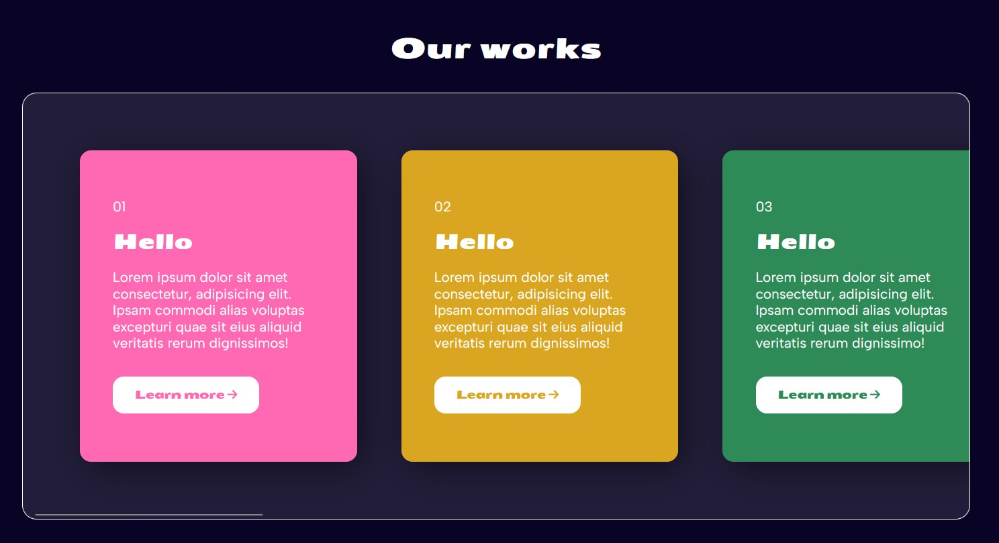
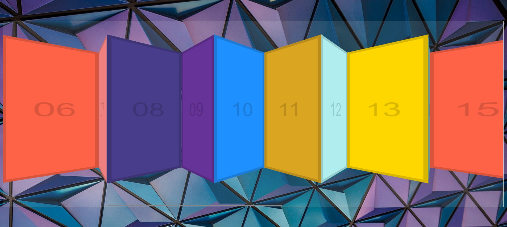
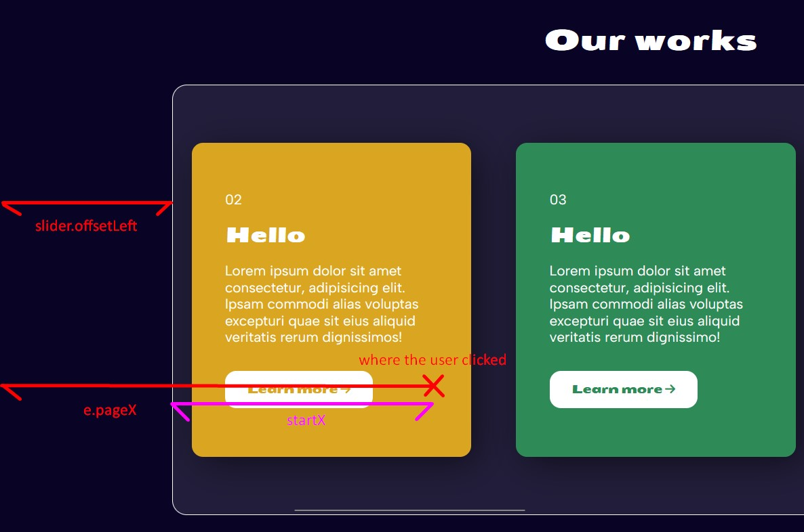

# 27 - Click and Drag to Scroll
## :eyes: Introduction




### Main goal

- Create horizontal slide effect when the mouse is hold and dragged.


### Demo: 👉 [Click me]() 

## :pushpin: Solution
### Example solution

```javascript
const slider = document.querySelector('.items');
let isDown = false;
let startX; // where the mouse clicked down
let scrollLeft; // to record how much the slider is scrolled initially

slider.addEventListener('mousedown', (e) => {
    isDown = true;
    slider.classList.add('active');
    startX = e.pageX - slider.offsetLeft;
    scrollLeft = slider.scrollLeft;
});

slider.addEventListener('mouseleave', () => {
    isDown = false;
    slider.classList.remove('active');
});

slider.addEventListener('mouseup', () => {
    isDown = false;
    slider.classList.remove('active');
});

slider.addEventListener('mousemove', (e) => {
    if (!isDown) return;  // stop the function from running
    e.preventDefault();
    const x = e.pageX - slider.offsetLeft;
    const walk = (x - startX) * 3;
    slider.scrollLeft = scrollLeft - walk;
});
```
### My solution
I changed a bit the design and add some elements inside the items to make it look closer to a design that we can see in common projects. I also get some design ideas from [this codepen](https://codepen.io/David6Blue/pen/JejmOO) by @David6Blue. Below is the original design. 



## :pencil2: Takeaways

### 1. Use flag variable to track mouse down state
Since we only want the slider to be dragged when the mouse is actually clicked and dragged, we can use a flag variable to track if the mouse is currently down. If not, the dragging function won't run. 

```javascript
let isDown = false;

slider.addEventListener('mousedown', (e) => {
    isDown = true;
});

slider.addEventListener('mouseleave', () => {
    isDown = false;
});

slider.addEventListener('mouseup', () => {
    isDown = false;
});

slider.addEventListener('mousemove', (e) => {
    if (!isDown) return;  // stop the fn from running
});
```
We also set `isdown` to `false` on `mouseleave` to prevent the dragging from running when the cursor is not in the slider.  

### 2. Calculate how much the slider has to be scrolled

To achieve the dragging effect, we need to do some calculation. 

```js
slider.addEventListener('mousedown', (e) => {
    isDown = true;
    slider.classList.add('active');
    startX = e.pageX - slider.offsetLeft;
    scrollLeft = slider.scrollLeft;
});
```
First, we can get the initial position of the mouse `startX` by using `e.pageX` and `slider.offsetLeft`. The `e.pageX` returns the X (horizontal) coordinate at which the mouse was clicked. The `slider.offsetLeft` gives us the distance between the left border of the slider and the left edge of the page. 



Also, we need to know how much the slider has been scrolled initially before the user start dragging. The value can be get easily by the `scrollLeft` property. 

Inside the callback for `mousemove` event, we can track the mouse position by using the same technic as we get the `startX` value. Then, we calculate the difference between the current mouse position and the `startX` and save it as a variable `walk` since this is how much the slider should move. (We can multiply it by N, so 1 pixel dragged will cause the slider to move N pixels etc)

```js
slider.addEventListener('mousemove', (e) => {
    if (!isDown) return;  // stop the function from running
    e.preventDefault();
    const x = e.pageX - slider.offsetLeft;
    const walk = (x - startX) * 3;
    slider.scrollLeft = scrollLeft - walk;
});
```
At the end, we should update the `scrollLeft` value of the slider to actually make it move. Note that when the user moves the mouse to the right, the slider should scroll to the LEFT, and thus the `scrollLeft` value should be LESS than the initial value.

## :book: References
* [Element.scrollLeft - MDN](https://developer.mozilla.org/en-US/docs/Web/API/Element/scrollLeft)
* [MouseEvent.pageX - MDN](https://developer.mozilla.org/en-US/docs/Web/API/MouseEvent/pageX)
* [HTMLElement.offsetLeft - MDN](https://developer.mozilla.org/en-US/docs/Web/API/HTMLElement/offsetLeft)