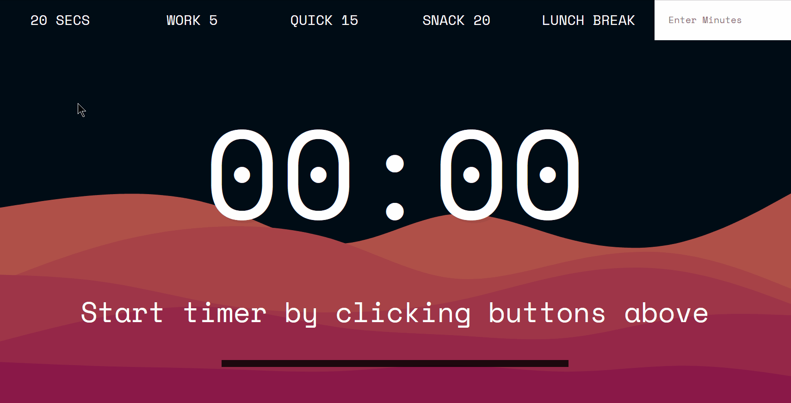

# 29 - Countdown Timer
## :eyes: Introduction



### Main goal

- A very simple countdown timer with various options. The user can customize the time too.


### Demo: 👉 [Click me]() 

## :pushpin: Solution
### Example solution

```javascript
let countdown;
const timerDisplay = document.querySelector('.display__time-left');
const endTime = document.querySelector('.display__end-time');
const buttons = document.querySelectorAll('[data-time]');

function timer(seconds) {
    clearInterval(countdown);

    const now = Date.now();
    const then = now + seconds * 1000;
    displayTimeLeft(seconds);
    displayEndTime(then);

    countdown = setInterval(() => {
        const secondsLeft = Math.round((then - Date.now()) / 1000);
        if (secondsLeft < 0) {
            clearInterval(countdown);
            return;
        }
        displayTimeLeft(secondsLeft);
    }, 1000);
}

function displayTimeLeft(seconds) {
  const minutes = Math.floor(seconds / 60);
  const remainderSeconds = seconds % 60;
  const display = `${minutes}:${remainderSeconds < 10 ? '0' : '' }${remainderSeconds}`;
  document.title = display;
  timerDisplay.textContent = display;
}

function displayEndTime(timestamp) {
  const end = new Date(timestamp);
  const hour = end.getHours();
  const adjustedHour = hour > 12 ? hour - 12 : hour;
  const minutes = end.getMinutes();
  endTime.textContent = `Be Back At ${adjustedHour}:${minutes < 10 ? '0' : ''}${minutes}`;
}

function startTimer() {
  const seconds = parseInt(this.dataset.time);
  timer(seconds);
}

buttons.forEach(button => button.addEventListener('click', startTimer));
document.customForm.addEventListener('submit', function(e) {
  e.preventDefault();
  const mins = this.minutes.value;
  timer(mins * 60);
  this.reset();
});
```
### My solution
In the example solution, there's no sound effect when the timeout is over, so I added an audio and it will play when the timeout is over. 
```js
function timer(seconds) {
    // ...
    if (secondsLeft < 0) {
        audio.play(); // play audio when timeout is over
        clearInterval(countdown);
        return;
    }
    // ...
}
```
Getting the idea from [this](https://pomofocus.io/) pomodoro website, I added a progress bar to show the user how much time has passed already.
```js
function timer(seconds) {
    clearInterval(countdown);
    // reset progress bar width
    progressBar.style.width = `0px`;

    // ...
    countdown = setInterval(() => {
        const secondsLeft = Math.round((then - Date.now()) / 1000);
        const timePassed = seconds - secondsLeft;
        // ...
        // update progress bar width every second
        progressBar.style.width = `${500 * (timePassed / seconds)}px`;
    }, 1000);
}
```
There will be an error if the user types something which is not a number in the input box, so I added a simple type check for it.
```js
document.customForm.addEventListener('submit', function (e) {
  e.preventDefault();
  const mins = this.minutes.value;
  // add type check
  if (isNaN(mins)) return this.reset();
  timer(mins * 60);
  this.reset();
});
```
## :pencil2: Takeaways

### 1. Get the timer running!

#### Problems with `setInterval` and the solution

In the video, he mentions that the following way of using `setInterval` can cause some unexpected problems since the browser sometimes pauses the interval when the user tabs away or scrolls down the page. 

```js
function timer(seconds) {
    setInterval(function() {
        seconds--;
    }, 1000)
}
```
Therefore, we should calculate the timeout manually by using the `Date` object. And by calling `Date.now()`, which returns the number of **milliseconds** representing the current time, we can know when the timeout should end and how much seconds are left before the timeout ends.

```javascript
function timer(seconds) {
    clearInterval(countdown);

    const now = Date.now();
    const then = now + seconds * 1000;
    displayTimeLeft(seconds);
    displayEndTime(then);

    countdown = setInterval(() => {
        const secondsLeft = Math.round((then - Date.now()) / 1000);
        if (secondsLeft < 0) {
            clearInterval(countdown);
            return;
        }
        displayTimeLeft(secondsLeft);
    }, 1000);
}
```
#### Clear the interval when the time is over
We have to call `clearInterval()` to stop the interval, otherwise it will continue running even if the value of `secondsLeft` is negative. To do so, we can wrap our interval in a variable, and pass it in  `clearInterval()`.

Besides, since we have several buttons that will fire the `timer` function and will all start a new countdown, we need to clear all the existing intervals at the beginning to avoid the situation where there are more than one intervals running at the same time.

#### The callback inside `setInterval` doesn't run immediately

The callback inside `setInterval` will first run after N milliseconds which we set with the second parameter. (In this example it will run after 1000 milliseconds) And this means the timer will be displayed 1 second after the user has clicked the button.

Since we want the timer to show immediately when the user clicks the button, we have to call `displayTimeLeft()` and   `displayEndTime()` at the beginning. Once the callback is running, the timer on the page will update every second so we don't have to worry about it anymore.

### 2. Notes on displaying time
#### Add a `0` when the seconds is less than 10
If the seconds is less than 10, we might see something like `5:5` or `12:1`, which is not a proper way to display time. We can use the ternary operator to check if the number is less than 10, if so, add a `0` in front of it, otherwise just add nothing.
```js
function displayTimeLeft(seconds) {
  const minutes = Math.floor(seconds / 60);
  const remainderSeconds = seconds % 60;
  const display = `${minutes}:${remainderSeconds < 10 ? '0' : '' }${remainderSeconds}`;
  document.title = display;
  timerDisplay.textContent = display;
}
```
#### For those that are not europeans...
The integer number we get from `getHours()` is between 0 to 23. Therefore, if you are using a 12-hour clock, you might need to change the hour format a bit. (In europe, people use 24-hour clock, so they don't need to bother with this :P)

Same as what we did with the seconds, we can use the ternary operator to check if the hours is higher than 12, if so, subtract 12, otherwise just keep the number. 
```js
function displayEndTime(timestamp) {
  const end = new Date(timestamp);
  const hour = end.getHours();
  const adjustedHour = hour > 12 ? hour - 12 : hour;
  const minutes = end.getMinutes();
  endTime.textContent = `Be Back At ${adjustedHour}:${minutes < 10 ? '0' : ''}${minutes}`;
}
```
### 3. Select elements directly by the `name` attribute
If there's a `name` attribute on the element, we can select it directly by calling `document.name`! Here both the `form` element and the `input` element have a name attribute on them.
```html
<form name="customForm" id="custom">
    <input type="text" name="minutes" placeholder="Enter Minutes">
</form>
```
In JavaScript, we can simply select the form by `document.customform` without using a `querySelector`. Furthermore, we can select the input just by `this.minutes`(`this` refers to the `form` element), very convenient!

```js
document.customForm.addEventListener('submit', function(e) {
  e.preventDefault();
  const mins = this.minutes.value;
  timer(mins * 60);
  this.reset();
});
```

## :book: References
* [setInterval() - MDN](https://developer.mozilla.org/en-US/docs/Web/API/setInterval)
* [clearInterval() - MDN](https://developer.mozilla.org/en-US/docs/Web/API/clearInterval)
* [Date.now() - MDN](https://developer.mozilla.org/en-US/docs/Web/JavaScript/Reference/Global_Objects/Date/now)
* [Date.prototype.getHours() - MDN](https://developer.mozilla.org/en-US/docs/Web/JavaScript/Reference/Global_Objects/Date/getHours)