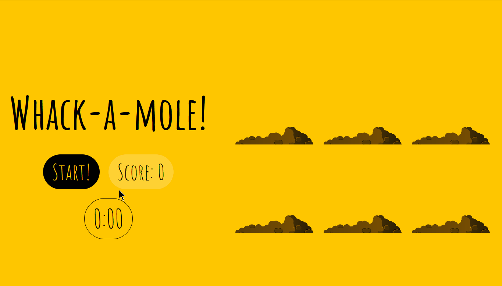

# 30 - Whack a Mole!
## :eyes: Introduction



### Main goal

- A simple whack a mole game. Click the moles to get as many points as you can before the time runs out!

### Demo: 👉 [Click me](https://kellychi22.github.io/JavaScript30/30-Whack-A-Mole/) 

## :pushpin: Solution
### Example solution

```javascript
const holes = document.querySelectorAll('.hole');
const scoreBoard = document.querySelector('.score');
const moles = document.querySelectorAll('.mole');
let lastHole;
let timeUp = false;
let score = 0;

function randomTime(min, max) {
    return Math.round(Math.random() * (max - min) + min);
}

function randomHole(holes) {
    const idx = Math.floor(Math.random() * holes.length);
    const hole = holes[idx];
    if (hole === lastHole) {
    console.log('Ah nah thats the same one bud');
    return randomHole(holes);
    }
    lastHole = hole;
    return hole;
}

function peep() {
    const time = randomTime(200, 1000);
    const hole = randomHole(holes);
    hole.classList.add('up');
    setTimeout(() => {
        hole.classList.remove('up');
        if (!timeUp) peep();
    }, time);
}

function startGame() {
    scoreBoard.textContent = 0;
    timeUp = false;
    score = 0;
    peep();
    setTimeout(() => timeUp = true, 10000)
}

function bonk(e) {
    if(!e.isTrusted) return; // cheater!
    score++;
    this.parentNode.classList.remove('up');
    scoreBoard.textContent = score;
}

moles.forEach(mole => mole.addEventListener('click', bonk));
```
### My solution

In the example solution, if the user clicks fast enough on the same mole, he can score more than one point. To fix this, I add a variable to track if the user clicks on the same mole that he has already clicked on. 

```js
let lastMole;

function bonk(e) {
    if (!e.isTrusted || lastMole === this) return;
    score++;
    lastMole = this;
    this.parentNode.classList.remove('up');
    scoreCount.textContent = score;
}
```
I also used the timer function from the previous day to show the user how much time it's left in the game.
```js
function timer(seconds) {
    clearInterval(countdown);

    const now = Date.now();
    const then = now + seconds * 1000;
    displayTimeLeft(seconds);

    countdown = setInterval(() => {
        const secondsLeft = Math.round((then - Date.now()) / 1000);

        if (secondsLeft < 0) {
            clearInterval(countdown);
            scoreBoard.classList.add('final');
            return;
        }
        displayTimeLeft(secondsLeft);
    }, 1000);
}
```

## :pencil2: Takeaways

### 1. Select a random hole on the page
First, we should create a function for choosing a random hole from all the holes on the page. We can achieve this easily by using `Math.random()`.

Also, we want the moles to come out from a different hole every time, so we create a variable `lastHole` to check if the random hole is the same as the last one. If so, the computer will randomly pick another hole.
```js
function randomHole(holes) {
    const idx = Math.floor(Math.random() * holes.length);
    const hole = holes[idx];
    if (hole === lastHole) {
        console.log('Ah nah thats the same one bud');
        return randomHole(holes);
    }
    lastHole = hole;
    return hole;
}
```
### 2. Pop up the moles until the time runs out

To make the game more interesting, besides popping up from different holes, every mole pops up for a different duration too. 

After getting a random duration and a random hole, we add the `up` class to `hole` to make the moles pop up on the page and use a `setTimeout` to make it hidden again after a period of time. Since we want the moles keep popping up unless the time runs out, we can call `peep()` again inside the callback.
```js
function randomTime(min, max) {
    return Math.round(Math.random() * (max - min) + min);
}

function peep() {
    const time = randomTime(200, 1000);
    const hole = randomHole(holes);
    hole.classList.add('up');
    setTimeout(() => {
        hole.classList.remove('up');
        if (!timeUp) peep();
    }, time);
}
```
### 3. Use `event.isTrusted` to check if the user is cheating 
There are some people who use programs to create fake clicks to cheat in this kind of game. To prevent this, we can use `event.isTrusted` to check if the user is cheating. 

According to MDN, the `isTrusted` property returns `true` when the event was generated by a user action, and `false` when the event was created or modified by a script.
```js
function bonk(e) {
    if(!e.isTrusted) return; 
    score++;
    this.parentNode.classList.remove('up');
    scoreBoard.textContent = score;
}
```

## :book: References
* [Event.isTrusted - MDN](https://developer.mozilla.org/en-US/docs/Web/API/Event/isTrusted)