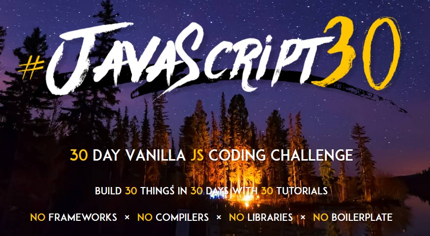

# JavaScript30

Here's a collection of all my [JavaScript30](https://javascript30.com/) practices.

| No  | Title                       | Description                                                                                                  | DEMO                                                                                  |
| --- | --------------------------- | ------------------------------------------------------------------------------------------------------------ | ------------------------------------------------------------------------------------- |
| 01  | JavaScript Drum Kit         | [README](https://github.com/KellyCHI22/JavaScript30/blob/main/01-JavaScript-Drum-Kit/README.md)              | [DEMO](https://kellychi22.github.io/JavaScript30/01-JavaScript-Drum-Kit/)             |
| 02  | CSS + JS Clock              | [README](https://github.com/KellyCHI22/JavaScript30/blob/main/02-JS-and-CS-Clock/README.md)                  | [DEMO](https://kellychi22.github.io/JavaScript30/02-JS-and-CS-Clock/)                 |
| 03  | Scoped CSS Variables and JS | [README](https://github.com/KellyCHI22/JavaScript30/blob/main/03-CSS-Variables/README.md)                    | [DEMO](https://kellychi22.github.io/JavaScript30/03-CSS-Variables/)                   |
| 04  | Array Cardio Day 1          | [README](https://github.com/KellyCHI22/JavaScript30/blob/main/04-Array-Cardio-Day-1/README.md)               | [DEMO](https://kellychi22.github.io/JavaScript30/04-Array-Cardio-Day-1/)              |
| 05  | Flex Panel Gallery          | [README](https://github.com/KellyCHI22/JavaScript30/tree/main/05-Flex-Panel-Gallery)                         | [DEMO](https://kellychi22.github.io/JavaScript30/05-Flex-Panel-Gallery/)              |
| 06  | Ajax Type Ahead             | [README](https://github.com/KellyCHI22/JavaScript30/blob/main/06-Type-Ahead/README.md)                       | [DEMO](https://kellychi22.github.io/JavaScript30/06-Type-Ahead/)                      |
| 07  | Array Cardio Day 2          | [README](https://github.com/KellyCHI22/JavaScript30/blob/main/07-Array-Cardio-Day-2/README.md)               | [DEMO](https://kellychi22.github.io/JavaScript30/07-Array-Cardio-Day-2/)              |
| 08  | Fun with HTML5 Canvas       | [README](https://github.com/KellyCHI22/JavaScript30/blob/main/08-Fun-with-HTML5-Canvas/README.md)            | [DEMO](https://kellychi22.github.io/JavaScript30/08-Fun-with-HTML5-Canvas/)           |
| 09  | Dev Tools Domination        | [README](https://github.com/KellyCHI22/JavaScript30/blob/main/09-Dev-Tools-Domination/README.md)             | [DEMO](https://kellychi22.github.io/JavaScript30/09-Dev-Tools-Domination/)            |
| 10  | Check Multiple Checkboxes   | [README](https://github.com/KellyCHI22/JavaScript30/blob/main/10-Hold-Shift-and-Check-Checkboxes/README.md)  | [DEMO](https://kellychi22.github.io/JavaScript30/10-Hold-Shift-and-Check-Checkboxes/) |
| 11  | Custom HTML5 Video Player   | [README](https://github.com/KellyCHI22/JavaScript30/blob/main/11-Custom-Video-Player/README.md)              | [DEMO](https://kellychi22.github.io/JavaScript30/11-Custom-Video-Player/)             |
| 12  | Key Sequence Detection      | [README](https://github.com/KellyCHI22/JavaScript30/blob/main/12-Key-Sequence-Detection/README.md)           | [DEMO](https://kellychi22.github.io/JavaScript30/12-Key-Sequence-Detection/)          |
| 13  | Slide in on Scroll          | [README](https://github.com/KellyCHI22/JavaScript30/blob/main/13-Slide-in-on-Scroll/README.md)               | [DEMO](https://kellychi22.github.io/JavaScript30/13-Slide-in-on-Scroll/)              |
| 14  | JS Reference VS Copy        | [README](https://github.com/KellyCHI22/JavaScript30/blob/main/14-JavaScript-References-VS-Copying/README.md) | ---                                                                                   |

___

[JavaScript30](https://javascript30.com/) is a free course created by Wes Bos where you can practice vanilla javascript skills by doing small and fun projects.